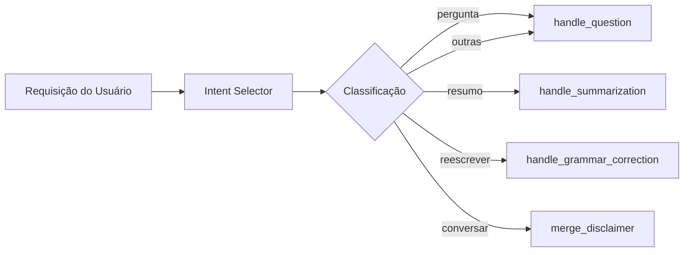

# Intent Selector Agent

> Classificação automática de intenção do usuário

## Função

O Intent Selector é o primeiro nó do workflow que analisa a requisição do usuário e classifica em uma das categorias de intenção. Esta classificação determina qual handler processará a requisição.

**Arquivo**: `sei_ia/agents/intent_selector_agent.py`

## Como Funciona



1. **Recebe** a requisição do usuário (`user_request`)
2. **Invoca** o LLM com temperatura baixa (0.01) para classificação determinística
3. **Retorna** a intenção em formato JSON estruturado
4. **Roteia** para o handler apropriado baseado na intenção

## Intenções Suportadas

| Intenção | Descrição | Handler | Exemplo |
|----------|-----------|---------|---------|
| `pergunta` | Pergunta sobre documentos | handle_question | "Qual o valor da multa?" |
| `resumo` | Sumarizar documento | handle_summarization | "Resuma este documento" |
| `reescrever` | Correção/tradução de texto | handle_grammar_correction | "Corrija este texto" |
| `conversar` | Conversa geral sem documentos | merge_disclaimer | "Olá, como você funciona?" |
| `multi_pergunta` | Múltiplas perguntas | handle_question | "Quais são os valores e prazos?" |
| `analise` | Análise detalhada | handle_question | "Analise os pontos críticos" |
| `escrever` | Redação de texto | handle_question | "Escreva um ofício sobre..." |
| `outras` | Fallback para outras intenções | handle_question | (qualquer outra requisição) |

## Configuração do LLM

```python
llm = get_llm_model(
    model_type=state["model_type"],
    temperature=0.01,  # Temperatura baixa para consistência
    response_format={"type": "json_object"},  # Força resposta em JSON
)
```

## Formato de Resposta

O LLM retorna um JSON estruturado:

```json
{
    "justificativa": "Usuário faz uma pergunta específica sobre informação contida no documento",
    "intencao": "pergunta"
}
```

## Tratamento de Erros

O agente implementa fallback para parsing de JSON:

1. Tenta `json.loads()` diretamente
2. Se falhar, busca o primeiro objeto JSON válido na string
3. Se a intenção não for válida, usa `"outras"` como fallback

## Verificação de Contexto

Após classificar a intenção, o agente verifica se o tamanho do contexto não excede o limite:

```python
if not check_length_context(state):
    raise HTTPException413("Tamanho do contexto excedido")
```

---

## Próximos Passos

- [Question Handler](question-handler.md) - Processamento de perguntas
- [Summarizer](summarizer.md) - Sumarização de documentos
