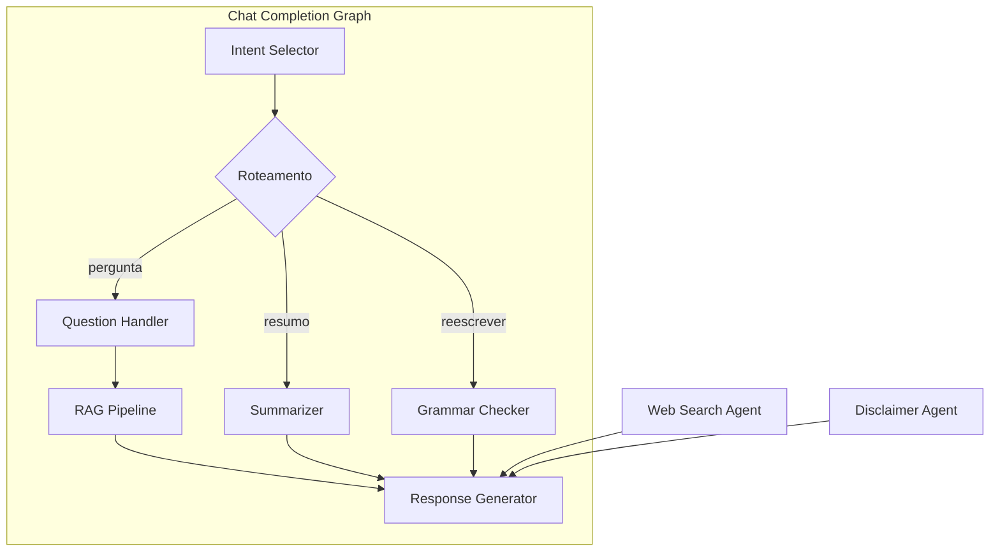

# Agentes - Visão Geral

> Arquitetura dos agentes de IA do SEI-IA

## Arquitetura

## Lista de Agentes

| Agente | Arquivo | Função |
|--------|---------|--------|
| Intent Selector | `intent_selector_agent.py` | Classifica intenção do usuário |
| Question Handler | `pergunta/__init__.py` | Processa perguntas (usa RAG se exceder limite de contexto) |
| Summarizer | `summarize/` | Sumariza documentos |
| Grammar Checker | `grammar_checker.py` | Correção gramatical |
| Web Search | `websearch/` | Busca na internet |
| Disclaimer | `disclaimer/` | Classificação de disclaimer |

## Fluxo de Execução

1. **Intent Selector** analisa a requisição e determina a intenção
2. Baseado na intenção, o workflow roteia para o handler apropriado
3. O handler processa a requisição e prepara o prompt
4. **Response Generator** chama o LLM e retorna a resposta

**Arquivo principal**: `sei_ia/agents/chat_completion_graph.py`
