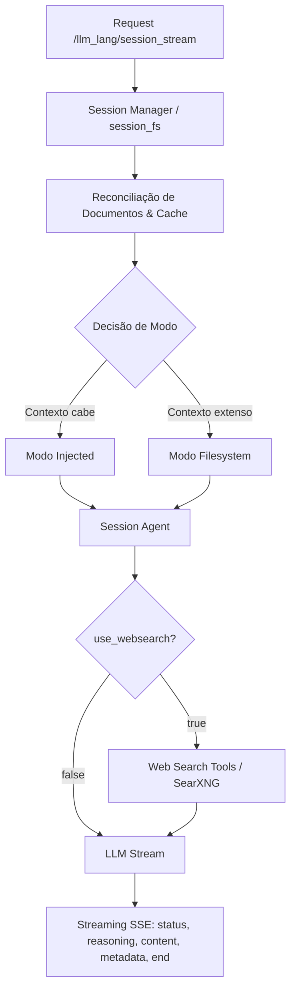

# Agentes - Visão Geral

O chat público usa `agents/session_agent/agent.py` por meio de
`POST /llm_lang/session_stream`. O agente trabalha com conteúdo injetado ou
filesystem de sessão e pode usar as ferramentas de busca web.

## Arquitetura do Session Agent

O Session Agent é um agente conversacional projetado para interagir com processos
e documentos do SEI mantendo contexto entre turnos.

```mermaid
graph TB
    A[Request /llm_lang/session_stream] --> B[Session Manager / session_fs]
    B --> C[Reconciliação de Documentos & Cache]
    C --> D{Decisão de Modo}
    D -->|Contexto cabe| E[Modo Injected]
    D -->|Contexto extenso| F[Modo Filesystem]
    E --> G[Session Agent]
    F --> G
    G --> H{use_websearch?}
    H -->|true| I[Web Search Tools / SearXNG]
    H -->|false| J[LLM Stream]
    I --> J
    J --> K[Streaming SSE: status, reasoning, content, metadata, end]
```

### Modos de Operação

O agente adapta dinamicamente sua estratégia conforme o volume documental:

| Modo | Condição | Comportamento |
|---|---|---|
| `injected` | Documentos cabem na janela de contexto | O conteúdo dos documentos é injetado diretamente no contexto do modelo |
| `filesystem` | Documentos excedem o limite de injeção | Os documentos são materializados no filesystem da sessão e acessados sob demanda via ferramenta `read_session` |

### Ferramentas Integradas

- **`read_session`**: Ferramenta de inspeção que permite ao agente consultar a árvore de processos e ler trechos ou arquivos específicos da sessão sem estourar o contexto.
- **Busca Web (`agents/websearch/`)**: Ferramentas de busca e raspagem via SearXNG (`SearxCrawlAgent`), pesquisa rasa (`WebResearchAgent`) e pesquisa profunda (`DeepResearchAgent`).

---

## RAG e pergunta arquivados

Os módulos `rag/` e `pergunta/`, seus prompts e exceções permanecem sob
`scripts/legado/sei_ia/`. O grafo, o seletor de intenção, o revisor gramatical,
o sumarizador e a classificação de disclaimer foram excluídos.

Os arquivos históricos estão no repositório, fora do site de documentação:

- `scripts/legado/README.md`
- `scripts/legado/docs/agents/question-handler.md`
