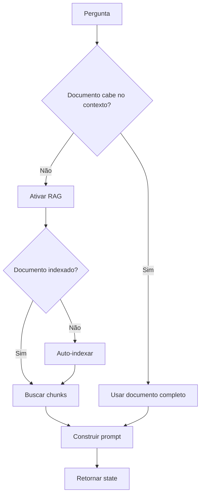

# Question Handler

> Processamento de perguntas sobre documentos

## Função

O Question Handler processa perguntas sobre documentos do SEI, decidindo automaticamente se deve usar RAG ou o documento completo.

**Arquivo**: `sei_ia/agents/pergunta/__init__.py`

## Fluxo de Decisão



## Componentes

| Componente | Arquivo | Função |
|------------|---------|--------|
| chunk_extractor | `chunk_extractor.py` | Extrai chunks relevantes |
| multi_search_rag | `multi_search_rag.py` | Busca com múltiplas queries |
| question_generator | `question_generator.py` | Gera perguntas alternativas |
| document_decision | `document_decision.py` | Decide se usa RAG |
| auto_indexing | `auto_indexing.py` | Indexa documentos automaticamente |
| prompt_builders | `prompt_builders.py` | Constrói prompts |

## Uso

```python
async def handle_question(state: UserState) -> UserState:
    state = await process_question_intent(state)
    return state
```

---

> **Para mais detalhes sobre o sistema RAG**: Quando o documento excede o limite de contexto, o Question Handler ativa o sistema RAG para buscar apenas os trechos mais relevantes. Consulte a seção [Sistema RAG](../rag-system/overview.md) para entender em detalhes como funciona a indexação automática, busca semântica e extração de chunks.
