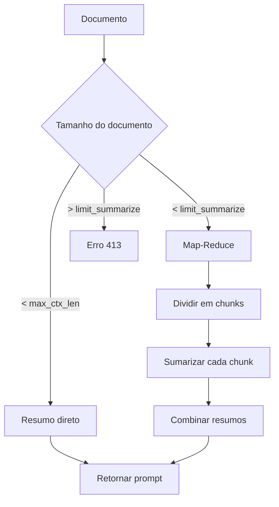

# Summarizer Agent

> Sumarização de documentos extensos

## Função

O Summarizer processa documentos extensos e gera resumos concisos mantendo as informações essenciais. É ativado quando a intenção do usuário é classificada como `resumo`.

**Arquivo**: `sei_ia/agents/summarize/prompt_with_doc_summarization.py`

## Como Funciona



## Estratégias de Sumarização

| Cenário | Condição | Estratégia |
|---------|----------|------------|
| Documento pequeno | `tokens < general_max_ctx_len` | Sumarização direta sem divisão |
| Documento médio | `tokens < limit_summarize` | Map-Reduce: divide, sumariza, combina |
| Documento muito grande | `tokens > limit_summarize` | Erro 413 - não é possível processar |

### Limite de Sumarização

O limite é calculado como múltiplo do contexto máximo:

```python
limit_summarize = SUMMARIZE_TOKENS_LIMIT_MULTIPLIER * general_max_ctx_len
```

## Map-Reduce

Para documentos que excedem o contexto mas estão dentro do limite de sumarização:

1. **Map (Paralelo)**: Divide o documento em chunks e sumariza cada um **em paralelo**
2. **Collect**: Coleta os resumos parciais
3. **Collapse**: Se necessário, combina resumos até caber no contexto

```python
chunks, _ = split_text_summarize(all_docs_content)
content_chunks = {"contents": [d.page_content for d in chunks]}
summarize_chain = select_summarize_model(user_state)
output: SummaryOverallState = summarize_chain.invoke(content_chunks)
```

### Execução Paralela

A fase **Map** utiliza o mecanismo `Send` do LangGraph para disparar chamadas paralelas ao LLM:

```python
def map_edge(state: SummaryOverallState) -> list[Send]:
    """Map edges to generate summaries and parallelize using Send."""
    return [Send("generate_summary", {"content": c}) for c in state["contents"]]
```

Cada chunk é enviado simultaneamente para o nó `generate_summary`, permitindo que múltiplos resumos sejam gerados em paralelo, reduzindo significativamente o tempo total de processamento.

## Configurações

| Parâmetro | Descrição |
|-----------|-----------|
| `SUMMARIZE_TOKENS_LIMIT_MULTIPLIER` | Multiplicador do limite de tokens (default: 5.0) |
| `SUMMARIZE_CHUNK_SIZE` | Tokens por chunk |
| `SUMMARIZE_CHUNK_MAX_OUTPUT` | Tokens máximos por resumo parcial |

## Tratamento de Erros

| Erro | Causa | Descrição |
|------|-------|-----------|
| `HTTPException408` | `RateLimitError` ou `APITimeoutError` | Timeout ou limite de taxa da API |
| `HTTPException413` | Documento muito grande | Excede o limite de sumarização |

## Paginação de Documentos

O Summarizer usa a paginação enviada no payload do frontend:

| Campo | Significado |
|-------|-------------|
| `pag_doc_init` | Página inicial do documento |
| `pag_doc_end` | Página final do documento |

Exemplo:

```json
{
  "id_documentos": [
    {
      "id_documento": "99",
      "pag_doc_init": 1,
      "pag_doc_end": 15
    }
  ]
}
```

> **Nota**: O texto livre do prompt não é usado para inferir paginação.

---

## Próximos Passos

- [Intent Selector](intent-selector.md) - Como a intenção `resumo` é classificada
- [Visão Geral dos Agentes](overview.md) - Arquitetura completa
