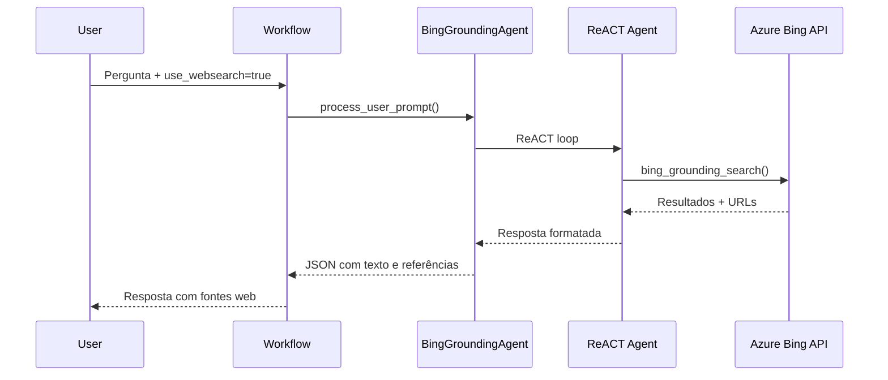

# Web Search Agent

> Busca na internet com Azure Bing Grounding

## Função

O Web Search Agent integra o Bing Search via Azure AI Project para enriquecer respostas com informações atualizadas da internet. É ativado quando o parâmetro `use_websearch=true` é enviado na requisição.

**Arquivo**: `sei_ia/agents/websearch/azure_web_search_tool.py`

## Arquitetura



## Componentes

### BingGroundingAgent

Classe principal que encapsula um agente ReACT do LangGraph com a ferramenta de busca Bing.

```python
agent = BingGroundingAgent()
result = await agent.process_user_prompt("Últimas notícias sobre 5G no Brasil")
```

### Tools Disponíveis

| Tool | Resultados | Uso |
|------|------------|-----|
| `bing_grounding_search` | 5 | Busca padrão com múltiplos resultados |
| `bing_grounding_search_1_results` | 1 | Busca rápida com apenas 1 resultado |

## Quando Usar

O agente decide automaticamente quando usar a busca web:

| Usar | Não Usar |
|------|----------|
| Informações atuais ou recentes | Conhecimento geral estabelecido |
| Notícias e eventos recentes | Matemática e lógica |
| Estatísticas atualizadas | Tópicos históricos |
| Verificação de informações | Explicações teóricas |

## Configuração

```bash
# .env
PROJECT_ENDPOINT=https://seu-projeto.cognitiveservices.azure.com
BING_CONNECTION_NAME=bing_connection
MODEL_DEPLOYMENT_NAME=gpt-4o
```

| Variável | Descrição |
|----------|-----------|
| `PROJECT_ENDPOINT` | Endpoint do Azure AI Project |
| `BING_CONNECTION_NAME` | Nome da conexão Bing configurada |
| `MODEL_DEPLOYMENT_NAME` | Modelo para o agente de busca |

## Formato de Resposta

O agente retorna um JSON estruturado:

```json
{
    "text": "Resposta com marcadores <web_1></web_1> para citações...",
    "references": [
        {
            "idx": 1,
            "url": "https://fonte.com/artigo",
            "title": "Título do artigo"
        }
    ]
}
```

### Marcadores de Citação

As referências são marcadas no texto com tags `<web_N></web_N>`, permitindo identificar a fonte de cada informação:

```
O Brasil avançou na implementação do 5G <web_1></web_1> com cobertura
em todas as capitais <web_2></web_2>.
```

## Tratamento de Erros

| Erro | Causa | Solução |
|------|-------|---------|
| `HTTPException503` | Variáveis de ambiente não configuradas | Verificar configuração |
| `ValueError` | Resposta inválida da API Azure | Verificar content filtering ou rate limiting |
| `run.status == "failed"` | Falha na execução da busca | Verificar logs para detalhes |

## Uso na API

```json
{
    "id_usuario": 1,
    "text": "Últimas notícias sobre 5G",
    "use_websearch": true
}
```

---

## Próximos Passos

- [Intent Selector](intent-selector.md) - Classificação de intenções
- [Visão Geral dos Agentes](overview.md) - Arquitetura completa
