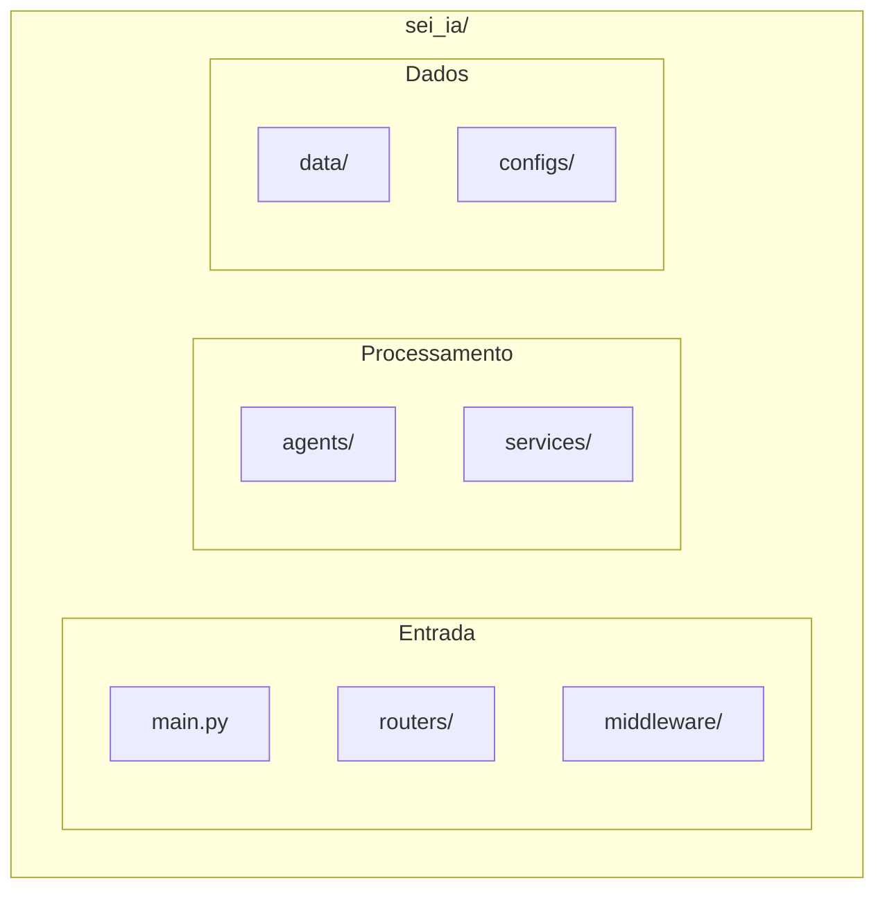

# Componentes / Components

> Descrição detalhada de cada componente do SEI-IA Assistente

## Visão Geral dos Componentes



---

## 1. Entry Point - main.py

**Arquivo**: `sei_ia/main.py`

**Responsabilidade**: Inicialização da aplicação FastAPI

### Funções Principais

| Função | Descrição |
|--------|-----------|
| `get_app()` | Cria instância FastAPI com middlewares |
| `initialize_database_tables()` | Lifespan handler para setup do banco |

### Fluxo de Inicialização

```python
# 1. Carrega variáveis de ambiente
load_dotenv()

# 2. Configura logging
setup_logging()

# 3. Inicializa Langfuse
initialize_langfuse_singleton()

# 4. Cria aplicação
app = get_app(enable_otel_metrics=settings.ENABLE_OTEL_METRICS)

# 5. Na inicialização (lifespan):
#    - Cria tabelas do banco
#    - Inicializa TableManager
```

---

## 2. Routers

**Diretório**: `sei_ia/routers/`

### Estrutura

```
routers/
├── __init__.py
├── healthcheck.py           # Health check
├── feedback.py              # Feedback do usuário
├── tests/                   # Endpoints de teste
└── chat/
    ├── gpt_4o_128k.py              # Modelo standard
    ├── gpt_4o_mini_128k.py         # Modelo mini
    └── gpt_endpoint.py             # Endpoint genérico
```

### Endpoints

| Arquivo | Endpoint | Model Type | Descrição |
|---------|----------|------------|-----------|
| healthcheck.py | `/health` | - | Status da API |
| feedback.py | `/feedback/feedback` | - | Enviar feedback |
| gpt_4o_128k.py | `/llm_lang/chat_gpt_4o_128k` | `standard` | Chat |
| gpt_4o_mini_128k.py | `/llm_lang/chat_gpt_4o_mini_128k` | `mini` | Chat |

> **Nota**: Os nomes dos arquivos e endpoints contêm "gpt_4o" por razões históricas (legado).

---

## 3. Middleware

**Diretório**: `sei_ia/middleware/`

### Componentes

| Arquivo | Classe | Função |
|---------|--------|--------|
| middleware_trace.py | `TraceMiddleware` | Adiciona trace ID |
| middleware_timeout.py | `TimeoutMiddleware` | Timeout de requisições |
| middleware_request.py | `RequestMiddleware` | Logging de requests |
| middleware_otel.py | `MetricsMeddleware` | Métricas OpenTelemetry |
| middleware_exception_handlers.py | - | Exception handlers globais |

### Ordem de Execução

```
Request → CORS → Trace → Timeout → Request → Router → Response
```

---

## 4. Agents

**Diretório**: `sei_ia/agents/`

### Estrutura

```
agents/
├── chat_completion_graph.py    # Workflow principal
├── intent_selector_agent.py    # Classificação de intenção
├── grammar_checker.py          # Correção gramatical
├── pergunta/                   # Handler de perguntas
│   ├── __init__.py
│   ├── chunk_extractor.py      # Extração de chunks
│   ├── multi_search_rag.py     # RAG com múltiplas queries
│   ├── question_generator.py   # Geração de perguntas
│   ├── document_decision.py    # Decisão de usar RAG
│   ├── document_validation.py  # Validação de documentos
│   ├── prompt_builders.py      # Construção de prompts
│   └── auto_indexing.py        # Indexação automática
├── summarize/                  # Sumarização
│   └── prompt_with_doc_summarization.py
├── websearch/                  # Busca web
│   └── azure_web_search_tool.py
├── disclaimer/                 # Classificação de disclaimer
│   └── __init__.py
├── rag/                        # Utilities de RAG
│   └── sources.py
├── memory/                     # Gerenciamento de memória
│   └── session/
└── prompts/                    # Prompts do sistema
    ├── system.py
    ├── intent_selector.py
    ├── question_generation.py
    ├── summarization.py
    ├── rag.py
    └── ...
```

### Componentes Principais

#### chat_completion_graph.py

O orquestrador principal usando LangGraph:

```python
async def build_chat_completion_graph() -> CompiledStateGraph:
    """Constrói o workflow de chat completion."""
    workflow = StateGraph(UserState)

    # Adiciona nós
    workflow.add_node("detect_document", initialize_document_processing_state)
    workflow.add_node("classify_disclaimer", classify_disclaimer_need)
    workflow.add_node("concatenate_docs", concatenate_documents)
    workflow.add_node("detect_intent", intent_selector_agent)
    workflow.add_node("handle_question", handle_question)
    workflow.add_node("handle_summarization", make_prompt_with_doc_summarization)
    workflow.add_node("generate_response", handle_response)

    # Define edges e condições
    workflow.add_conditional_edges(START, websearch_condition, ...)

    return workflow.compile()
```

#### intent_selector_agent.py

Classifica a intenção do usuário:

- `conversar` - Conversa geral
- `pergunta` - Pergunta sobre documentos
- `resumo` - Sumarização
- `reescrever` - Correção gramatical
- `multi_pergunta` - Múltiplas perguntas
- `analise` - Análise de documentos

---

## 5. Services

**Diretório**: `sei_ia/services/`

### Estrutura

```
services/
├── llm_models/
│   ├── get_model.py          # Factory de modelos
│   └── chat_workflow.py      # Chamadas ao LLM
├── embedder/
│   ├── embedding_generator.py # Geração de embeddings
│   ├── chunk_retriever.py     # Busca de chunks
│   ├── chunks.py              # Gerenciamento de chunks
│   ├── content_cleaner.py     # Limpeza de texto
│   ├── pipeline.py            # Pipeline de embedding
│   └── providers/
│       └── azure.py           # Provider Azure
├── cache/
│   ├── redis_client.py        # Cliente Redis
│   ├── cache_keys.py          # Geração de chaves
│   └── cache_cleanup_service.py
├── persistance/
│   └── feedback.py            # Persistência de feedback
├── exceptions/
│   ├── http_exceptions.py     # Exceções HTTP
│   ├── pdf_exceptions.py      # Erros de PDF
│   └── rag_exceptions.py      # Erros de RAG
├── counter.py                 # Contagem de tokens
└── validators.py              # Validações
```

### Componentes Principais

#### get_model.py

Factory para criação de modelos LLM via LiteLLM Proxy:

```python
from langchain_openai import ChatOpenAI

def get_model(model_type: str = "mini", temperature: float = 0.0) -> ChatOpenAI:
    """Retorna modelo LLM configurado via proxy."""
    config = get_model_config(model_type)

    # Para modelos de raciocínio (think), força temperature=1.0
    if model_type.lower() == "think":
        temperature = 1.0

    return ChatOpenAI(
        model=config["model"],               # "standard", "mini", "nano", "think"
        base_url=settings.LITELLM_PROXY_URL, # URL do proxy
        api_key=settings.LITELLM_PROXY_API_KEY or "dummy-key",
        temperature=temperature,
        max_tokens=config["max_tokens"],
    )
```

> **Nota**: A aplicação usa `ChatOpenAI` apontando para o LiteLLM Proxy.
> Os nomes reais dos modelos (gpt-4.1, gpt-5.1, etc.) são configurados no proxy.

#### embedding_generator.py

Geração de embeddings com Azure OpenAI:

```python
class EmbeddingGenerator:
    async def generate(self, texts: list[str]) -> list[list[float]]:
        """Gera embeddings para uma lista de textos."""
        # Usa batching e concorrência controlada
```

#### chunk_retriever.py

Busca de chunks similares usando pgvector:

```python
class ChunkRetriever:
    async def retrieve(self, query: str, top_k: int = 5) -> list[Chunk]:
        """Busca chunks mais similares à query."""
        # Usa operador <=> do pgvector para similaridade
```

---

## 6. Data

**Diretório**: `sei_ia/data/`

### Estrutura

```
data/
├── pydantic_models.py         # Modelos de dados
├── database/
│   ├── db_instances.py        # Conexões do banco
│   ├── db_models/
│   │   ├── embedding.py       # Modelo de embeddings
│   │   └── feedback.py        # Modelo de feedback
│   ├── table_manager.py       # Gerenciamento de tabelas
│   ├── async_db_connection.py # Conexão assíncrona
│   └── sei_db_handlers.py     # Handlers da API SEI
└── etl/
    ├── extract/
    │   ├── doc_content.py     # Extração de conteúdo
    │   ├── metadata.py        # Extração de metadados
    │   ├── internal.py        # Documentos internos
    │   └── external.py        # Documentos externos
    ├── text_preprocess.py     # Pré-processamento
    └── concatenate_documents.py  # Concatenação
```

### Modelos de Dados

#### UserState

Estado principal durante processamento:

```python
class UserState(TypedDict):
    id_request: int
    id_usuario: int
    user_request: str
    intent: Literal[...]
    model_type: Literal[...]
    doc_rag: bool
    response: dict[str, Any]
    # ... outros campos
```

#### ChatRequest

Request de entrada:

```python
class ChatRequest(BaseModel):
    id_usuario: int
    text: str
    system_prompt: str | None
    id_procedimentos: list[ItemRequestIdProcedimento] | None
    use_websearch: bool = False
```

---

## 7. Configs

**Diretório**: `sei_ia/configs/`

### Arquivos

| Arquivo | Descrição |
|---------|-----------|
| settings_config.py | Configurações da aplicação (Pydantic Settings) |
| logging_config.py | Configuração de logging |
| langfuse_config.py | Configuração do Langfuse |
| gunicorn_conf.py | Configuração do Gunicorn |

---

## Próximos Passos

- [Workflow LangGraph](workflow.md) - Fluxo detalhado do processamento
