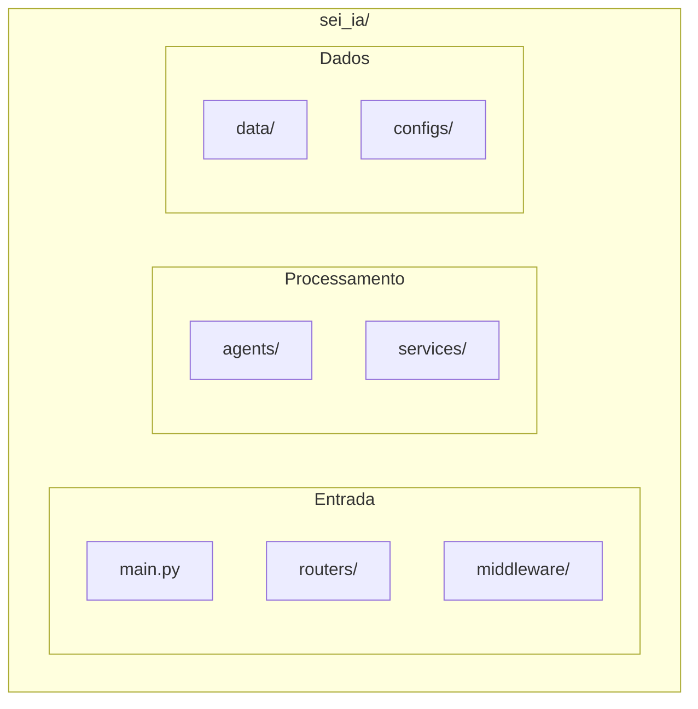

# Componentes / Components

> Descrição detalhada de cada componente do SEI-IA Assistente

## Visão Geral dos Componentes


```mermaid
graph TB
    subgraph "sei_ia/"
        subgraph "Entrada"
            A[main.py]
            B[routers/]
            C[middleware/]
        end

        subgraph "Processamento"
            D[agents/]
            E[services/]
        end

        subgraph "Dados"
            F[data/]
            G[configs/]
        end
    end
```

---

## 1. Entry Point - main.py

**Arquivo**: `sei_ia/main.py`

**Responsabilidade**: Inicialização da aplicação FastAPI

### Funções Principais

| Função | Descrição |
|--------|-----------|
| `get_app()` | Cria instância FastAPI com middlewares |
| `initialize_database_tables()` | Lifespan handler para setup do banco |

### Fluxo de Inicialização

```python
# 1. Carrega variáveis de ambiente
load_dotenv()

# 2. Configura logging
setup_logging()

# 3. Inicializa Langfuse
initialize_langfuse_singleton()

# 4. Cria aplicação
app = get_app(enable_otel_metrics=settings.ENABLE_OTEL_METRICS)

# 5. Na inicialização (lifespan):
#    - Cria tabelas do banco
#    - Inicializa TableManager
```

---

## 2. Routers

**Diretório**: `sei_ia/routers/`

### Estrutura

O chat é publicado por `routers/session/stream.py`. O pacote Session também
concentra os helpers de uploads e observabilidade usados na preparação e no
encerramento do stream.

| Arquivo | Endpoint | Descrição |
|---------|----------|-----------|
| healthcheck.py | `/health` | Status da API |
| feedback.py | `/feedback/feedback` | Enviar feedback |
| session/stream.py | `/llm_lang/session_stream` | Chat com sessão e resposta SSE |

O tier interno `mini` continua disponível; não existe um endpoint de chat por tier.

---

## 3. Middleware

**Diretório**: `sei_ia/middleware/`

### Componentes

| Arquivo | Classe | Função |
|---------|--------|--------|
| middleware_trace.py | `TraceMiddleware` | Adiciona trace ID |
| middleware_timeout.py | `TimeoutMiddleware` | Timeout de requisições |
| middleware_request.py | `RequestMiddleware` | Logging de requests |
| middleware_otel.py | `MetricsMeddleware` | Métricas OpenTelemetry |
| middleware_exception_handlers.py | - | Exception handlers globais |

### Ordem de Execução

```
Request → CORS → Trace → Timeout → Request → Router → Response
```

---

## 4. Agents

**Diretório**: `sei_ia/agents/`

O agente do chat publicado em produção está em `agents/session_agent/agent.py`.
Ele utiliza `services/session_fs/` para materialização, manifesto, checkpoints e
expiração. `routers/session/uploads.py` prepara anexos e gerencia o ciclo de
vida no SEI; `services/llm_models/message_content.py` concentra a construção
multimodal e extração de reasoning compartilhadas.

As ferramentas de busca web (`SearxCrawlAgent`, `WebResearchAgent` e
`DeepResearchAgent`) ficam em `agents/websearch/`.

RAG, pergunta e seus auxiliares diretos permanecem em `scripts/legado/`
(consulte `scripts/legado/README.md`). O grafo clássico, o seletor de intenção,
o revisor gramatical e a sumarização foram excluídos.

### Estrutura Ativa

```
agents/
├── session_agent/              # Agente principal da sessão (/llm_lang/session_stream)
│   ├── agent.py               # Definição e execução do agente
│   ├── prompts.py             # Prompts específicos da sessão
│   ├── mode.py                # Decisão de modo (injected vs filesystem)
│   └── read_session.py        # Leitura estruturada de arquivos da sessão
├── websearch/                  # Busca web e coleta de páginas
│   ├── searx_crawl_tool.py    # Integração com SearXNG e scrapers
│   ├── web_research_agent.py  # Busca rasa com janelas de contexto
│   └── deep_research_agent.py # Busca profunda com planejamento
└── prompts/                    # Prompts do sistema e formatadores
    ├── system.py
    └── web_search.py
```
---

## 5. Services

**Diretório**: `sei_ia/services/`

### Estrutura

```
services/
├── llm_models/
│   ├── get_model.py           # Factory de modelos via LiteLLM
│   ├── message_content.py     # Construção multimodal e reasoning
│   ├── stream_citations.py    # Processamento de tags de citação no stream
│   └── citation_sources.py    # Extração e metadados de fontes
├── session_fs/
│   ├── manager.py             # Gerenciamento de sessões e manifesto
│   ├── types.py               # Tipos e especificações documentais
│   └── checkpointer.py        # Checkpointing no PostgreSQL
├── embedder/                  # Infraestrutura de embeddings (ativa para startup)
│   ├── pipeline.py            # Pipeline de processamento
│   ├── embedding_generator.py # Gerador de embeddings (probe de inicialização)
│   └── providers/azure.py     # Provider Azure OpenAI
├── cache/
│   ├── redis_client.py        # Cliente Redis
│   └── cache_keys.py          # Geração de chaves
├── persistance/
│   └── feedback.py            # Persistência de feedback
├── exceptions/
│   ├── http_exceptions.py     # Exceções HTTP
│   └── embedding_exceptions.py # Exceções de embedding
└── counter.py                 # Contagem de tokens
```

Os componentes clássicos `chat_workflow.py` e `cache_cleanup_service.py` foram excluídos.

### Componentes Principais

#### get_model.py

Factory para criação de modelos LLM via LiteLLM Proxy:

A API da factory é `get_model(agent_tag, temperature=None, model_override=None, **kwargs)`.
`get_model_config` resolve o alias estável e a janela de contexto do papel.
O cliente `ChatOpenAI` usa o proxy LiteLLM e envia a tag `agents:<papel>`.
Os tiers `standard`, `mini` e `nano` não correspondem a endpoints HTTP separados.

#### embedding_generator.py

Geração de embeddings com Azure OpenAI:

```python
class EmbeddingGenerator:
    async def generate(self, texts: list[str]) -> list[list[float]]:
        """Gera embeddings para uma lista de textos."""
        # Usa batching e concorrência controlada
```

#### stream_citations.py e citation_sources.py

Processamento em tempo real de citações no streaming SSE (`/llm_lang/session_stream`),
extraindo tags de documentos, uploads e fontes web para compor as referências finais.
---

## 6. Data

**Diretório**: `sei_ia/data/`

### Estrutura

```
data/
├── pydantic_models.py         # Modelos de dados
├── database/
│   ├── db_instances.py        # Conexões do banco
│   ├── db_models/
│   │   ├── embedding.py       # Modelo de embeddings
│   │   └── feedback.py        # Modelo de feedback
│   ├── table_manager.py       # Gerenciamento de tabelas
│   ├── async_db_connection.py # Conexão assíncrona
│   └── sei_db_handlers.py     # Handlers da API SEI
└── etl/
    └── extract/
        ├── doc_content.py     # Extração de conteúdo documental (inclui get_doc_from_id_async)
        ├── metadata.py        # Extração de metadados
        ├── internal.py        # Documentos internos
        └── external.py        # Documentos externos
```

O orquestrador clássico de concatenação (`concatenate_documents.py`) foi excluído; a extração documental ativa permanece em `sei_ia/data/etl/extract/doc_content.py`.

### Modelos de Dados

#### UserState

Estado principal durante processamento:

```python
class UserState(TypedDict):
    id_request: int
    id_usuario: int
    user_request: str
    intent: Literal[...]
    model_type: Literal[...]
    doc_rag: bool
    response: dict[str, Any]
    # ... outros campos
```

#### ChatRequest

Request de entrada:

```python
class ChatRequest(BaseModel):
    id_usuario: int
    text: str
    system_prompt: str | None
    id_procedimentos: list[ItemRequestIdProcedimento] | None
    use_websearch: bool = False
```

---

## 7. Configs

**Diretório**: `sei_ia/configs/`

### Arquivos

| Arquivo | Descrição |
|---------|-----------|
| settings_config.py | Configurações da aplicação (Pydantic Settings) |
| logging_config.py | Configuração de logging |
| langfuse_config.py | Configuração do Langfuse |
| gunicorn_conf.py | Configuração do Gunicorn |

---

## Próximos Passos

- [Visão Geral da Arquitetura](overview.md) - Fluxo geral da aplicação
- [Endpoints da API](../api/endpoints.md) - Documentação dos endpoints REST
- Arquivo histórico: consulte `scripts/legado/README.md`
