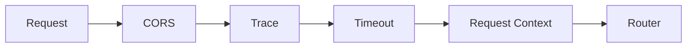
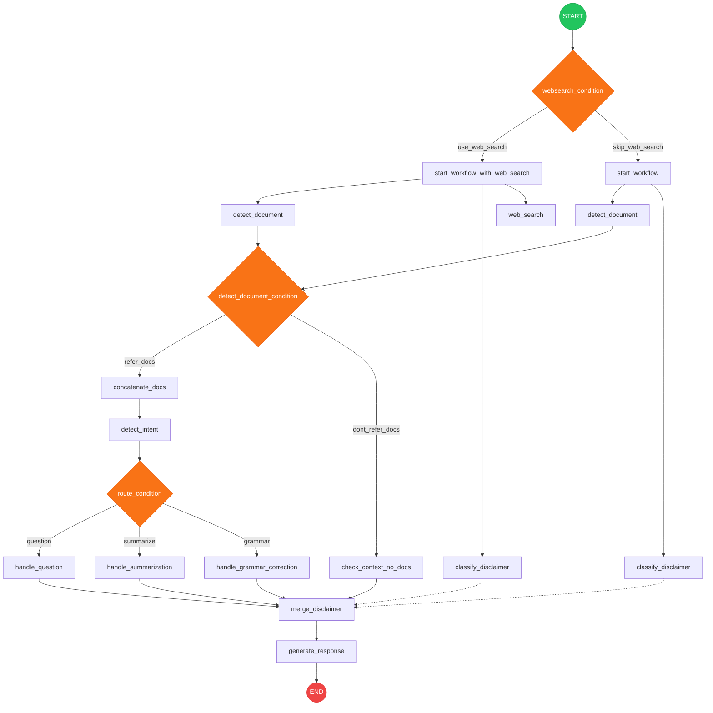
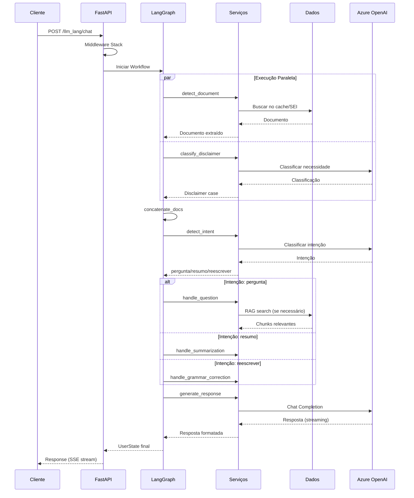

# Visão Geral da Arquitetura / Architecture Overview

> Arquitetura completa do SEI-IA Assistente

## Índice

O SEI-IA Assistente é estruturado em **8 camadas** que trabalham em conjunto para processar requisições de chat com inteligência artificial:

1. **Camada de Apresentação** - Interface com clientes externos
2. **Camada de API - FastAPI** - Routers, middlewares e validação
3. **Camada de Orquestração - LangGraph** - Workflow de processamento
4. **Camada de Agentes** - Processadores especializados
5. **Camada de Serviços** - Lógica de negócio e integrações
6. **Camada de Dados** - Persistência e acesso a dados
7. **APIs Externas** - Azure OpenAI, SEI API, Bing Search
8. **Observabilidade** - Langfuse e OpenTelemetry

---

## Camadas da Arquitetura

### 1. Camada de Apresentação

**Responsabilidade**: Interface com clientes externos

| Componente | Descrição |
|------------|-----------|
| Cliente HTTP | Requisições REST da aplicação SEI |
| Swagger/ReDoc | Documentação interativa da API |

**Arquivo principal**: `sei_ia/main.py`

---

### 2. Camada de API (FastAPI)

**Responsabilidade**: Receber requisições, validar entrada, aplicar middlewares



#### Routers

| Router | Path | Model Type |
|--------|------|------------|
| healthcheck | `/health` | - |
| chat_gpt_4o_128k | `/llm_lang/chat_gpt_4o_128k` | `standard` |
| chat_gpt_4o_mini_128k | `/llm_lang/chat_gpt_4o_mini_128k` | `mini` |
| feedback | `/feedback/feedback` | - |

> **Nota**: Os nomes dos endpoints contêm "gpt_4o" por razões históricas (legado).
> Os model types `standard` e `mini` são mapeados para os modelos atuais configurados no Azure OpenAI.

**Arquivos**: `sei_ia/routers/`

#### Middlewares

| Middleware | Função |
|------------|--------|
| CORSMiddleware | Permite requisições cross-origin |
| TraceMiddleware | Adiciona trace ID às requisições |
| TimeoutMiddleware | Limita tempo de execução |
| RequestMiddleware | Logging de requisições |
| MetricsMeddleware | Métricas OpenTelemetry |

**Arquivos**: `sei_ia/middleware/`

---

### 3. Camada de Orquestração (LangGraph)

**Responsabilidade**: Orquestrar o fluxo de processamento da requisição

O coração do sistema é o **Chat Completion Graph**, um workflow baseado em LangGraph com **12 nós** e **3s condicionais** que coordena todas as etapas do processamento.


**Detalhes do Workflow**:

| Aspecto | Descrição |
|---------|-----------|
| **Execução Paralela** | `detect_document`, `classify_disclaimer` e `web_search` (se ativo) executam em paralelo |
| **Condicionais** | 3 pontos de decisão: websearch, documentos, intenção |
| **Nós Funcionais** | 12 nós: start_workflow, detect_document, classify_disclaimer, web_search, concatenate_docs, check_context_no_docs, detect_intent, handle_question, handle_summarization, handle_grammar_correction, merge_disclaimer, generate_response |

**Arquivo principal**: `sei_ia/agents/chat_completion_graph.py`

---

### 4. Camada de Agentes

**Responsabilidade**: Processadores especializados para cada tipo de intenção e tarefa

#### Intent Selector

| Arquivo | Função |
|---------|--------|
| `intent_selector_agent.py` | Classifica a intenção do usuário (pergunta, resumo, reescrita) |

#### Question Handler (`agents/pergunta/`)

| Arquivo | Função |
|---------|--------|
| `__init__.py` | Orquestra o fluxo de processamento de perguntas |
| `chunk_extractor.py` | Extrai chunks relevantes do documento |
| `multi_search_rag.py` | Busca vetorial com múltiplas perguntas |
| `question_generator.py` | Gera perguntas alternativas para melhorar recall |
| `auto_indexing.py` | Indexação automática de documentos não indexados |
| `document_validation.py` | Valida se documentos estão indexados |
| `document_decision.py` | Decide entre documento completo ou RAG |
| `prompt_builders.py` | Constrói prompts otimizados com contexto |

#### Summarization Handler (`agents/summarize/`)

| Arquivo | Função |
|---------|--------|
| `prompt_with_doc_summarization.py` | Gera resumos de documentos |

#### Grammar Checker

| Arquivo | Função |
|---------|--------|
| `grammar_checker.py` | Corrige e reescreve textos |

#### Disclaimer Classifier (`agents/disclaimer/`)

| Arquivo | Função |
|---------|--------|
| `classify_disclaimer_need.py` | Identifica necessidade de avisos legais |
| `prepare_disclaimer.py` | Prepara texto do disclaimer |

#### Web Search Agent (`agents/websearch/`)

| Arquivo | Função |
|---------|--------|
| `azure_web_search_tool.py` | Busca informações na web via Bing API |

---

### 5. Camada de Serviços

**Responsabilidade**: Lógica de negócio e integrações técnicas

| Serviço | Responsabilidade | Arquivos |
|---------|------------------|----------|
| **LLM Service** | Chamadas aos modelos de linguagem | `services/llm_models/chat_workflow.py` |
| **Embedding Service** | Geração e busca de embeddings | `services/embedder/` |
| **Cache Service** | Gerenciamento de cache Redis | `services/cache/redis_client.py` |
| **ETL Service** | Extração de documentos do SEI | `data/etl/` |

---

### 6. Camada de Dados

**Responsabilidade**: Persistência e acesso a dados

| Componente | Tecnologia | Função |
|------------|------------|--------|
| PostgreSQL + pgvector | Banco relacional + vetorial | Embeddings, feedback, sessões |
| Redis | Cache em memória | Cache de documentos |
| SEI API | REST API | Extração de documentos |

**Arquivos**: `sei_ia/data/database/`

---

## Fluxo de uma Requisição



---

## Estado do Usuário (UserState)

O `UserState` é um TypedDict que carrega todo o contexto durante o processamento:

```python
class UserState(TypedDict):
    # Identificação
    id_request: int
    id_usuario: int
    id_topico: int | None

    # Documentos
    id_procedimentos: list[ItemRequestIdProcedimento] | None
    all_documents: list[str]

    # Requisição
    user_request: str
    system_prompt: str
    intent: Literal["conversar", "pergunta", "resumo", "escrever", "reescrever", ...]

    # Configuração do modelo
    model_type: Literal["mini", "standard", "nano", "think"]
    temperature: float
    general_max_output_tokens: int
    general_max_ctx_len: int

    # Flags de processamento
    doc_paged: bool | list
    doc_summarized: bool
    doc_rag: bool

    # RAG
    rag_method: str | None
    rag_chunks_data: dict | None

    # Resposta
    response: dict[str, Any]
```

**Arquivo**: `sei_ia/data/pydantic_models.py`

---

## Considerações de Performance

### Otimizações Implementadas

1. **Execução Paralela**: `detect_document` e `classify_disclaimer` executam em paralelo
2. **Cache Redis**: Documentos são cacheados para evitar re-extração
3. **Connection Pooling**: PostgreSQL e Redis usam pools de conexão
4. **Async/Await**: Todas as operações I/O são assíncronas
5. **Streaming**: Respostas são transmitidas via SSE

---

## Próximos Passos

- [Componentes](components.md) - Detalhes de cada componente
- [Workflow LangGraph](workflow.md) - Fluxo detalhado
