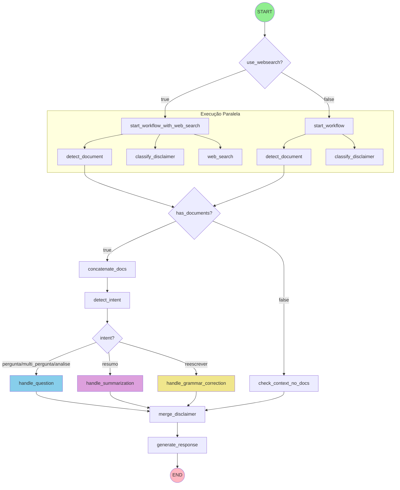
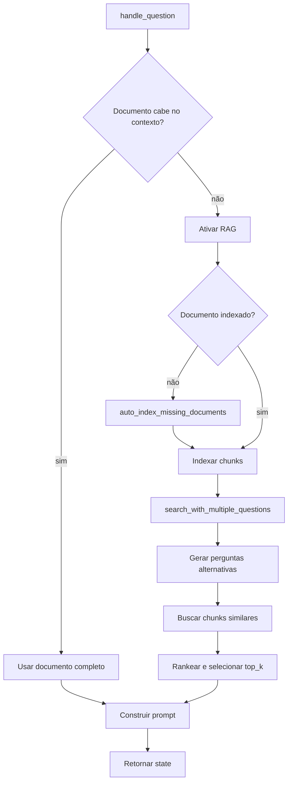

# Workflow LangGraph

> Fluxo detalhado do processamento de requisições

## Visão Geral

O SEI-IA Assistente utiliza [LangGraph](https://langchain-ai.github.io/langgraph/) para orquestrar o fluxo de processamento. O workflow é definido como um grafo de estados onde cada nó executa uma função específica.

**Arquivo principal**: `sei_ia/agents/chat_completion_graph.py`

---

## Diagrama Completo do Workflow



---

## Nós do Workflow

### 1. start_workflow / start_workflow_with_web_search

**Função**: Nó de entrada que dispara execução paralela

```python
async def start_parallel_flow(state: UserState) -> dict:
    """Node de entrada que inicia o fluxo paralelo."""
    return {}  # Não modifica estado, apenas dispara fanout
```

---

### 2. detect_document

**Função**: Inicializa o estado de documentos antes da concatenação

**Arquivo**: `sei_ia/data/etl/concatenate_documents.py`

```python
async def initialize_document_processing_state(state: UserState) -> dict:
    """Inicializa estado sem inferir paginação a partir do prompt."""
    return {"doc_paged": []}
```

**Saída**:
- `doc_paged`: Estado inicial da paginação

!!! note "Contrato atual"
    A paginação real dos documentos é lida dos campos `pag_doc_init` e
    `pag_doc_end` enviados no payload. O texto livre do usuário não é usado
    para descobrir intervalos de páginas.

---

### 3. classify_disclaimer

**Função**: Classifica se a resposta precisa de disclaimer

**Arquivo**: `sei_ia/agents/disclaimer/__init__.py`

```python
async def classify_disclaimer_need(state: UserState) -> dict:
    """Classifica necessidade de disclaimer."""
    # Analisa contexto e user_request
    # Determina se resposta pode conter:
    # - Previsões
    # - Suposições
    # - Elementos fictícios
    return {"disclaimer_case": "case_a" | "case_b" | None}
```

---

### 4. web_search

**Função**: Executa busca web com Azure Bing (opcional)

**Arquivo**: `sei_ia/agents/websearch/azure_web_search_tool.py`

```python
async def web_search_node(state: UserState) -> dict:
    """Executa busca web e armazena resultado."""
    agent = BingGroundingAgent()
    result = await agent.process_user_prompt(enriched_system)

    # Extrai resultados das ToolMessages
    tool_web_search = [{"content": ..., "query": ..., "references": []}]

    return {"tool_web_search": tool_web_search}
```

---

### 5. concatenate_docs

**Função**: Concatena múltiplos documentos em um único contexto

**Arquivo**: `sei_ia/data/etl/concatenate_documents.py`

```python
async def concatenate_documents(state: UserState) -> dict:
    """Concatena documentos e conta tokens."""
    # 1. Para cada documento em id_procedimentos
    # 2. Extrai conteúdo (cache ou API)
    # 3. Concatena com separadores
    # 4. Conta tokens totais
    return {"all_tokens_counter": total_tokens, ...}
```

---

### 6. detect_intent

**Função**: Classifica a intenção do usuário

**Arquivo**: `sei_ia/agents/intent_selector_agent.py`

```python
async def intent_selector_agent(state: UserState) -> dict:
    """Classifica intenção usando LLM."""
    # Prompt estruturado com categorias:
    # - conversar: Conversa geral
    # - pergunta: Pergunta sobre documentos
    # - resumo: Sumarização
    # - reescrever: Correção gramatical
    # - multi_pergunta: Múltiplas perguntas
    # - analise: Análise de documentos

    return {"intent": classified_intent}
```

**Intenções Possíveis**:

| Intenção | Descrição | Handler |
|----------|-----------|---------|
| `conversar` | Conversa geral sem documentos | merge_disclaimer |
| `pergunta` | Pergunta sobre documento específico | handle_question |
| `resumo` | Resumir documento | handle_summarization |
| `reescrever` | Correção/tradução | handle_grammar_correction |
| `multi_pergunta` | Múltiplas perguntas | handle_question |
| `analise` | Análise de documento | handle_question |

---

### 7. handle_question

**Função**: Processa perguntas sobre documentos

**Arquivo**: `sei_ia/agents/pergunta/__init__.py`

```python
async def handle_question(state: UserState) -> UserState:
    """Handler para intenção pergunta."""
    state = await process_question_intent(state)
    return state
```

**Subfluxo do RAG**:



---

### 8. handle_summarization

**Função**: Sumariza documentos

**Arquivo**: `sei_ia/agents/summarize/prompt_with_doc_summarization.py`

```python
async def make_prompt_with_doc_summarization(state: UserState) -> dict:
    """Constrói prompt para sumarização."""
    # Se documento muito grande:
    # - Divide em chunks
    # - Sumariza cada chunk
    # - Combina resumos
    return {"last_prompt": summarization_prompt, "doc_summarized": True}
```

---

### 9. handle_grammar_correction

**Função**: Corrige/traduz texto

**Arquivo**: `sei_ia/agents/grammar_checker.py`

```python
async def make_prompt_with_doc_grammar_correction(state: UserState) -> dict:
    """Constrói prompt para correção gramatical."""
    # Usa system prompt específico para correção
    return {"last_prompt": correction_prompt}
```

---

### 10. merge_disclaimer

**Função**: Prepara texto do disclaimer

**Arquivo**: `sei_ia/agents/disclaimer/__init__.py`

```python
async def prepare_disclaimer_for_response(state: UserState) -> dict:
    """Prepara disclaimer baseado na classificação."""
    if state.get("disclaimer_case"):
        disclaimer_text = DISCLAIMER_TEXTS[state["disclaimer_case"]]
        return {"disclaimer_text": disclaimer_text}
    return {}
```

---

### 11. generate_response

**Função**: Gera resposta final usando LLM

**Arquivo**: `sei_ia/agents/chat_completion_graph.py`

```python
async def handle_response(state: UserState, writer: StreamWriter = None) -> UserState:
    """Gera resposta com streaming."""
    # 1. Stream disclaimer primeiro (se houver)
    if disclaimer_text and writer:
        writer(disclaimer_text)

    # 2. Chama LLM com streaming
    response = await chat_gpt(state, writer=writer)

    # 3. Processa marcadores de fonte (RAG/web)
    if state.get("doc_rag") or has_markers:
        response = transform_response_sources_enhanced(response, state)

    # 4. Adiciona disclaimer na resposta
    state["response"] = response
    return state
```

---

## Condições de Roteamento

### websearch_condition

```python
def websearch_condition(state: UserState) -> str:
    if state.get("use_websearch", False):
        return "use_web_search"
    return "skip_web_search"
```

### detect_document_condition

```python
def detect_document_condition(state: UserState) -> str:
    if len(state["all_documents"]) > 0:
        return "refer_docs"
    return "dont_refer_docs"
```

### route_condition

```python
def route_condition(state: UserState) -> str:
    if state["intent"] == "reescrever":
        return "grammar"
    if state["intent"] in ("multi_pergunta", "analise", "pergunta"):
        return "question"
    return "summarize"
```

---

## Execução Paralela

O workflow utiliza execução paralela para otimizar performance:

```python
# Edges paralelos do start_workflow
workflow.add_edge("start_workflow", "detect_document")
workflow.add_edge("start_workflow", "classify_disclaimer")

# Com web search: 3 tarefas paralelas
workflow.add_edge("start_workflow_with_web_search", "detect_document")
workflow.add_edge("start_workflow_with_web_search", "classify_disclaimer")
workflow.add_edge("start_workflow_with_web_search", "web_search")
```

---

## Streaming de Resposta

O workflow suporta streaming via LangGraph:

```python
from langgraph.config import get_stream_writer

async def handle_response(state, writer=None):
    writer = get_stream_writer()  # Obtém writer do contexto

    # Stream disclaimer
    if disclaimer_text:
        writer(disclaimer_text)

    # Stream resposta do LLM
    response = await chat_gpt(state, writer=writer)
```

---

## Próximos Passos

- [Sistema RAG](../rag-system/overview.md) - Detalhes do RAG
- [Agentes](../agents/overview.md) - Detalhes dos agentes
