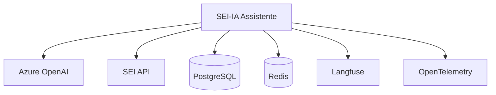

# Integrações / Integrations

Esta seção documenta as integrações externas do SEI-IA Assistente.

## Conteúdo

1. [Azure OpenAI](azure-openai.md) - LLMs e Embeddings
2. [SEI API](sei-api.md) - Extração de documentos
3. [PostgreSQL](postgresql.md) - Banco de dados + pgvector
4. [Redis](redis.md) - Cache
5. [Observabilidade](observability.md) - Langfuse + OpenTelemetry

## Diagrama de Integrações

