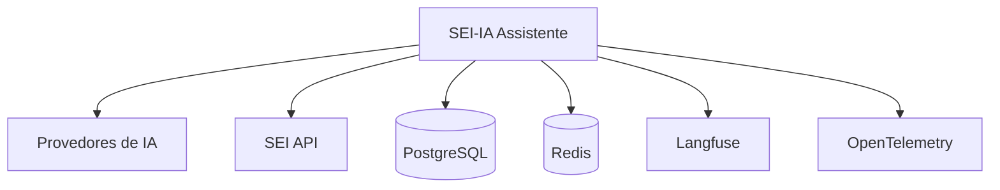

# Integrações / Integrations

Esta seção documenta as integrações externas do SEI-IA Assistente.

## Conteúdo

1. Providers de modelos (LLM/embedding/transcrição), todos via LiteLLM Proxy — escolha um, dois ou os três; não é preciso configurar todos, e nenhum depende dos outros:
   1. [Azure OpenAI](azure-openai.md) - LLMs, Embeddings e Whisper (STT)
   2. [AWS Bedrock](aws-bedrock.md) - LLMs e Embeddings
   3. [Google Vertex AI](google-vertex-ai.md) - LLMs (Gemini e Claude via Model Garden) e Embeddings

Demais integrações:

2. [SEI API](sei-api.md) - Extração de documentos
3. [PostgreSQL](postgresql.md) - Banco de dados + pgvector
4. [Redis](redis.md) - Cache
5. [Observabilidade](observability.md) - Langfuse + OpenTelemetry

## Diagrama de Integrações

```mermaid
graph TB
    A[SEI-IA Assistente] --> B[Provedores de IA]
    A --> C[SEI API]
    A --> D[(PostgreSQL)]
    A --> E[(Redis)]
    A --> G[Langfuse]
    A --> H[OpenTelemetry]
```
