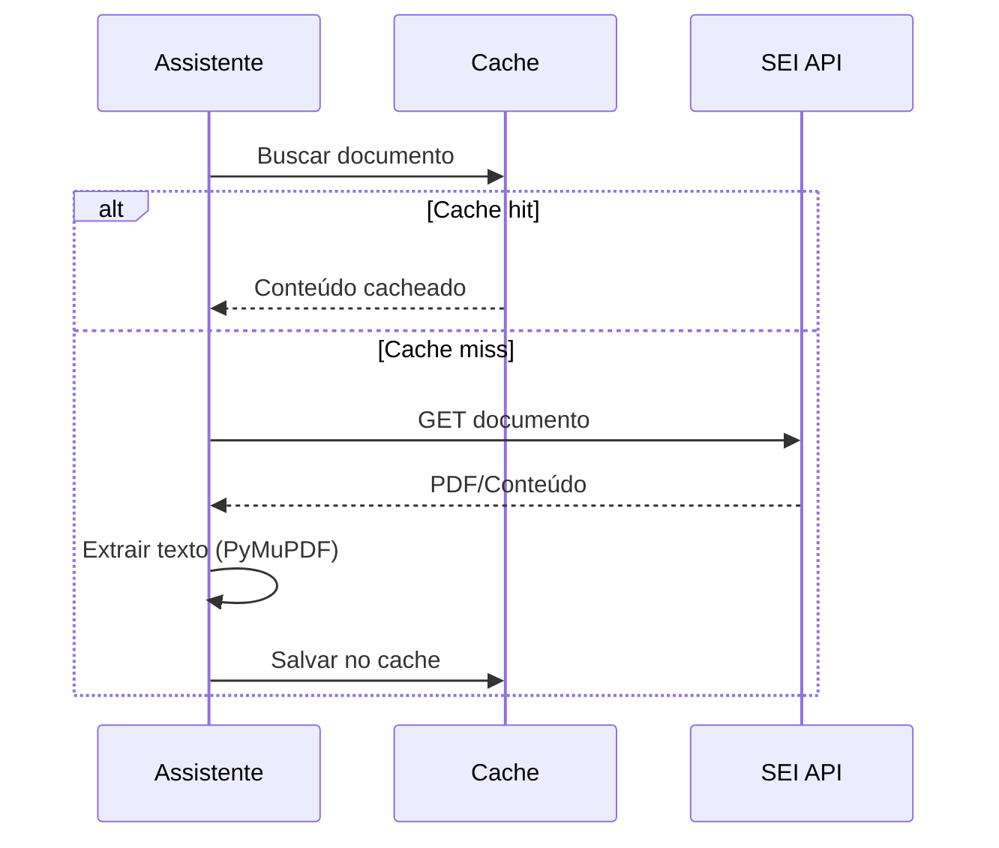

# SEI API

> Integração com o Sistema Eletrônico de Informações

## Visão Geral

A SEI API é usada para extrair conteúdo de documentos do sistema SEI.

**Arquivo**: `sei_ia/data/database/sei_db_handlers.py`

## Configuração

```bash
SEI_API_DB_ADDRESS=https://api-sei.exemplo.gov.br
SEI_API_DB_IDENTIFIER_SERVICE=seu_token_servico
SEI_API_DB_USER=Usuario_IA
SEI_API_DB_TIMEOUT=120
SEI_API_SEMAPHORE=30
```

## Funcionalidades

| Função | Descrição |
|--------|-----------|
| Extração de documentos | Obtém conteúdo de PDFs e anexos |
| Metadados | Extrai informações do processo |
| Retry automático | Retry com backoff em erros |

## Fluxo de Extração



## Tratamento de Erros

```python
class SeiDBAPIError(Exception):
    """Erro da API SEI."""
    pass

# Retry automático em timeouts
@backoff.on_exception(backoff.expo, TimeoutError, max_tries=3)
async def fetch_document(doc_id: str):
    ...
```
