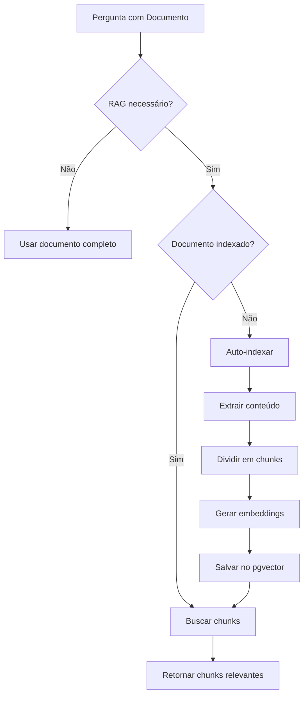

# Indexação Automática / Auto-Indexing

> Indexação automática de documentos para RAG

## Visão Geral

O sistema indexa automaticamente documentos quando são referenciados em uma pergunta e ainda não estão no banco de embeddings.

---

## Fluxo de Auto-Indexação



---

## Verificação de Indexação

```python
# sei_ia/agents/pergunta/document_validation.py

async def is_document_indexed(doc_id: str) -> bool:
    """Verifica se documento já possui embeddings."""
    async with get_session() as session:
        result = await session.execute(
            text("""
                SELECT COUNT(*) as count
                FROM embeddings
                WHERE id_documento = :doc_id
            """),
            {"doc_id": doc_id}
        )
        row = result.fetchone()
        return row.count > 0

async def get_indexed_documents(doc_ids: list[str]) -> set[str]:
    """Retorna conjunto de documentos já indexados."""
    async with get_session() as session:
        result = await session.execute(
            text("""
                SELECT DISTINCT id_documento
                FROM embeddings
                WHERE id_documento = ANY(:doc_ids)
            """),
            {"doc_ids": doc_ids}
        )
        return {row.id_documento for row in result.fetchall()}
```

---

## Processo de Indexação

```python
# sei_ia/agents/pergunta/auto_indexing.py

async def auto_index_missing_documents(
    state: UserState,
    document_ids: list[str]
) -> dict[str, int]:
    """
    Indexa automaticamente documentos que não possuem embeddings.

    Args:
        state: Estado do usuário com conteúdo dos documentos
        document_ids: Lista de IDs de documentos a verificar

    Returns:
        Dict com documento_id -> número de chunks criados
    """
    # 1. Identificar documentos não indexados
    indexed = await get_indexed_documents(document_ids)
    missing = [d for d in document_ids if d not in indexed]

    if not missing:
        logger.info("Todos os documentos já estão indexados")
        return {}

    logger.info(f"Indexando {len(missing)} documentos: {missing}")

    indexed_counts = {}

    # 2. Processar cada documento
    for doc_id in missing:
        # Obter conteúdo do documento
        content = get_document_content(state, doc_id)

        if not content:
            logger.warning(f"Documento {doc_id} sem conteúdo para indexar")
            continue

        # Indexar
        chunk_count = await index_document(doc_id, content)
        indexed_counts[doc_id] = chunk_count

        logger.info(f"Documento {doc_id} indexado com {chunk_count} chunks")

    return indexed_counts


async def index_document(doc_id: str, content: str) -> int:
    """
    Indexa um documento criando embeddings para seus chunks.

    Args:
        doc_id: ID do documento
        content: Conteúdo textual do documento

    Returns:
        Número de chunks criados
    """
    # 1. Dividir em chunks
    chunk_manager = ChunkManager(
        chunk_size=settings.MAX_LENGTH_CHUNK_SIZE,
        chunk_overlap=settings.CHUNK_OVERLAP
    )
    chunks = chunk_manager.split_document(content)

    if not chunks:
        return 0

    # 2. Gerar embeddings em batch
    generator = EmbeddingGenerator()
    texts = [c.content for c in chunks]
    embeddings = await generator.generate(texts)

    # 3. Preparar registros
    records = []
    for chunk, embedding in zip(chunks, embeddings):
        records.append({
            "chunk_id": uuid.uuid4(),
            "id_documento": doc_id,
            "chunk_content": chunk.content,
            "embedding": embedding,
            "start_position": chunk.start_position,
            "finished_position": chunk.end_position,
            "metadata": {
                "token_count": chunk.token_count,
                "indexed_at": datetime.utcnow().isoformat()
            }
        })

    # 4. Salvar no banco
    async with get_session() as session:
        await session.execute(
            insert(EmbeddingsTable),
            records
        )
        await session.commit()

    return len(records)
```

---

## Integração no Workflow

A auto-indexação é chamada no handler de perguntas:

```python
# sei_ia/agents/pergunta/__init__.py

async def process_question_intent(state: UserState) -> UserState:
    """Processa intenção de pergunta com RAG."""

    # Verificar se precisa de RAG
    if state["all_tokens_counter"] <= state["limit_rag"]:
        # Documento cabe no contexto
        state["doc_rag"] = False
        return build_prompt_with_full_doc(state)

    # Ativar RAG
    state["doc_rag"] = True
    state["rag_method"] = "enhanced"

    # Auto-indexar documentos se necessário
    indexed = await auto_index_missing_documents(
        state,
        state["all_documents"]
    )

    if indexed:
        logger.info(f"Auto-indexados: {indexed}")

    # Continuar com busca de chunks
    chunks = await search_with_multiple_questions(
        state["user_request"],
        state["all_documents"]
    )

    state["rag_chunks_data"] = chunks
    state["rag_chunks_count"] = len(chunks)

    return state
```

---

## Limpeza de Índice

Para reindexar um documento (ex: após atualização):

```python
async def delete_document_embeddings(doc_id: str) -> int:
    """Remove todos os embeddings de um documento."""
    async with get_session() as session:
        result = await session.execute(
            text("""
                DELETE FROM embeddings
                WHERE id_documento = :doc_id
                RETURNING chunk_id
            """),
            {"doc_id": doc_id}
        )
        deleted = len(result.fetchall())
        await session.commit()
        return deleted


async def reindex_document(doc_id: str, content: str) -> int:
    """Reindexa um documento (delete + insert)."""
    await delete_document_embeddings(doc_id)
    return await index_document(doc_id, content)
```

---

## Configurações

```python
# settings_config.py

# Tamanho do chunk em tokens
MAX_LENGTH_CHUNK_SIZE = 1512

# Overlap entre chunks
CHUNK_OVERLAP = 50

# Concorrência para geração de embeddings
EMBEDDINGS_MAX_CONCURRENCY = 20
```

---

## Considerações de Performance

### Indexação em Background

Para documentos muito grandes, considere indexação assíncrona:

```python
from asyncio import create_task

async def index_document_background(doc_id: str, content: str):
    """Indexa documento em background."""
    task = create_task(index_document(doc_id, content))
    # Não aguarda conclusão
    return task
```

### Batch Indexing

Para múltiplos documentos:

```python
async def batch_index_documents(docs: list[tuple[str, str]]) -> dict:
    """Indexa múltiplos documentos em paralelo."""
    tasks = [
        index_document(doc_id, content)
        for doc_id, content in docs
    ]
    results = await asyncio.gather(*tasks, return_exceptions=True)
    return dict(zip([d[0] for d in docs], results))
```

---

## Monitoramento

### Logs

```
INFO - Indexando 2 documentos: ['12345678', '87654321']
INFO - Documento 12345678 indexado com 15 chunks
INFO - Documento 87654321 indexado com 8 chunks
```

### Métricas

```python
# Exemplo de métricas a coletar
indexing_duration_seconds = Histogram(
    "rag_indexing_duration_seconds",
    "Tempo de indexação de documento"
)

chunks_indexed_total = Counter(
    "rag_chunks_indexed_total",
    "Total de chunks indexados"
)
```

---

## Troubleshooting

### Documento não indexado

1. Verificar se documento tem conteúdo
2. Verificar logs de erro na geração de embeddings
3. Verificar conexão com Azure OpenAI

### Indexação lenta

1. Verificar tamanho do documento
2. Aumentar `EMBEDDINGS_MAX_CONCURRENCY`
3. Verificar latência da API Azure

### Erro de duplicação

```python
# Usar ON CONFLICT para evitar duplicatas
await session.execute(
    text("""
        INSERT INTO embeddings (...)
        ON CONFLICT (chunk_id) DO NOTHING
    """)
)
```

---

## Próximos Passos

- [Retrieval](retrieval.md) - Como os chunks são buscados
- [Embeddings](embeddings.md) - Detalhes da geração
