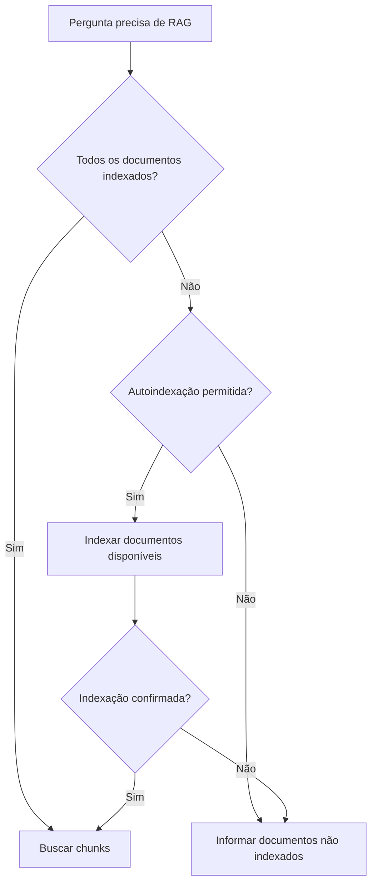

# Indexação automática

> Indexação sob demanda dos documentos ausentes no RAG

## Quando ocorre

O handler de perguntas verifica a tabela de embeddings quando os documentos não
cabem integralmente no contexto. Se a proporção de documentos ausentes permitir
autoindexação, ele processa os documentos disponíveis no `UserState`, grava os
chunks no pgvector e verifica novamente a indexação antes de fazer a busca RAG.

```mermaid
flowchart TD
    A[Pergunta precisa de RAG] --> B{Todos os documentos indexados?}
    B -->|Sim| G[Buscar chunks]
    B -->|Não| C{Autoindexação permitida?}
    C -->|Não| H[Informar documentos não indexados]
    C -->|Sim| D[Indexar documentos disponíveis]
    D --> E{Indexação confirmada?}
    E -->|Sim| G
    E -->|Não| H
```

O limite que decide se a autoindexação é recomendada fica em
`should_auto_index`, em `sei_ia/agents/pergunta/auto_indexing.py`. Os tamanhos de
chunk e os limites de concorrência pertencem a
`sei_ia/configs/settings_config.py`.

## Processamento

`indexing_embeddings`, em `sei_ia/services/embedder/pipeline.py`, localiza cada
documento no estado, divide seu conteúdo em chunks, gera embeddings pelo proxy
LiteLLM e faz upsert no pgvector. O produtor e os consumidores do pool obedecem
ao contrato de entrada descrito em [Embeddings](embeddings.md#validacao-de-entrada).

Documentos sem conteúdo extraível não são ignorados e não contam como
indexados. A indexação falha antes de chamar um cliente de embeddings.

## Contrato de falha

Os lotes concorrentes terminam antes da agregação dos erros. A autoindexação
registra cada exceção com traceback e devolve uma `AutoIndexingException`
sanitizada:

- falha de conteúdo resulta em status 400;
- somente falhas internas resultam em status 500;
- a resposta informa contagens e expõe no máximo cinco IDs de documentos;
- conteúdo de documentos e listas completas não entram na resposta.

O handler de perguntas preserva `AutoIndexingException` e
`EmbeddingInputException`. O handler de streaming as serializa no SSE como
`HTTPException`, sem convertê-las em erro de LiteLLM ou Azure. Exceções fora
dessa hierarquia seguem o tratamento genérico de documentos não indexados.

## Implementação autoritativa

- decisão e agregação:
  `sei_ia/agents/pergunta/auto_indexing.py`;
- preservação até o fluxo de pergunta:
  `sei_ia/agents/pergunta/__init__.py`;
- produção, leitura e gravação:
  `sei_ia/services/embedder/pipeline.py`;
- erros públicos:
  `sei_ia/services/exceptions/embedding_exceptions.py`.
