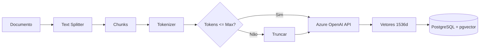

# Embeddings

> Geração e gerenciamento de embeddings vetoriais

## Visão Geral

Embeddings são representações vetoriais de texto que capturam significado semântico. O SEI-IA usa embeddings para:

- Indexar chunks de documentos
- Buscar trechos semanticamente similares
- Habilitar RAG (Retrieval-Augmented Generation)

---

## Modelo de Embedding

| Propriedade | Valor |
|-------------|-------|
| Modelo | `text-embedding-3-small` |
| Provider | Azure OpenAI |
| Dimensões | 1536 |
| Max Tokens | 8191 |

---

## Pipeline de Embedding



---

## Configurações

```python
# settings_config.py

# Provider de embeddings
EMBEDDING_PROVIDER = "azure"

# Modelo
EMBEDDING_MODEL = "text-embedding-3-small"

# Tamanho máximo do chunk em tokens
MAX_LENGTH_CHUNK_SIZE = 1512

# Overlap entre chunks (caracteres)
CHUNK_OVERLAP = 50

# Concorrência máxima
EMBEDDINGS_MAX_CONCURRENCY = 20
```

---

## EmbeddingGenerator

Classe principal para geração de embeddings:

```python
# sei_ia/services/embedder/embedding_generator.py

class EmbeddingGenerator:
    def __init__(self):
        self.client = AsyncAzureOpenAI(
            api_key=settings.EMBEDDING_API_KEY,
            azure_endpoint=settings.EMBEDDING_ENDPOINT,
            api_version=settings.OPENAI_API_VERSION
        )
        self.model = settings.EMBEDDING_MODEL
        self.semaphore = asyncio.Semaphore(settings.EMBEDDINGS_MAX_CONCURRENCY)

    async def generate(self, texts: list[str]) -> list[list[float]]:
        """Gera embeddings para uma lista de textos."""
        async with self.semaphore:
            response = await self.client.embeddings.create(
                input=texts,
                model=self.model
            )
            return [e.embedding for e in response.data]

    async def generate_single(self, text: str) -> list[float]:
        """Gera embedding para um único texto."""
        embeddings = await self.generate([text])
        return embeddings[0]
```

---

## Chunking de Documentos

O documento é dividido em chunks menores antes da geração de embeddings:

```python
# sei_ia/services/embedder/chunks.py

class ChunkManager:
    def __init__(
        self,
        chunk_size: int = 1512,
        chunk_overlap: int = 50
    ):
        self.chunk_size = chunk_size
        self.chunk_overlap = chunk_overlap
        self.tokenizer = tiktoken.get_encoding("o200k_base")

    def split_document(self, text: str) -> list[Chunk]:
        """Divide documento em chunks."""
        chunks = []
        tokens = self.tokenizer.encode(text)

        start = 0
        while start < len(tokens):
            end = min(start + self.chunk_size, len(tokens))

            chunk_tokens = tokens[start:end]
            chunk_text = self.tokenizer.decode(chunk_tokens)

            chunks.append(Chunk(
                content=chunk_text,
                start_position=start,
                end_position=end,
                token_count=len(chunk_tokens)
            ))

            # Próximo chunk com overlap
            start = end - self.chunk_overlap

        return chunks
```

### Exemplo de Chunking

```
Documento original (5000 tokens):
"Lorem ipsum dolor sit amet, consectetur adipiscing elit..."

Chunks gerados:
[
    Chunk(content="Lorem ipsum...", start=0, end=1512),
    Chunk(content="...adipiscing elit...", start=1462, end=2974),  # overlap 50
    Chunk(content="...sed do eiusmod...", start=2924, end=4436),
    Chunk(content="...tempor incididunt...", start=4386, end=5000)
]
```

---

## Armazenamento (pgvector)

Os embeddings são armazenados no PostgreSQL com a extensão pgvector:

```sql
-- Tabela de embeddings
CREATE TABLE embeddings (
    chunk_id UUID PRIMARY KEY DEFAULT gen_random_uuid(),
    id_documento VARCHAR(50) NOT NULL,
    embedding VECTOR(1536) NOT NULL,
    chunk_content TEXT NOT NULL,
    start_position INTEGER NOT NULL,
    finished_position INTEGER NOT NULL,
    created_at TIMESTAMP DEFAULT NOW(),
    metadata JSONB DEFAULT '{}'
);

-- Índice para busca por documento
CREATE INDEX idx_embeddings_doc ON embeddings(id_documento);

-- Índice vetorial (IVFFlat)
CREATE INDEX idx_embeddings_vector ON embeddings
USING ivfflat (embedding vector_cosine_ops)
WITH (lists = 100);
```

---

## Modelo SQLAlchemy

```python
# sei_ia/data/database/db_models/embedding.py

from sqlalchemy import Column, String, Integer, Text, DateTime
from sqlalchemy.dialects.postgresql import UUID, JSONB
from pgvector.sqlalchemy import Vector

class EmbeddingsTable(Base):
    __tablename__ = "embeddings"

    chunk_id = Column(UUID(as_uuid=True), primary_key=True)
    id_documento = Column(String(50), nullable=False, index=True)
    embedding = Column(Vector(1536), nullable=False)
    chunk_content = Column(Text, nullable=False)
    start_position = Column(Integer, nullable=False)
    finished_position = Column(Integer, nullable=False)
    created_at = Column(DateTime, server_default=func.now())
    metadata = Column(JSONB, default={})
```

---

## Pipeline Completo

```python
async def index_document(doc_id: str, content: str) -> int:
    """Indexa um documento gerando embeddings para seus chunks."""

    # 1. Dividir em chunks
    chunk_manager = ChunkManager()
    chunks = chunk_manager.split_document(content)

    # 2. Gerar embeddings em batch
    generator = EmbeddingGenerator()
    texts = [c.content for c in chunks]
    embeddings = await generator.generate(texts)

    # 3. Salvar no banco
    records = []
    for chunk, embedding in zip(chunks, embeddings):
        records.append({
            "id_documento": doc_id,
            "chunk_content": chunk.content,
            "embedding": embedding,
            "start_position": chunk.start_position,
            "finished_position": chunk.end_position,
        })

    async with get_session() as session:
        session.execute(insert(EmbeddingsTable), records)
        await session.commit()

    return len(chunks)
```

---

## Otimizações

### 1. Batch Processing

Processa múltiplos textos em uma única chamada API:

```python
# Máximo de textos por batch (limite da API)
MAX_BATCH_SIZE = 2048

async def generate_batched(self, texts: list[str]) -> list[list[float]]:
    all_embeddings = []
    for i in range(0, len(texts), MAX_BATCH_SIZE):
        batch = texts[i:i + MAX_BATCH_SIZE]
        embeddings = await self.generate(batch)
        all_embeddings.extend(embeddings)
    return all_embeddings
```

### 2. Concorrência Controlada

Semáforo para limitar requisições simultâneas:

```python
self.semaphore = asyncio.Semaphore(20)  # Máximo 20 requisições paralelas

async def generate_with_limit(self, texts):
    async with self.semaphore:
        return await self._call_api(texts)
```

### 3. Cache de Embeddings

Embeddings já gerados são reutilizados:

```python
async def get_or_create_embeddings(doc_id: str, content: str):
    # Verificar se já existe
    existing = await get_embeddings_by_doc(doc_id)
    if existing:
        return existing

    # Gerar novos
    return await index_document(doc_id, content)
```

---

## Troubleshooting

### Erro: Rate Limit

```python
# Implementar retry com backoff
@backoff.on_exception(
    backoff.expo,
    openai.RateLimitError,
    max_tries=5
)
async def generate_with_retry(self, texts):
    return await self.generate(texts)
```

### Erro: Token Limit Exceeded

```python
# Verificar tamanho antes de enviar
def validate_chunk_size(self, text: str) -> bool:
    tokens = self.tokenizer.encode(text)
    return len(tokens) <= 8191  # Limite do modelo
```

---

## Referências

- [Azure OpenAI Embeddings](https://learn.microsoft.com/azure/ai-services/openai/concepts/understand-embeddings)
- [pgvector Documentation](https://github.com/pgvector/pgvector)
- [tiktoken](https://github.com/openai/tiktoken)
