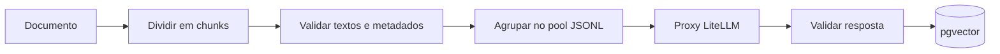

# Embeddings

> Geração e armazenamento dos vetores usados pelo RAG

## Fluxo

O Assistente divide o texto em chunks, agrupa os chunks em pools compatíveis
com o limite de contexto, gera os embeddings pelo proxy LiteLLM e faz upsert no
pgvector.

```mermaid
flowchart LR
    A[Documento] --> B[Dividir em chunks]
    B --> C[Validar textos e metadados]
    C --> D[Agrupar no pool JSONL]
    D --> E[Proxy LiteLLM]
    E --> F[Validar resposta]
    F --> G[(pgvector)]
```

O request usa sempre o alias público `embedding`. O `LITELLM_EMBEDDING_MODEL`
físico permanece na identidade da tabela, enquanto tokenizer, tamanho de chunk e
limites de concorrência pertencem a `sei_ia/configs/settings_config.py`. A dimensão
e o schema da tabela são contratos de `docs/agent_docs/database_schema.md`, na raiz
do monorepo.

## Validação de entrada

O pipeline rejeita entradas vazias antes de qualquer chamada ao cliente de
embeddings:

- conteúdo ausente, composto só por espaços ou sem chunks gera
  `DocumentContentNotExtractableException`, associada ao ID do documento;
- o produtor não grava um item de pool sem `input_texts` e também rejeita
  `input_texts`, `chunk_ids` e `positions` desalinhados;
- leitores de pools legados, executores assíncronos e o provedor repetem a
  validação na borda. Lista vazia, texto vazio, item não textual ou texto
  composto só por espaços gera `EmptyEmbeddingInputException` antes de rede;
- quando há metadados legados, a mensagem usa no máximo o primeiro ID do lote.
  Conteúdo e listas completas de documentos não entram no erro.

As regras pertencem a
`sei_ia/services/embedder/input_validation.py`,
`sei_ia/services/embedder/pipeline.py` e
`sei_ia/services/embedder/embedding_generator.py`. A hierarquia de erros fica em
`sei_ia/services/exceptions/embedding_exceptions.py`.

## Armazenamento e busca

`sei_ia/services/embedder/pipeline.py` grava os vetores. A busca por
similaridade fica em `sei_ia/agents/rag/similarity.py` e está descrita em
[Retrieval](retrieval.md). A divisão de responsabilidades entre geração batch,
geração sob demanda e leitura pertence a
`docs/agent_docs/service_architecture.md`, na raiz do monorepo.
