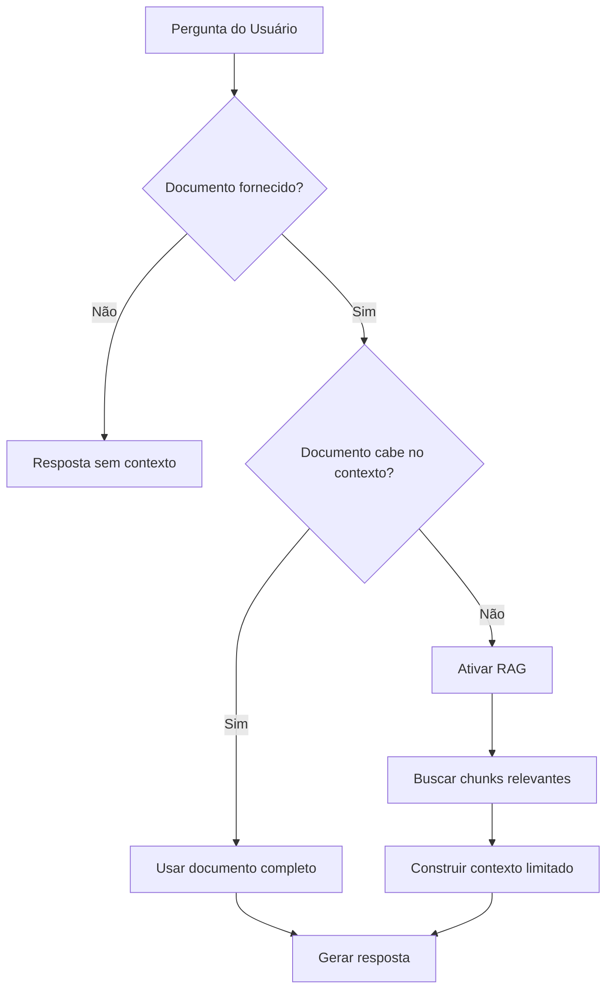
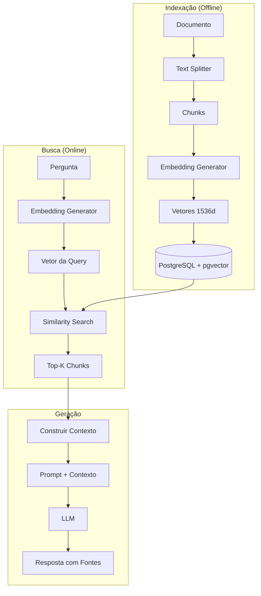
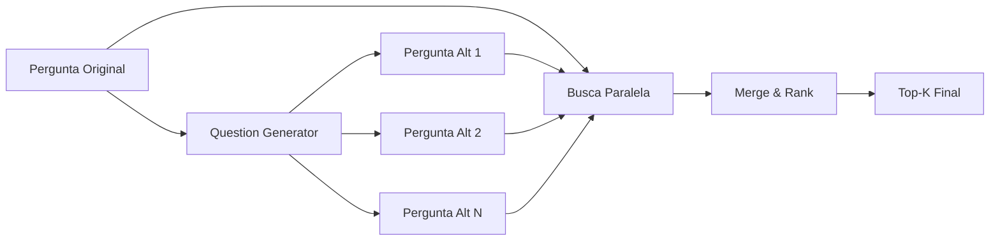

# Sistema RAG - Visão Geral

> Retrieval-Augmented Generation no SEI-IA Assistente

## Quando o RAG é Ativado?

O sistema decide automaticamente quando usar RAG:



### Critérios de Ativação

```python
# Configurações em settings_config.py
FACTOR_LIMIT_RAG = 4.0  # Fator multiplicador
general_max_ctx_len = 250000  # Contexto do modelo

# Limite para RAG
limit_rag = general_max_ctx_len / FACTOR_LIMIT_RAG  # ~62.500 tokens

# Ativa RAG se:
doc_tokens > limit_rag
```

---

## Arquitetura do RAG



---

## Componentes Principais

### 1. Text Splitter

Divide o documento em chunks menores:

```python
# Configurações
MAX_LENGTH_CHUNK_SIZE = 1512  # tokens
CHUNK_OVERLAP = 50            # caracteres

# Exemplo de divisão
documento = "Texto muito longo..."
chunks = [
    "Texto muito lon...",  # chunk 1
    "...longo que prec...", # chunk 2 (com overlap)
    "...precisa ser div..." # chunk 3
]
```

**Arquivo**: `sei_ia/services/embedder/chunks.py`

### 2. Embedding Generator

Gera vetores de 1536 dimensões usando Azure OpenAI:

```python
class EmbeddingGenerator:
    model = "text-embedding-3-small"

    async def generate(self, texts: list[str]) -> list[list[float]]:
        # Batch processing com concorrência controlada
        # Retorna vetores de 1536 dimensões
```

**Arquivo**: `sei_ia/services/embedder/embedding_generator.py`

### 3. Vector Store (pgvector)

Armazena e busca vetores no PostgreSQL:

```sql
-- Tabela de embeddings
CREATE TABLE embeddings (
    chunk_id UUID PRIMARY KEY,
    id_documento VARCHAR,
    embedding VECTOR(1536),
    start_position INT,
    finished_position INT,
    created_at TIMESTAMP,
    chunk_content TEXT,
    metadata JSONB
);

-- Índice para busca vetorial
CREATE INDEX ON embeddings
USING ivfflat (embedding vector_cosine_ops)
WITH (lists = 100);
```

**Arquivo**: `sei_ia/data/database/db_models/embedding.py`

### 4. Chunk Retriever

Busca chunks similares:

```python
class ChunkRetriever:
    async def retrieve(
        self,
        query: str,
        document_ids: list[str],
        top_k: int = 5,
        min_similarity: float = 0.3
    ) -> list[Chunk]:
        # 1. Gera embedding da query
        # 2. Busca com operador <=> (cosine distance)
        # 3. Filtra por min_similarity
        # 4. Retorna top_k chunks
```

**Arquivo**: `sei_ia/services/embedder/chunk_retriever.py`

---

## RAG Enhanced: Múltiplas Queries

Para melhorar a recuperação, o sistema gera perguntas alternativas:



### Exemplo

**Pergunta original**: "Qual o valor da multa?"

**Perguntas geradas**:
1. "Qual é o montante da penalidade aplicada?"
2. "Quanto foi cobrado como sanção?"
3. "Qual o valor monetário da infração?"

Cada pergunta é usada para buscar chunks, e os resultados são combinados e rankeados.

**Arquivo**: `sei_ia/agents/pergunta/question_generator.py`

---

## Configurações

```python
# settings_config.py

# Número de chunks a retornar
TOP_K_DOCUMENTS = 5

# Similaridade mínima (0.0 a 1.0)
MIN_SIMILARITY = 0.3

# Perguntas adicionais para RAG enhanced
N_QUESTIONS = 5

# Tamanho do chunk em tokens
MAX_LENGTH_CHUNK_SIZE = 1512

# Overlap entre chunks
CHUNK_OVERLAP = 50

# Fator para decidir quando usar RAG
FACTOR_LIMIT_RAG = 4.0
```

---

## Fluxo Completo

```python
async def process_question_intent(state: UserState) -> UserState:
    # 1. Verificar se documento cabe no contexto
    if state["all_tokens_counter"] <= state["limit_rag"]:
        # Usar documento completo
        state["doc_rag"] = False
        return build_prompt_with_full_doc(state)

    # 2. Ativar RAG
    state["doc_rag"] = True

    # 3. Verificar se documento está indexado
    if not await is_document_indexed(doc_id):
        await auto_index_document(doc_id)

    # 4. Gerar perguntas alternativas
    questions = await generate_alternative_questions(
        state["user_request"],
        n_questions=settings.N_QUESTIONS
    )

    # 5. Buscar chunks com múltiplas queries
    chunks = await search_with_multiple_questions(
        questions=[state["user_request"]] + questions,
        document_ids=state["all_documents"],
        top_k=settings.TOP_K_DOCUMENTS
    )

    # 6. Construir contexto com chunks
    state["rag_chunks_data"] = chunks
    state["last_prompt"] = build_rag_prompt(state, chunks)

    return state
```

---

## Resposta com Fontes

O sistema adiciona marcadores de fonte na resposta:

**Prompt**:
```
Baseie sua resposta nos trechos abaixo. Use <doc_N> para citar fontes.

<doc_1>
Trecho do documento 1...
</doc_1>

<doc_2>
Trecho do documento 2...
</doc_2>
```

**Resposta do LLM**:
```
De acordo com o documento <doc_1>, a multa aplicada foi de R$ 50.000,00.
A fundamentação legal está descrita no <doc_2>.
```

**Resposta processada** (com tooltips):
```json
{
    "response": "De acordo com o documento [1], a multa foi de R$ 50.000,00...",
    "sources": [
        {
            "index": 1,
            "id_documento_formatado": "12345678",
            "conteudo_documento": "Trecho do documento 1..."
        }
    ]
}
```

---

## Próximos Passos

- [Embeddings](embeddings.md) - Detalhes da geração de embeddings
- [Retrieval](retrieval.md) - Algoritmo de busca
- [Indexação Automática](auto-indexing.md) - Auto-indexação
