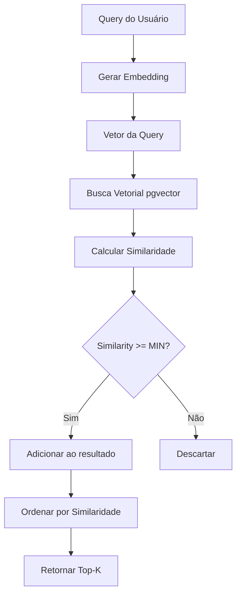

# Retrieval

> Busca e recuperação de chunks relevantes

## Visão Geral

O processo de retrieval busca os chunks mais similares à pergunta do usuário usando busca vetorial com pgvector.

---

## Algoritmo de Busca



---

## Métricas de Similaridade

O pgvector suporta três métricas:

| Operador | Métrica | Descrição |
|----------|---------|-----------|
| `<->` | L2 Distance | Distância Euclidiana |
| `<#>` | Inner Product | Produto Interno (negativo) |
| `<=>` | Cosine Distance | **1 - Similaridade Cosseno** (usado) |

### Similaridade Cosseno

O sistema usa similaridade cosseno por ser invariante à magnitude:

```sql
-- Busca com similaridade cosseno
SELECT
    chunk_id,
    id_documento,
    chunk_content,
    1 - (embedding <=> query_embedding) AS similarity
FROM embeddings
WHERE id_documento = ANY($1)
ORDER BY embedding <=> query_embedding
LIMIT 5;
```

---

## ChunkRetriever

```python
# sei_ia/services/embedder/chunk_retriever.py

class ChunkRetriever:
    def __init__(self):
        self.embedding_generator = EmbeddingGenerator()
        self.min_similarity = settings.MIN_SIMILARITY  # 0.3
        self.top_k = settings.TOP_K_DOCUMENTS          # 5

    async def retrieve(
        self,
        query: str,
        document_ids: list[str],
        top_k: int = None,
        min_similarity: float = None
    ) -> list[RetrievedChunk]:
        """
        Busca chunks similares à query.

        Args:
            query: Pergunta do usuário
            document_ids: IDs dos documentos para buscar
            top_k: Número máximo de chunks a retornar
            min_similarity: Similaridade mínima (0.0 a 1.0)

        Returns:
            Lista de chunks ordenados por similaridade
        """
        top_k = top_k or self.top_k
        min_similarity = min_similarity or self.min_similarity

        # 1. Gerar embedding da query
        query_embedding = await self.embedding_generator.generate_single(query)

        # 2. Buscar no banco
        async with get_session() as session:
            result = await session.execute(
                text("""
                    SELECT
                        chunk_id,
                        id_documento,
                        chunk_content,
                        start_position,
                        finished_position,
                        1 - (embedding <=> :query_embedding) AS similarity
                    FROM embeddings
                    WHERE id_documento = ANY(:doc_ids)
                      AND 1 - (embedding <=> :query_embedding) >= :min_sim
                    ORDER BY embedding <=> :query_embedding
                    LIMIT :top_k
                """),
                {
                    "query_embedding": query_embedding,
                    "doc_ids": document_ids,
                    "min_sim": min_similarity,
                    "top_k": top_k
                }
            )
            rows = result.fetchall()

        # 3. Converter para objetos
        return [
            RetrievedChunk(
                chunk_id=row.chunk_id,
                document_id=row.id_documento,
                content=row.chunk_content,
                similarity=row.similarity,
                start_position=row.start_position,
                end_position=row.finished_position
            )
            for row in rows
        ]
```

---

## Multi-Query Retrieval

Para melhorar a recuperação, o sistema usa múltiplas queries:

```python
# sei_ia/agents/pergunta/multi_search_rag.py

async def search_with_multiple_questions(
    original_query: str,
    document_ids: list[str],
    n_questions: int = 5,
    top_k: int = 5
) -> list[RetrievedChunk]:
    """
    Busca usando múltiplas variações da pergunta.
    """
    # 1. Gerar perguntas alternativas
    alternative_questions = await generate_alternative_questions(
        original_query,
        n=n_questions
    )

    all_queries = [original_query] + alternative_questions

    # 2. Buscar em paralelo
    retriever = ChunkRetriever()
    tasks = [
        retriever.retrieve(q, document_ids, top_k=top_k * 2)
        for q in all_queries
    ]
    results = await asyncio.gather(*tasks)

    # 3. Merge e deduplicate
    seen_chunks = set()
    merged_chunks = []

    for result in results:
        for chunk in result:
            if chunk.chunk_id not in seen_chunks:
                seen_chunks.add(chunk.chunk_id)
                merged_chunks.append(chunk)

    # 4. Re-rankear por similaridade média
    merged_chunks.sort(key=lambda c: c.similarity, reverse=True)

    # 5. Retornar top-k final
    return merged_chunks[:top_k]
```

---

## Geração de Perguntas Alternativas

```python
# sei_ia/agents/pergunta/question_generator.py

async def generate_alternative_questions(
    original_query: str,
    n: int = 5
) -> list[str]:
    """
    Gera variações da pergunta original usando LLM.
    """
    prompt = f"""
    Gere {n} variações da seguinte pergunta, mantendo o mesmo significado
    mas usando palavras e estruturas diferentes:

    Pergunta original: {original_query}

    Retorne apenas as perguntas, uma por linha.
    """

    response = await llm.generate(prompt)

    questions = [
        line.strip()
        for line in response.split('\n')
        if line.strip()
    ]

    return questions[:n]
```

### Exemplo

**Pergunta original**: "Qual foi o valor da multa aplicada?"

**Variações geradas**:
1. "Qual é o montante da penalidade pecuniária?"
2. "Quanto foi cobrado como sanção administrativa?"
3. "Qual o valor monetário da infração?"
4. "De quanto é a multa imposta?"
5. "Qual o total da penalidade financeira?"

---

## Configurações

```python
# settings_config.py

# Número de chunks a retornar
TOP_K_DOCUMENTS = 5

# Similaridade mínima (0.0 a 1.0)
MIN_SIMILARITY = 0.3

# Perguntas alternativas para RAG enhanced
N_QUESTIONS = 5
```

---

## Índices de Busca

### IVFFlat

Índice aproximado para busca rápida:

```sql
CREATE INDEX ON embeddings
USING ivfflat (embedding vector_cosine_ops)
WITH (lists = 100);
```

**Parâmetros**:
- `lists`: Número de clusters (recomendado: sqrt(n_rows))
- Trade-off: Mais lists = mais preciso, mais lento

### HNSW (Alternativa)

Índice mais preciso, mas usa mais memória:

```sql
CREATE INDEX ON embeddings
USING hnsw (embedding vector_cosine_ops)
WITH (m = 16, ef_construction = 64);
```

---

## Resultado da Busca

```python
@dataclass
class RetrievedChunk:
    chunk_id: UUID
    document_id: str
    content: str
    similarity: float       # 0.0 a 1.0
    start_position: int     # Posição no documento original
    end_position: int

    def to_context(self) -> str:
        """Formata para incluir no prompt."""
        return f"<doc_{self.document_id}>\n{self.content}\n</doc_{self.document_id}>"
```

---

## Métricas de Qualidade

### Precision@K

```python
def precision_at_k(retrieved: list, relevant: set, k: int) -> float:
    """Proporção de chunks relevantes nos top-k."""
    top_k = retrieved[:k]
    relevant_count = sum(1 for c in top_k if c.chunk_id in relevant)
    return relevant_count / k
```

### Mean Reciprocal Rank (MRR)

```python
def mrr(retrieved: list, relevant: set) -> float:
    """Posição média do primeiro chunk relevante."""
    for i, chunk in enumerate(retrieved, 1):
        if chunk.chunk_id in relevant:
            return 1.0 / i
    return 0.0
```

---

## Troubleshooting

### Baixa Similaridade

Se todos os chunks retornarem similaridade < 0.3:

1. Verificar se documento está indexado
2. Verificar qualidade dos embeddings
3. Considerar reduzir `MIN_SIMILARITY`
4. Usar mais perguntas alternativas

### Chunks Irrelevantes

Se chunks retornados não são relevantes:

1. Aumentar `MIN_SIMILARITY`
2. Reduzir `TOP_K`
3. Melhorar chunking (tamanho/overlap)
4. Usar re-ranking com cross-encoder

---

## Próximos Passos

- [Indexação Automática](auto-indexing.md)
- [Embeddings](embeddings.md)
