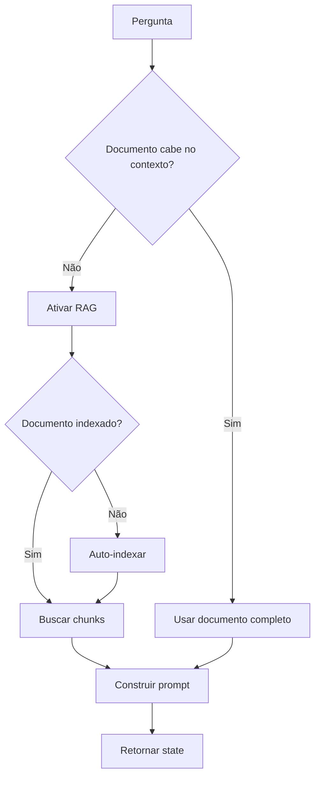

# Question Handler (histórico arquivado)

!!! info "Documentação histórica arquivada"
    Este documento registra o Question Handler do fluxo clássico (`pergunta/__init__.py`), arquivado sob `scripts/legado/sei_ia/agents/pergunta/`. No runtime atual, as perguntas sobre processos e documentos são atendidas pelo agente Session (`agents/session_agent/agent.py`), publicado via `/llm_lang/session_stream`.

## Função

O Question Handler processava perguntas sobre documentos do SEI, decidindo automaticamente se deveria usar RAG ou o documento completo.

**Arquivo original**: `sei_ia/agents/pergunta/__init__.py` (arquivado em `scripts/legado/sei_ia/agents/pergunta/`)

## Fluxo de Decisão



## Componentes

| Componente | Arquivo original | Função |
|------------|------------------|--------|
| chunk_extractor | `chunk_extractor.py` | Extraía chunks relevantes |
| multi_search_rag | `multi_search_rag.py` | Busca com múltiplas queries |
| question_generator | `question_generator.py` | Gerava perguntas alternativas |
| document_decision | `document_decision.py` | Decidia se usava RAG |
| auto_indexing | `auto_indexing.py` | Indexava documentos automaticamente |
| prompt_builders | `prompt_builders.py` | Construía prompts |

## Uso original

```python
async def handle_question(state: UserState) -> UserState:
    state = await process_question_intent(state)
    return state
```

---

## Referências

- [Sistema RAG Arquivado](../rag-system/overview.md)
- [README do Legado](../../README.md)
