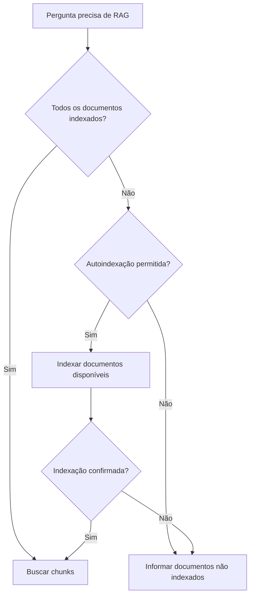

# Indexação automática (histórico arquivado)

!!! info "Documentação histórica arquivada"
    Este documento descreve a rotina clássica de auto-indexação sob demanda do RAG, cujos controladores (`pergunta/auto_indexing.py`, `pergunta/__init__.py`) foram arquivados sob `scripts/legado/sei_ia/agents/pergunta/`. No fluxo ativo Session, a leitura e preparação documental são geridas sem auto-indexação vetorial pelo agente.

## Quando ocorria no fluxo clássico

O handler de perguntas verificava a tabela de embeddings quando os documentos não
cabiam integralmente no contexto. Se a proporção de documentos ausentes permitisse
autoindexação, ele processava os documentos disponíveis no `UserState`, gravava os
chunks no pgvector e verificava novamente a indexação antes de fazer a busca RAG.

O limite que decidia se a autoindexação era recomendada ficava em
`should_auto_index`, em `sei_ia/agents/pergunta/auto_indexing.py` (arquivado). Os tamanhos de
chunk e os limites de concorrência pertencem a
`sei_ia/configs/settings_config.py`.

## Processamento

`indexing_embeddings`, em `sei_ia/services/embedder/pipeline.py`, localizava cada
documento no estado, dividia seu conteúdo em chunks, gerava embeddings pelo proxy
LiteLLM e fazia upsert no pgvector. O produtor e os consumidores do pool obedeciam
ao contrato de entrada descrito em [Embeddings](embeddings.md#validacao-de-entrada).

Documentos sem conteúdo extraível não eram ignorados e não contavam como
indexados. A indexação falhava antes de chamar um cliente de embeddings.

## Contrato de falha

Os lotes concorrentes terminavam antes da agregação dos erros. A autoindexação
registrava cada exceção com traceback e devolvia uma `AutoIndexingException`
sanitizada:

- falha de conteúdo resultava em status 400;
- somente falhas internas resultavam em status 500;
- a resposta informava contagens e expunha no máximo cinco IDs de documentos;
- conteúdo de documentos e listas completas não entravam na resposta.

## Localização original e arquivamento

- decisão e agregação:
  `sei_ia/agents/pergunta/auto_indexing.py` (arquivado em `scripts/legado/sei_ia/agents/pergunta/`);
- preservação até o fluxo de pergunta:
  `sei_ia/agents/pergunta/__init__.py` (arquivado em `scripts/legado/sei_ia/agents/pergunta/`);
- produção, leitura e gravação:
  `sei_ia/services/embedder/pipeline.py` (mantido ativo para o startup);
- erros públicos:
  `sei_ia/services/exceptions/embedding_exceptions.py`.

## Referências

- [Visão Geral](overview.md)
- [Embeddings](embeddings.md)
- [Retrieval](retrieval.md)
- [README do Legado](../../README.md)
