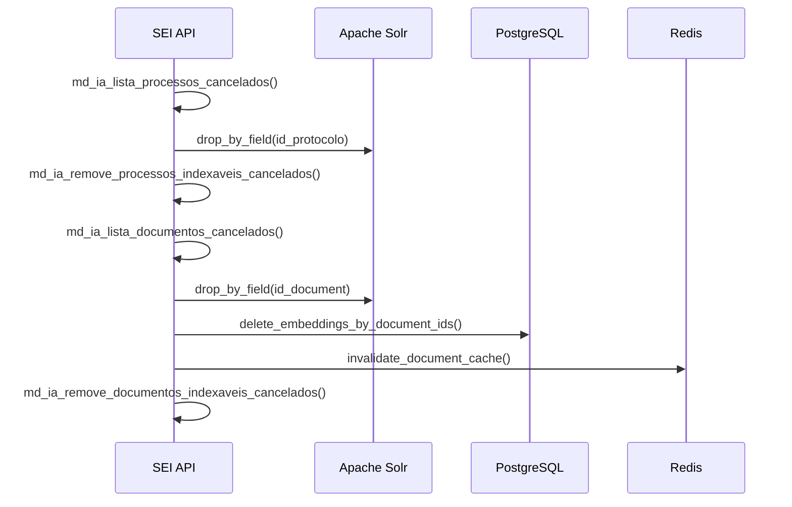
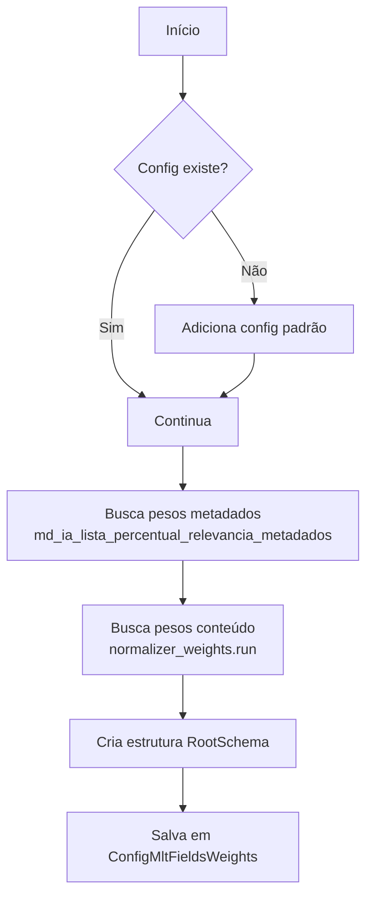

# DAGs de Manutenção

DAGs responsáveis por tarefas de manutenção e configuração do sistema.

## Visão Geral

| DAG | Schedule | Função |
|-----|----------|--------|
| `cache_invalidation` | `*/5 * * * *` | Remove itens cancelados do Solr, PostgreSQL e Redis |
| `system_clean_airflow_logs` | `0 20 * * *` | Limpa logs antigos do Airflow (>30 dias) |
| `system_create_mlt_weights_config` | `0 * * * *` | Atualiza pesos de campos MLT para similaridade |

---

## Cache Invalidation

**Arquivo:** `jobs/dags/dag_objects/mlt_etl_process/dag_mlt_cache_invalidation.py`

Remove processos e documentos cancelados do SEI de todos os datastores.

### Fluxo



### Tasks

#### drop_canceled_processes_from_solr

Remove processos cancelados do Solr.

```python
@task
def drop_canceled_processes_from_solr(batch_size, solr_url, solr_core, auth):
    while True:
        delete_list, id_ultimo = SEIDBHandler.md_ia_lista_processos_indexaveis_cancelados(
            batch_size, id_ultimo
        )
        if not delete_list:
            break

        # Remove do Solr
        SolrHandlers.drop_by_field(
            id_values=delete_list,
            solr_core=solr_core,
            field="id_protocolo",
        )

        # Marca como removido na API SEI
        SEIDBHandler.md_ia_remove_processos_indexaveis_cancelados(id)
```

#### drop_canceled_documents_and_embeddings

Remove documentos cancelados do Solr, embeddings do PostgreSQL e cache do Redis.

```python
@task
def drop_canceled_documents_and_embeddings(batch_size, solr_url, solr_core, auth):
    while True:
        delete_list, id_ultimo = SEIDBHandler.md_ia_lista_documentos_indexaveis_cancelados(
            batch_size, id_ultimo
        )
        if not delete_list:
            break

        # 1. Remove do Solr
        SolrHandlers.drop_by_field(id_values=delete_list, field="id_document")

        # 2. Remove embeddings do PostgreSQL
        delete_embeddings_by_document_ids(delete_list)

        # 3. Invalida cache Redis
        invalidate_document_cache(delete_list)

        # 4. Marca como removido na API SEI
        SEIDBHandler.md_ia_remove_documentos_indexaveis_cancelados(id)
```

### O que é removido

| Datastore | Campo | Descrição |
|-----------|-------|-----------|
| Solr (processos) | `id_protocolo` | Processos indexados |
| Solr (documentos) | `id_document` | Documentos indexados |
| PostgreSQL | `id_documento` | Embeddings vetoriais |
| Redis | Cache keys | Cache de conteúdo de documentos |

---

## System Clean Airflow Logs

**Arquivo:** `jobs/dags/dag_objects/clean_logs.py`

Limpa logs do Airflow com mais de 30 dias para evitar crescimento descontrolado do banco de dados.

### Comando

```bash
airflow db clean --yes --skip-archive --clean-before-timestamp 'YYYY-MM-DDTHH:MM:SS'
```

### Parâmetros

| Parâmetro | Valor | Descrição |
|-----------|-------|-----------|
| `--yes` | - | Confirma automaticamente |
| `--skip-archive` | - | Não arquiva, apenas remove |
| `--clean-before-timestamp` | 30 dias atrás | Data limite para limpeza |

---

## System Create MLT Weights Config

**Arquivo:** `jobs/dags/dag_objects/sync_config.py`

Atualiza os pesos de campos MLT (More Like This) usados pelo projeto `api_sei` para calcular similaridade.

### Fluxo



### Estrutura de Pesos

```python
RootSchema(
    metadata=Metadata(
        fields={
            "metadata_name_id_type_process": FieldEntry(weight=1.0),
            "metadata_id_unit_process_generator": FieldEntry(weight=0.8),
            "metadata_process_specification": FieldEntry(weight=0.5),
            # ...
        },
        weight=0.3,  # Peso geral de metadados
    ),
    content=Content(
        fields={
            "content_id_type_doc_8": {
                "fields": {
                    "content_id_type_doc_8_acordao": FieldEntry(weight=1.0),
                    "content_id_type_doc_8_voto": FieldEntry(weight=0.9),
                },
                "weight": 1.0,
            },
            # ...
        },
        weight=0.7,  # Peso geral de conteúdo
    ),
)
```

### Tabela de Configuração

Os pesos são salvos na tabela `config_mlt_fields_weights`:

```sql
CREATE TABLE config_mlt_fields_weights (
    id SERIAL PRIMARY KEY,
    weights JSONB NOT NULL,
    created_at TIMESTAMP DEFAULT NOW()
);
```

### Origem dos Pesos

| Tipo | Origem | API SEI |
|------|--------|---------|
| Metadados | Configuração administrativa | `md_ia_lista_percentual_relevancia_metadados()` |
| Conteúdo | Análise de relevância por segmento | `normalizer_weights.run()` |

---

## Variáveis de Ambiente

| Variável | Descrição |
|----------|-----------|
| `SOLR_ADDRESS` | Endereço do servidor Solr |
| `SOLR_MLT_PROCESS_CORE` | Core Solr para processos |
| `SOLR_MLT_DOCUMENTS_CORE` | Core Solr para documentos |
| `INDEX_BATCH_SIZE` | Tamanho do lote de processamento |

---

## Próximos Passos

- [Indexação de Processos](indexacao-processos.md)
- [Indexação de Documentos](indexacao-documentos.md)
- [ETL de Embeddings](embeddings.md)
