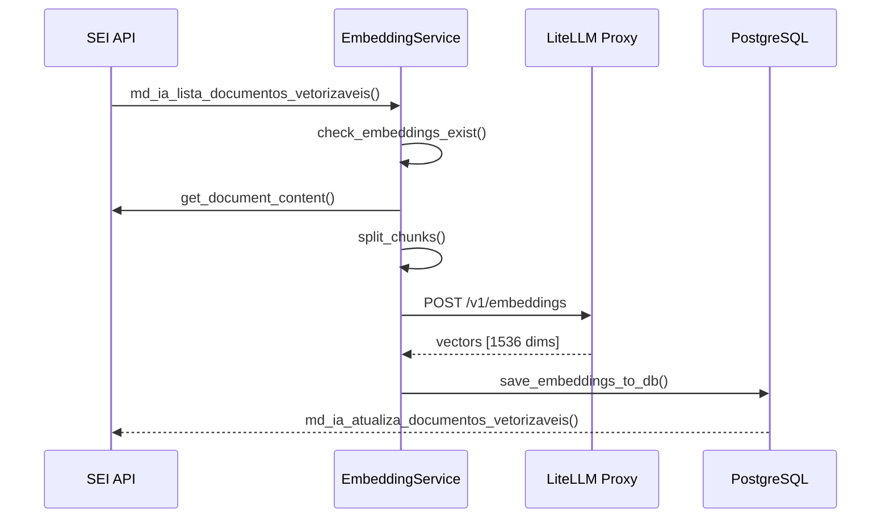
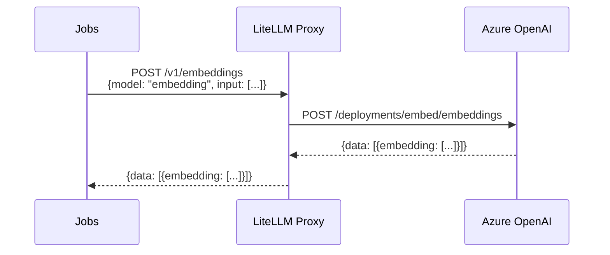

# ETL de Embeddings

Este pipeline gera embeddings vetoriais dos documentos via LiteLLM e armazena no PostgreSQL com pgvector. Os embeddings são consumidos pelo projeto **Assistente** para RAG (Retrieval-Augmented Generation).

## DAGs

| DAG | Schedule | Função |
|-----|----------|--------|
| `documents_update_embedding` | `*/1 * * * *` | Enfileira documentos para geração de embeddings |
| `documents_embedding_generation` | Triggered | Gera embeddings e salva no PostgreSQL |

---

## Fluxo



---

## Chunking

O documento é dividido em chunks antes de gerar embeddings usando `RecursiveCharacterTextSplitter` do LangChain.

**Configuração:**

| Parâmetro | Valor | Variável |
|-----------|-------|----------|
| Tamanho do chunk | 1512 tokens | `MAX_LENGTH_CHUNK_SIZE` |
| Overlap entre chunks | 50 tokens | `CHUNK_OVERLAP` |

**Separadores (em ordem de prioridade):**

```python
SEPARATORS = [
    "\n\n",      # Parágrafos
    "\n",        # Quebra de linha
    ".",         # Ponto final
    ",",         # Vírgula
    "\u200b",    # Zero-width space
    "\uff0c",    # Vírgula fullwidth
    "\u3001",    # Vírgula ideográfica
    "\uff0e",    # Ponto fullwidth
    "\u3002",    # Ponto ideográfico
    "",          # Fallback caractere
]
```

**Exemplo:**

```
Documento (10.000 tokens)
    ↓ RecursiveCharacterTextSplitter
Chunk 1 (1512 tokens) + Chunk 2 (1512 tokens) + ...
    ↓ overlap de 50 tokens entre chunks
```

---

## LiteLLM Integration

O sistema usa LiteLLM Proxy como intermediário para gerar embeddings. O LiteLLM roteia as requisições para provedores como Azure OpenAI.

### Provider

**Arquivo:** `jobs/services/embedder/providers/litellm.py`

```python
class LiteLLMEmbeddingProvider(EmbeddingProvider):
    def __init__(
        self,
        base_url: str,         # URL do LiteLLM proxy
        model: str,            # Nome do modelo no proxy
        api_key: str = None,   # Chave de API (opcional)
        max_context_size: int = 8191,
        timeout_api: int = 900,
    ):
        # Cliente OpenAI apontando para LiteLLM
        self.client = OpenAI(
            base_url=f"{base_url}/v1",
            api_key=api_key or "dummy-key",
        )
```

### Métodos Principais

| Método | Descrição |
|--------|-----------|
| `generate_embeddings(texts)` | Gera embeddings via API OpenAI-compatible |
| `apply_tokenizer(texts)` | Tokeniza textos usando tiktoken |
| `test_connection()` | Testa conectividade com o proxy |

### Fluxo de Requisição



---

## Serviço de Embeddings

**Arquivo:** `jobs/api_rest/services/embedding_service.py`

### Funções Principais

| Função | Descrição |
|--------|-----------|
| `generate_embeddings_for_documents(ids)` | Orquestra geração de embeddings |
| `split_chunks(doc, chunk_size, overlap)` | Divide documento em chunks |
| `check_embeddings_exist(ids)` | Verifica se já existem embeddings |
| `process_document_for_embedding(id, content)` | Processa documento individual |
| `save_embeddings_to_db(results)` | Salva embeddings no PostgreSQL |
| `delete_embeddings_by_document_ids(ids)` | Remove embeddings (cache invalidation) |

### Fluxo de Processamento

```python
async def generate_embeddings_for_documents(id_documentos):
    # 1. Verificar quais documentos já têm embeddings
    existing = await check_embeddings_exist(id_documentos)
    docs_to_process = [id for id, exists in existing.items() if not exists]

    # 2. Buscar conteúdo dos documentos
    for doc_id in docs_to_process:
        content = await get_document_content(doc_id)

        # 3. Dividir em chunks
        chunks, positions = split_chunks(content, MAX_LENGTH_CHUNK_SIZE, CHUNK_OVERLAP)

        # 4. Adicionar ao pool de processamento
        pool_input = InputPoolEmbd(
            input_texts=chunks,
            doc_id=doc_id,
            chunk_ids=list(range(len(chunks))),
            positions=positions,
        )
        embedding_generator.append_pool_file(pool_input, req_filepath)

    # 5. Gerar embeddings via LiteLLM
    result_file = await generate_embeddings_from_pool(req_filepath, save_filepath)

    # 6. Salvar no banco
    await save_embeddings_to_db(result_file)
```

---

## Schema PostgreSQL

```sql
CREATE TABLE embeddings (
    chunk_id INTEGER,
    id_documento INTEGER,
    embedding VECTOR(1536),
    start_position INTEGER,
    finished_position INTEGER,
    created_at TIMESTAMP DEFAULT NOW(),
    PRIMARY KEY (id_documento, chunk_id)
);
```

**Campos:**

| Campo | Tipo | Descrição |
|-------|------|-----------|
| `chunk_id` | INTEGER | Índice do chunk no documento |
| `id_documento` | INTEGER | ID do documento no SEI |
| `embedding` | VECTOR(1536) | Vetor de embedding |
| `start_position` | INTEGER | Posição inicial do chunk no texto |
| `finished_position` | INTEGER | Posição final do chunk no texto |
| `created_at` | TIMESTAMP | Data de criação |

---

## Controle de Fila

Similar ao ETL de processos/documentos:

```python
# Configurações em jobs/envs.py
LIMIT_QUEUE = 10              # Máximo de DAGs enfileiradas
EMBEDDING_BATCH_SIZE = 50     # Documentos por lote
EMBEDDING_MAX_ACTIVE_RUNS = 5 # DAGs paralelas
```

---

## Variáveis de Ambiente

| Variável | Descrição |
|----------|-----------|
| `LITELLM_BASE_URL` | URL do LiteLLM proxy |
| `LITELLM_EMBEDDING_MODEL` | Nome do modelo no proxy |
| `LITELLM_API_KEY` | Chave de API (se necessário) |
| `MAX_LENGTH_CHUNK_SIZE` | Tamanho máximo do chunk (tokens) |
| `CHUNK_OVERLAP` | Overlap entre chunks (tokens) |
| `EMBEDDING_BATCH_SIZE` | Documentos por lote |
| `EMBEDDING_MAX_ACTIVE_RUNS` | DAGs paralelas máximas |
| `DB_SEIIA_ASSISTENTE_*` | Configurações do PostgreSQL |
| `EMBEDDINGS_TABLE_NAME` | Nome da tabela de embeddings |

---

## Classes Principais

| Classe | Arquivo | Função |
|--------|---------|--------|
| `EmbeddingService` | `jobs/api_rest/services/embedding_service.py` | Orquestra geração de embeddings |
| `LiteLLMEmbeddingProvider` | `jobs/services/embedder/providers/litellm.py` | Provider LiteLLM |
| `EmbeddingGenerator` | `jobs/services/embedder/embedding_generator.py` | Gerador de embeddings |
| `EmbeddingsTable` | `jobs/db_models/embedding.py` | Model SQLAlchemy |

---

## Próximos Passos

- [Indexação de Processos](indexacao-processos.md)
- [Indexação de Documentos](indexacao-documentos.md)
- [DAGs de Manutenção](dags-manutencao.md)
