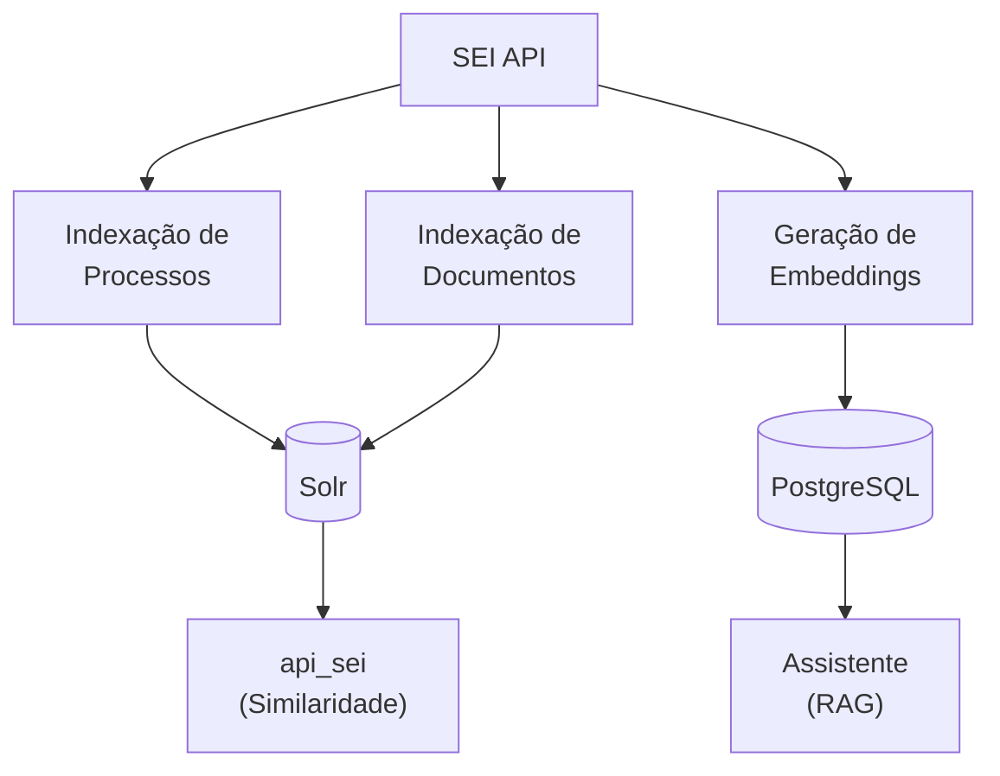

# ETL Pipelines

O Jobs implementa pipelines ETL para processar dados do SEI e disponibilizar para outros sistemas.

## Visão Geral

## Pipelines

| Pipeline | Descrição | Destino | Consumidor |
|----------|-----------|---------|------------|
| [Indexação de Processos](indexacao-processos.md) | Indexa processos completos com documentos agregados | Solr | `api_sei` (similaridade de processos) |
| [Indexação de Documentos](indexacao-documentos.md) | Indexa documentos individuais | Solr | `api_sei` (Doc2Doc) |
| [Geração de Embeddings](embeddings.md) | Gera vetores semânticos dos documentos | PostgreSQL | Assistente (RAG) |

## DAGs de Manutenção

| DAG | Schedule | Função |
|-----|----------|--------|
| `cache_invalidation` | `*/5 * * * *` | Remove itens cancelados |
| `system_clean_airflow_logs` | `0 20 * * *` | Limpa logs do Airflow |
| `system_create_mlt_weights_config` | `0 * * * *` | Atualiza pesos MLT |

Ver detalhes em [DAGs de Manutenção](dags-manutencao.md).

## Classes Principais

| Classe | Arquivo | Função |
|--------|---------|--------|
| `ProcessFromSEI` | `jobs/dags/preprocessing/process_from_sei.py` | Extrai dados do SEI |
| `ProcessTransformed` | `jobs/dags/preprocessing/process_transformed.py` | Transforma para Solr |
| `GenericSender` | `jobs/dags/database/generic_sender.py` | Envia para Solr |
| `SEIDBHandler` | `jobs/db_models/sei_db_handlers.py` | Cliente API SEI |
| `EmbeddingService` | `jobs/api_rest/services/embedding_service.py` | Gera embeddings |
| `LiteLLMEmbeddingProvider` | `jobs/services/embedder/providers/litellm.py` | Provider LiteLLM |

## Próximos Passos

- [Indexação de Processos](indexacao-processos.md)
- [Indexação de Documentos](indexacao-documentos.md)
- [ETL de Embeddings](embeddings.md)
- [DAGs de Manutenção](dags-manutencao.md)
