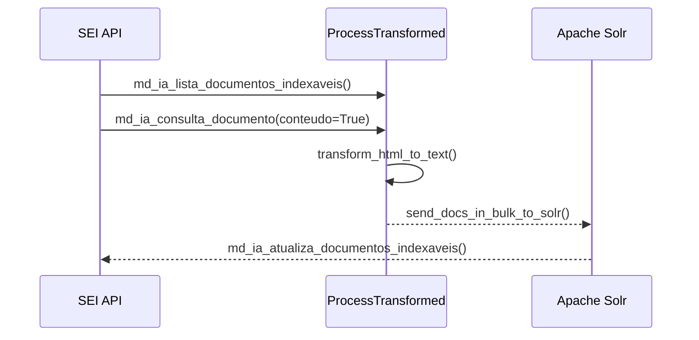

# Indexação de Documentos

Este pipeline extrai documentos do SEI, transforma e envia para Apache Solr. O projeto `api_sei` consome esses dados para realizar busca por similaridade de documentos (Doc2Doc).

## DAGs

| DAG | Schedule | Função |
|-----|----------|--------|
| `documents_update_index` | `*/1 * * * *` | Enfileira documentos para indexação |
| `documents_indexing` | Triggered | Transforma e envia documentos para Solr |

---

## Fluxo



---

## Schema Solr

```python
{
    "id_document": "789012",
    "id_process": "123456",
    "id_type_document": "8",
    "content": "texto do documento...",
    "dt_ref_insert": "2024-01-15T10:30:00Z"
}
```

---

## Classes de Envio

### GenericSender

**Arquivo:** `jobs/dags/database/generic_sender.py`

Envia dados para o Solr em bulk.

```python
GenericSender(
    df=dataframe,
    core_url=f"{SOLR_ADDRESS}/solr/{core}"
).send_docs_in_bulk_to_solr(auth=auth)
```

### SEIDBHandler

**Arquivo:** `jobs/db_models/sei_db_handlers.py`

Cliente para API do SEI.

| Método | Descrição |
|--------|-----------|
| `md_ia_lista_documentos_indexaveis()` | Lista documentos pendentes |
| `md_ia_consulta_documento()` | Obtém conteúdo de documento |
| `md_ia_atualiza_documentos_indexaveis()` | Marca documento como indexado |

---

## Controle de Fila

O sistema usa o mesmo mecanismo de controle de fila dos processos:

```python
# Configurações em jobs/envs.py
LIMIT_QUEUE = 10        # Máximo de DAGs enfileiradas
INDEX_BATCH_SIZE = 100  # Itens por lote
```

---

## Variáveis de Ambiente

| Variável | Descrição |
|----------|-----------|
| `SOLR_ADDRESS` | Endereço do servidor Solr |
| `SOLR_MLT_DOCUMENTS_CORE` | Core Solr para documentos |
| `MLT_DOCUMENTS_CONFIGSET` | Configset para documentos |
| `INDEX_BATCH_SIZE` | Tamanho do lote |
| `LIMIT_QUEUE` | Limite de DAGs enfileiradas |

---

## Próximos Passos

- [Indexação de Processos](indexacao-processos.md)
- [ETL de Embeddings](embeddings.md)
- [DAGs de Manutenção](dags-manutencao.md)
