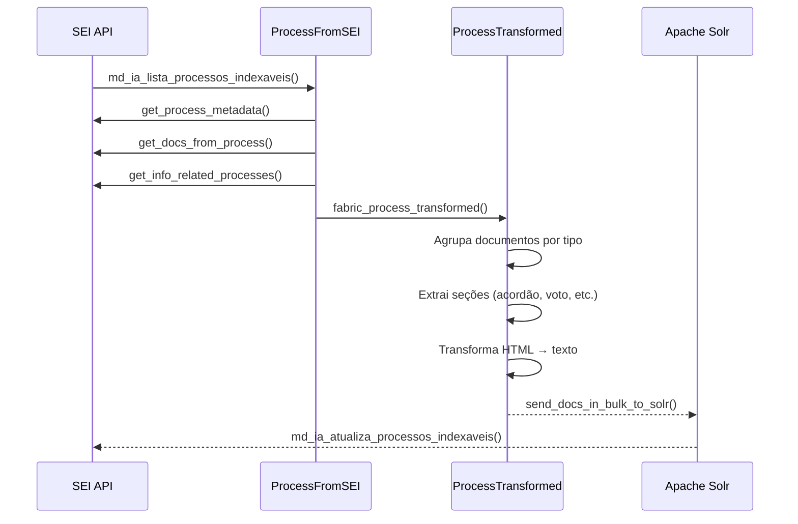

# Indexação de Processos

Este pipeline extrai processos do SEI, transforma e envia para Apache Solr. O projeto `api_sei` consome esses dados para realizar busca por similaridade de processos.

## DAGs

| DAG | Schedule | Função |
|-----|----------|--------|
| `process_update_index` | `*/1 * * * *` | Enfileira processos para indexação |
| `process_indexing` | Triggered | Transforma e envia processos para Solr |

---

## Fluxo



---

## Classes Principais

### ProcessFromSEI

**Arquivo:** `jobs/dags/preprocessing/process_from_sei.py`

Extrai dados do SEI e prepara para transformação.

```python
@dataclass
class ProcessFromSEI:
    id_protocolo: str
    id_type_process: int
    interested_max: int
    related_processes_max: int
    subprocesses: bool = True
```

**Métodos principais:**

| Método | Descrição |
|--------|-----------|
| `fabric_process_transformed()` | Orquestra a extração e cria `ProcessTransformed` |
| `get_process_metadata()` | Obtém metadados do processo |
| `get_docs_from_process()` | Lista documentos elegíveis |
| `get_info_related_processes()` | Obtém dados de processos relacionados |

### ProcessTransformed

**Arquivo:** `jobs/dags/preprocessing/process_transformed.py`

Transforma os dados para o schema do Solr.

```python
class ProcessTransformed(BaseModel):
    id_protocolo: str
    df_process_documents: pd.DataFrame
    df_process_metadata: pd.DataFrame
    df_related_processes: pd.DataFrame
    interested_max: int
    related_processes_max: int
```

**Transformações realizadas:**

1. **Agrupamento por tipo de documento** - Agrupa conteúdo por `id_type_document`
2. **Extração de seções** - Para tipos específicos (acórdão, voto, análise, etc.)
3. **HTML para texto** - Remove tags HTML via BeautifulSoup
4. **Extração de citações** - Aplica regex para extrair referências

---

## Schema Solr

```python
{
    "id_protocolo": 123456,
    "protocolo_formatado": "00000.000001/2024-01",
    "id_type_process": 1,
    "metadata_name_id_type_process": "Recurso Administrativo",
    "metadata_id_unit_process_generator": 100,
    "metadata_process_specification": "Especificação...",
    "metadata_id_contact_interested": "1234 5678 ...",
    "metadata_info_related_processes": "...",
    "metadata_citations": "Lei 8.666/93 ...",

    # Conteúdo agrupado por tipo de documento
    "content_id_type_doc_8": ["texto do acórdão..."],
    "content_id_type_doc_8_acordao": ["seção acórdão..."],
    "content_id_type_doc_94": ["texto do voto..."],
    "content_id_type_doc_94_voto": ["seção voto..."],

    # Metadados de documentos
    "metadata_name_id_type_doc_8": "Acórdão",
    "metadata_specification_id_type_doc_8": ["especificação..."],

    "list_documents": [789, 790, 791],
    "version_manager_id": 1,
    "dt_ref_insert": "2024-01-15T10:30:00Z"
}
```

---

## Tipos de Documento com Extração de Seções

| ID | Tipo | Seções Extraídas |
|----|------|------------------|
| 8 | Acórdão | acordao, relatorio, voto |
| 7 | Análise | analise |
| 4 | Despacho | despacho |
| 16 | Informe | informe |
| 94 | Voto | voto |

---

## Controle de Fila

O sistema usa um mecanismo de controle de fila para evitar sobrecarga:

```python
# Configurações em jobs/envs.py
LIMIT_QUEUE = 10        # Máximo de DAGs enfileiradas
INDEX_BATCH_SIZE = 100  # Itens por lote
```

**Comportamento:**

1. DAG de update (`process_update_index`) verifica slots disponíveis
2. Consulta DAGs em estado `queued` ou `running`
3. Se houver slots, busca novos itens via API SEI
4. Remove IDs já enfileirados (evita duplicação)
5. Dispara DAG de indexação (`process_indexing`) com lote

---

## Variáveis de Ambiente

| Variável | Descrição |
|----------|-----------|
| `SOLR_ADDRESS` | Endereço do servidor Solr |
| `SOLR_MLT_PROCESS_CORE` | Core Solr para processos |
| `MLT_PROCESS_CONFIGSET` | Configset para processos |
| `INDEX_BATCH_SIZE` | Tamanho do lote |
| `LIMIT_QUEUE` | Limite de DAGs enfileiradas |

---

## Próximos Passos

- [Indexação de Documentos](indexacao-documentos.md)
- [ETL de Embeddings](embeddings.md)
- [DAGs de Manutenção](dags-manutencao.md)
