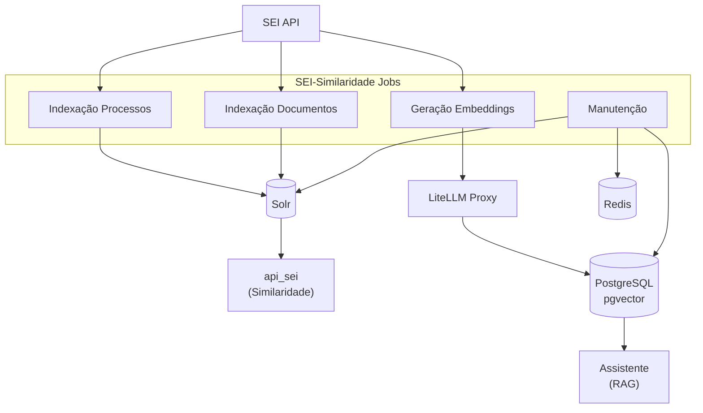

# SEI-Similaridade Jobs

Sistema de processamento ETL para preparar dados do SEI (Sistema Eletrônico de Informações) da Anatel.

## O que o Jobs faz

O SEI-Similaridade Jobs é responsável por:

1. **Indexação de Processos**: Extrai processos do SEI, transforma e envia para Apache Solr para que o projeto `api_sei` realize busca por similaridade de processos.

2. **Indexação de Documentos**: Extrai documentos do SEI, transforma e envia para Apache Solr para que o projeto `api_sei` realize busca por similaridade de documentos (Doc2Doc).

3. **Geração de Embeddings**: Gera embeddings vetoriais dos documentos via LiteLLM e armazena no PostgreSQL para serem usados em RAG pelo projeto Assistente.

4. **Manutenção**: Limpeza de cache, logs e atualização de configurações de pesos MLT.

## Visão Geral

## Tecnologias

| Categoria | Tecnologia |
|-----------|------------|
| **Orquestração** | Apache Airflow 2.9.3 |
| **API** | FastAPI |
| **Busca** | Apache Solr (destino do ETL) |
| **Vector DB** | PostgreSQL + pgvector |
| **Cache** | Redis |
| **Embeddings** | LiteLLM Proxy → Azure OpenAI |
| **Processamento** | PyMuPDF, Docling, BeautifulSoup |

## Navegação

### Getting Started
- [Variáveis de Ambiente](getting-started/environment-variables.md)

### ETL Pipelines
- [Visão Geral](etl/index.md)
- [Indexação de Processos](etl/indexacao-processos.md)
- [Indexação de Documentos](etl/indexacao-documentos.md)
- [Embeddings](etl/embeddings.md)
- [DAGs de Manutenção](etl/dags-manutencao.md)

### Referência
- [Módulos](modules.md)

## Links Externos

- [GitLab - sei-similaridade/jobs](https://git.anatel.gov.br/processo_eletronico/sei-ia/sei-similaridade/jobs)
- [Wiki Anatel](https://anatel365.sharepoint.com/:u:/r/sites/WikiAnatel/SitePages/TIC-Dados-Sei-Similaridade-jobs.aspx)
