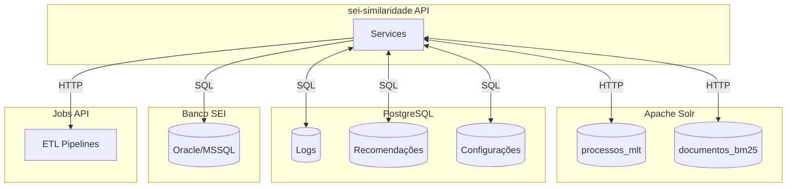
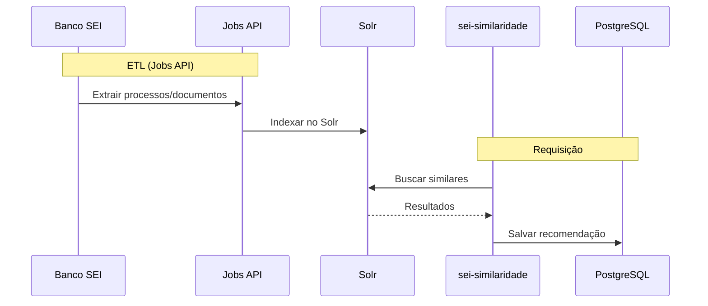

# Camada de Dados

A API sei-similaridade integra com múltiplas fontes de dados para fornecer recomendações precisas.

---

## Visão Geral

---

## Componentes

| Componente | Tecnologia | Propósito |
|------------|------------|-----------|
| **Apache Solr** | Solr 9.0+ | Motor de busca textual (MLT) |
| **PostgreSQL** | PostgreSQL 15+ | Persistência e configurações |
| **Banco SEI** | Oracle/MSSQL | Fonte de dados de documentos |
| **Jobs API** | Python/Airflow | ETL e indexação |

---

## Fluxo de Dados

---

## Detalhamento

### Apache Solr

O Solr é o motor de busca principal, responsável por:

- **Indexação**: Armazenar documentos com seus campos de texto
- **MLT (More Like This)**: Encontrar documentos similares
- **Extração de termos**: Identificar termos relevantes

[Ver documentação completa do Solr →](solr.md)

### PostgreSQL

O PostgreSQL armazena:

- **Logs de auditoria**: Todas as requisições
- **Recomendações**: Resultados para histórico
- **Configurações**: Pesos e parâmetros

[Ver documentação completa do PostgreSQL →](postgresql.md)

### Jobs API

A Jobs API executa ETL para manter os dados atualizados:

- **Extração**: Busca dados no banco SEI
- **Transformação**: Processa e tokeniza
- **Carga**: Indexa no Solr

[Ver documentação completa da Jobs API →](jobs-api.md)

---

## Conexões

| Fonte | Protocolo | Variável de Ambiente |
|-------|-----------|----------------------|
| Solr | HTTP | `SOLR_ADDRESS` |
| PostgreSQL | SQL | `CONN_STRING_APP_DB` |
| Banco SEI | SQL | `SEI_API_DB_ADDRESS` |
| Jobs API | HTTP | `JOBS_API_ADDRESS` |

---

## Próximos Passos

- [Apache Solr](solr.md) - Configuração dos cores
- [PostgreSQL](postgresql.md) - Schema das tabelas
- [Jobs API](jobs-api.md) - Integração ETL
- [Variáveis de Ambiente](../getting-started/environment-variables.md) - Configuração
