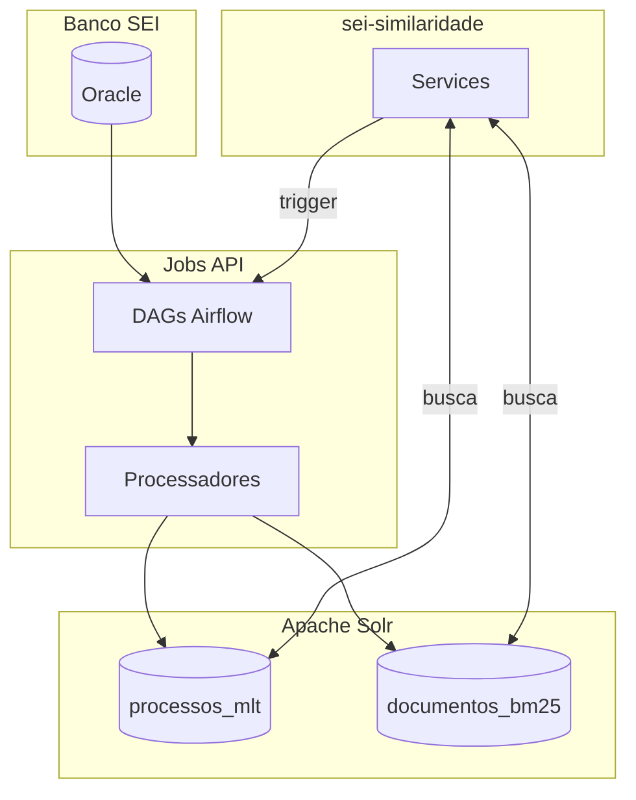
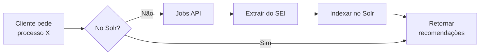
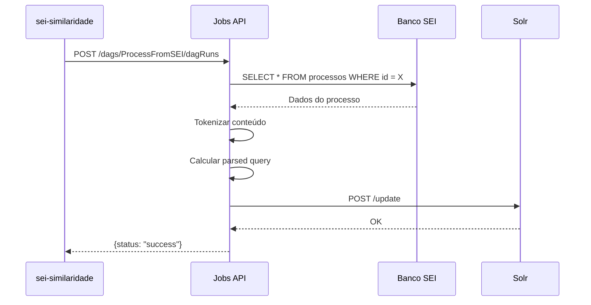
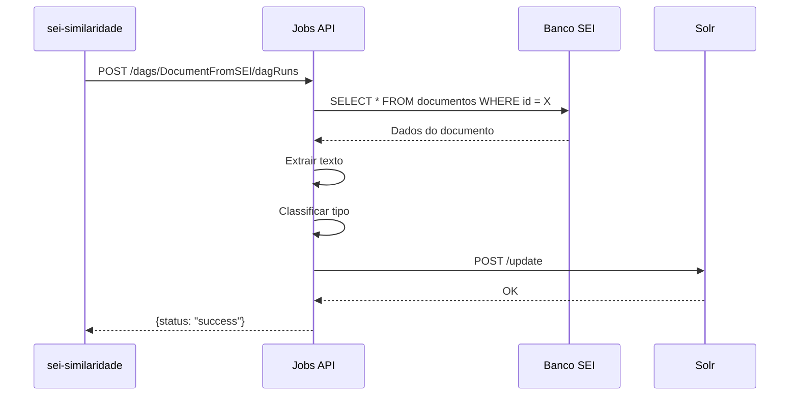

# Jobs API - ETL On-Demand

A Jobs API é responsável pelo ETL (Extract, Transform, Load) que alimenta os cores Solr.

---

## Visão Geral

| Aspecto | Valor |
|---------|-------|
| **Tecnologia** | Python + Apache Airflow |
| **Protocolo** | HTTP/REST |
| **Propósito** | Indexação de dados no Solr |

---

## Arquitetura



---

## Integração com sei-similaridade

### Quando a Jobs API é Chamada?

A Jobs API é chamada quando um documento **não está indexado** no Solr:



### Fluxo Detalhado

1. Cliente solicita recomendação para processo X
2. API verifica se X está indexado no Solr
3. **Se NÃO está indexado:**
   - API chama Jobs API para indexar
   - Jobs extrai dados do banco SEI
   - Jobs processa e transforma
   - Jobs indexa no Solr
   - API retorna recomendações
4. **Se está indexado:**
   - API retorna recomendações diretamente

---

## DAGs Disponíveis

A Jobs API possui várias DAGs (Directed Acyclic Graphs) para diferentes propósitos:

| DAG | Schedule | Propósito |
|-----|----------|-----------|
| `ProcessFromSEI` | On-demand | Indexar processos |
| `DocumentFromSEI` | On-demand | Indexar documentos |
| `EmbeddingsProcessor` | Daily | Gerar embeddings |
| `MaintenanceDAG` | Weekly | Limpeza e otimização |

---

## Configuração

### Variável de Ambiente

| Variável | Default | Descrição |
|----------|---------|-----------|
| `JOBS_API_ADDRESS` | `https://jobs_api:8642` | URL da Jobs API |

### Exemplo de Configuração

```bash
JOBS_API_ADDRESS=http://jobs-api:8642
```

---

## Endpoints

### Trigger de Indexação

```
POST /api/v1/dags/{dag_id}/dagRuns
```

### Exemplo de Requisição

```bash
curl -X POST "http://jobs-api:8642/api/v1/dags/ProcessFromSEI/dagRuns" \
  -H "Content-Type: application/json" \
  -d '{"conf": {"id_protocolo": "53500123456202400"}}'
```

### Verificar Status

```bash
curl "http://jobs-api:8642/api/v1/dags/ProcessFromSEI/dagRuns/{run_id}"
```

---

## Pipeline de Processamento

### Processos (ProcessFromSEI)



### Documentos (DocumentFromSEI)



---

## Transformações

Durante o ETL, os dados passam por várias transformações:

### 1. Extração de Texto

```python
# Extrair texto de HTML/PDF
content = extract_text(documento)
```

### 2. Tokenização

```python
# Tokenizar e normalizar
tokens = tokenize(content)
# ["recurso", "administrativo", "multa"]
```

### 3. Remoção de Stopwords

```python
# Remover palavras comuns
filtered = remove_stopwords(tokens)
# ["recurso", "administrativo", "multa"]
```

### 4. Cálculo de Parsed Query

```python
# Calcular scores BM25
parsed_query = calculate_bm25(filtered, corpus)
# "recurso^0.8 administrativo^0.6 multa^0.5"
```

---

## Monitoramento

### Health Check

```bash
curl "http://jobs-api:8642/health"
```

### Status das DAGs

```bash
curl "http://jobs-api:8642/api/v1/dags"
```

### Logs de Execução

```bash
curl "http://jobs-api:8642/api/v1/dags/{dag_id}/dagRuns/{run_id}/taskInstances/{task_id}/logs"
```

---

## Tratamento de Erros

### Documento Não Encontrado

Se o documento não existe no banco SEI:

```json
{
  "status": "failed",
  "error": "Document not found in SEI database"
}
```

### Timeout

Se a indexação demorar muito:

```json
{
  "status": "timeout",
  "message": "Indexation is still running, check back later"
}
```

---

## Documentação Completa

Para documentação completa da Jobs API, consulte:

- [Jobs API - Documentação](../../jobs/docs/index.md)
- [ETL Pipelines](../../jobs/docs/etl/index.md)
- [Variáveis de Ambiente](../../jobs/docs/getting-started/environment-variables.md)

---

## Próximos Passos

- [Apache Solr](solr.md) - Cores alimentados pela Jobs API
- [PostgreSQL](postgresql.md) - Persistência de configurações
- [Visão Geral](index.md) - Voltar à visão geral
