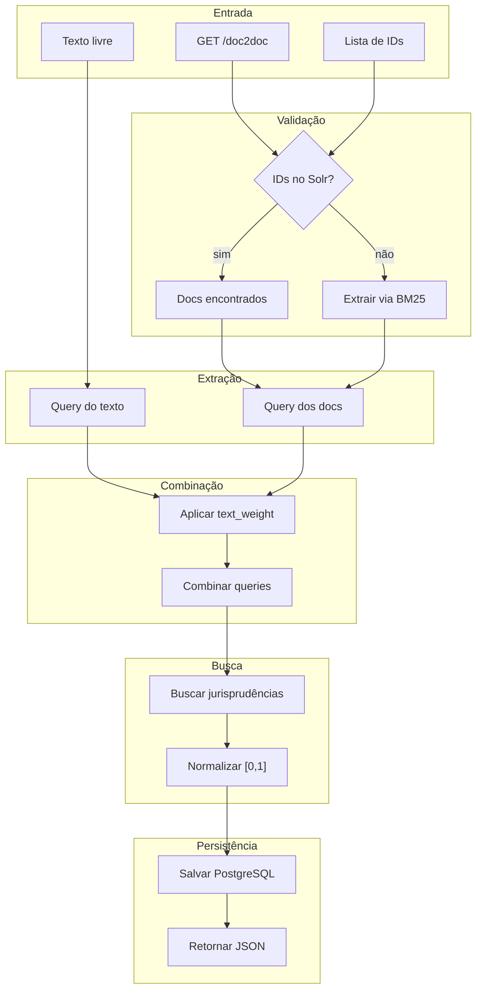
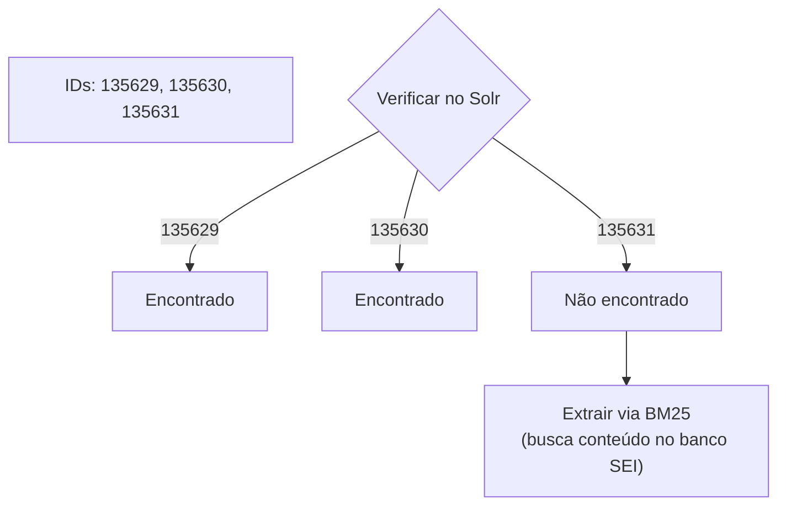
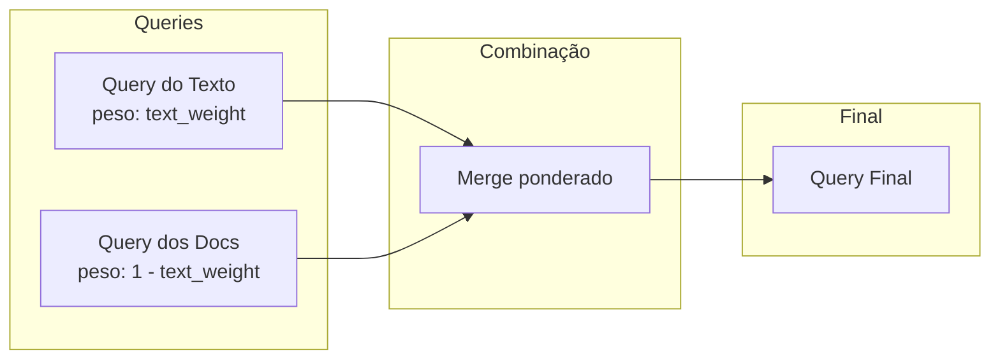
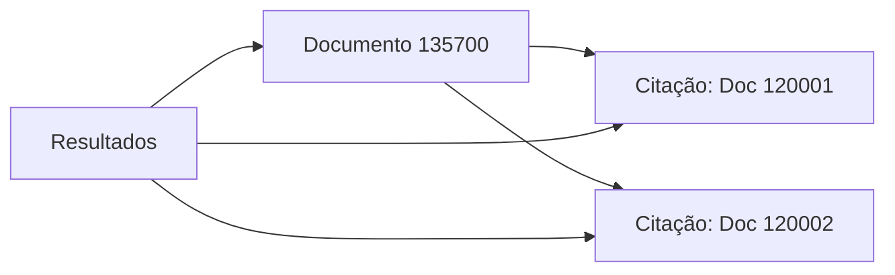
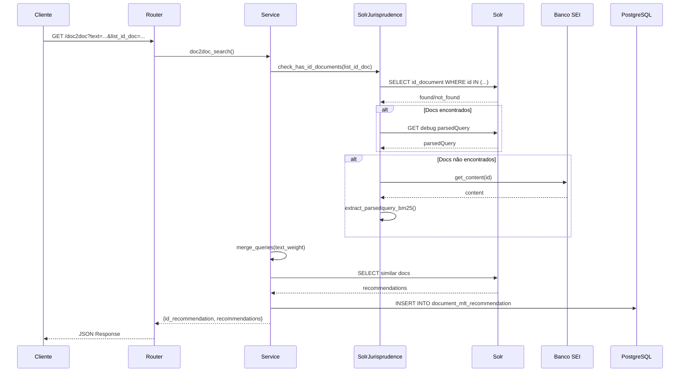

# Fluxo Doc2Doc Passo a Passo

Este documento detalha as etapas do processamento Doc2Doc.

---

## Visão Geral do Fluxo



---

## Etapa 1: Recepção da Requisição

O cliente envia uma requisição com texto e/ou IDs de documentos:

```
GET /document-recommenders/mlt-recommender/recommendations?
    text=recurso administrativo&
    list_id_doc=135629&
    list_id_doc=135630&
    text_weight=0.7&
    rows=10&
    normalized=true
```

### Validação dos Parâmetros

| Parâmetro | Validação |
|-----------|-----------|
| `text` | String (opcional se `list_id_doc` fornecido) |
| `list_id_doc` | Lista de inteiros (opcional se `text` fornecido) |
| `text_weight` | Float entre 0.0 e 1.0 |
| `rows` | Inteiro positivo |

!!! warning "Entrada Obrigatória"
    Pelo menos `text` ou `list_id_doc` deve ser fornecido.

---

## Etapa 2: Validação dos IDs de Documentos

Para cada ID fornecido, o sistema verifica se existe no Solr:



### Requisição de Verificação

```
GET /solr/documentos_bm25/select?q=id_document:(135629 OR 135630 OR 135631)&fl=id_document
```

### Resultado

```python
FoundIdsDocs(
    id_docs_found=[135629, 135630],
    id_docs_not_found=[135631]
)
```

---

## Etapa 3: Extração de Queries

### 3.1 Query do Texto

Se `text` foi fornecido, é tokenizado e convertido em query:

```
Entrada: "recurso administrativo sobre multa de trânsito"

Processamento:
1. Tokenização: ["recurso", "administrativo", "sobre", "multa", "de", "trânsito"]
2. Remoção de stopwords: ["recurso", "administrativo", "multa", "trânsito"]
3. Normalização: ["recurso", "administrativo", "multa", "transito"]

Saída: "content:recurso content:administrativo content:multa content:transito"
```

### 3.2 Query dos Documentos Encontrados

Para documentos que existem no Solr, usa o debug para obter a parsedQuery:

```
GET /solr/documentos_bm25/select?q=id_document:135629&debugQuery=true
```

Resposta:
```json
{
  "debug": {
    "parsedquery": "content:jurisprudencia^0.8 content:acordao^0.6 content:recurso^0.5"
  }
}
```

### 3.3 Query dos Documentos Não Encontrados

Para documentos que NÃO existem no Solr:

1. Busca conteúdo no banco SEI
2. Tokeniza localmente
3. Calcula BM25

```python
# Buscar conteúdo
content = sei_db.get_document_content(135631)

# Extrair parsed query via BM25
parsedquery = extract_parsedquery(content, max_tokens=25)
# Resultado: "content:documento^0.7 content:legal^0.5 ..."
```

---

## Etapa 4: Combinação com text_weight

O parâmetro `text_weight` define como combinar as queries:



### Cálculo do Peso

Para cada termo, o peso final é calculado:

```python
peso_texto = text_weight  # ex: 0.7
peso_docs = 1 - text_weight  # ex: 0.3

# Termo do texto
"content:recurso^1.0" → "content:recurso^0.7"

# Termo dos documentos
"content:acordao^0.8" → "content:acordao^0.24"  # 0.8 × 0.3
```

### Exemplo com text_weight = 0.7

| Fonte | Termo | Score Original | Peso | Score Final |
|-------|-------|----------------|------|-------------|
| Texto | `content:recurso` | 1.0 | × 0.7 | **0.70** |
| Texto | `content:multa` | 1.0 | × 0.7 | **0.70** |
| Docs | `content:acordao` | 0.8 | × 0.3 | **0.24** |
| Docs | `content:jurisprudencia` | 0.6 | × 0.3 | **0.18** |

### Query Final Combinada

```
content:recurso^0.70 content:multa^0.70 content:acordao^0.24 content:jurisprudencia^0.18
```

Veja mais detalhes em [Parâmetro text_weight](text-weight.md).

---

## Etapa 5: Filtros de Tipo de Documento

Se `list_type_id_doc` foi fornecido, adiciona filtro:

```python
# Parâmetro: list_type_id_doc=[4, 7, 8]

# Filter Query gerada:
fq = "id_type_document:(4 7 8)"
```

### Tipos de Documento Comuns

| ID | Tipo | Descrição |
|----|------|-----------|
| 4 | Despacho | Decisão administrativa |
| 7 | Análise | Análise técnica |
| 8 | Acórdão | Decisão colegiada |
| 16 | Informe | Documento informativo |
| 94 | Voto | Voto de conselheiro |

---

## Etapa 6: Busca no Solr

A query combinada é enviada ao core de jurisprudência:

```
POST /solr/documentos_bm25/select
{
  "query": "content:recurso^0.70 content:multa^0.70 content:acordao^0.24",
  "filter": "id_type_document:(4 7 8)",
  "fields": "id_document,id_type_document,score",
  "rows": 10
}
```

### Resposta

```json
{
  "response": {
    "numFound": 250,
    "docs": [
      {"id_document": 135700, "id_type_document": 8, "score": 45.2},
      {"id_document": 135701, "id_type_document": 7, "score": 38.7},
      {"id_document": 135702, "id_type_document": 4, "score": 31.4}
    ]
  }
}
```

---

## Etapa 7: Normalização de Scores

Se `normalized=true`, os scores são normalizados para [0, 1]:

```
score_normalizado = score / score_maximo
```

| Documento | Score Original | Score Normalizado |
|-----------|----------------|-------------------|
| 135700 | 45.2 | 1.00 |
| 135701 | 38.7 | 0.86 |
| 135702 | 31.4 | 0.69 |

---

## Etapa 8: Inclusão de Citações (Opcional)

Se `include_citations=true`, documentos citados são adicionados:



---

## Etapa 9: Persistência e Resposta

### Persistência no PostgreSQL

```sql
INSERT INTO document_mlt_recommendation
(text, list_id_doc, list_type_id_doc, text_weight, rows, normalized, recommendation, requested_at)
VALUES ('recurso administrativo', '{135629,135630}', '{4,7,8}', 0.7, 10, true, '[...]', NOW())
```

### Resposta ao Cliente

```json
{
  "id_recommendation": 123,
  "recommendation": [
    {
      "id_document": 135700,
      "id_type_document": 8,
      "score": 1.00
    },
    {
      "id_document": 135701,
      "id_type_document": 7,
      "score": 0.86
    }
  ]
}
```

---

## Diagrama de Sequência Completo



---

## Próximos Passos

- [Parâmetro text_weight](text-weight.md) - Detalhes sobre combinação de queries
- [Visão Geral](index.md) - Voltar à visão geral do Doc2Doc
- [Apache Solr](../dados/solr.md) - Configuração do core documentos_bm25
