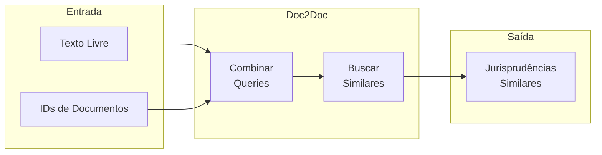
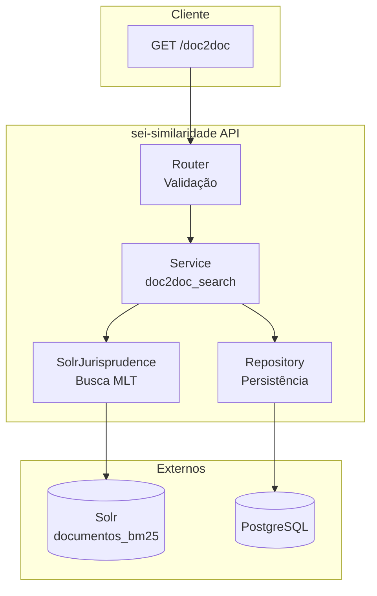

# Doc2Doc - Busca de Jurisprudência

O **Doc2Doc** é o sistema de busca de documentos de jurisprudência similares.

---

## O que é Doc2Doc?

O Doc2Doc encontra **documentos similares** a partir de:

- **Texto livre**: Uma consulta textual
- **Documentos de referência**: IDs de documentos existentes
- **Combinação de ambos**: Texto + documentos com pesos configuráveis



---

## Diferenças do WMLT

| Aspecto | WMLT | Doc2Doc |
|---------|------|---------|
| **Propósito** | Recomendação de processos | Busca de jurisprudência |
| **Entrada** | ID de processo | Texto e/ou IDs de documentos |
| **Core Solr** | `processos_mlt` | `documentos_bm25` |
| **Combinação** | Não | Sim (`text_weight`) |
| **Pesos customizados** | Sim (hierárquicos) | Não |

---

## Endpoint

```
GET /document-recommenders/mlt-recommender/recommendations
```

### Parâmetros

| Parâmetro | Tipo | Default | Obrigatório | Descrição |
|-----------|------|---------|-------------|-----------|
| `text` | string | `""` | Não* | Texto livre para busca |
| `list_id_doc` | list[int] | `[]` | Não* | IDs de documentos de referência |
| `list_type_id_doc` | list[int] | `[]` | Não | Filtrar por tipos de documento |
| `text_weight` | float | `0.5` | Não | Peso do texto vs documentos (0-1) |
| `rows` | int | `10` | Não | Quantidade de resultados |
| `normalized` | bool | `false` | Não | Normalizar scores [0,1] |
| `include_citations` | bool | `false` | Não | Incluir documentos citados |
| `id_user` | int | `null` | Não | ID do usuário (auditoria) |

!!! warning "Entrada Obrigatória"
    Pelo menos um dos parâmetros `text` ou `list_id_doc` deve ser fornecido.

### Exemplo de Requisição

```bash
# Busca por texto
curl "http://localhost:8000/document-recommenders/mlt-recommender/recommendations?text=recurso+administrativo&rows=5"

# Busca por documentos de referência
curl "http://localhost:8000/document-recommenders/mlt-recommender/recommendations?list_id_doc=135629&list_id_doc=135630"

# Busca combinada
curl "http://localhost:8000/document-recommenders/mlt-recommender/recommendations?text=multa&list_id_doc=135629&text_weight=0.7"
```

### Exemplo de Resposta

```json
{
  "id_recommendation": 123,
  "recommendation": [
    {
      "id_document": 135700,
      "id_type_document": 8,
      "score": 1.00
    },
    {
      "id_document": 135701,
      "id_type_document": 7,
      "score": 0.85
    }
  ]
}
```

---

## Arquitetura



---

## Casos de Uso

### 1. Busca por Texto

O usuário digita uma consulta textual:

```bash
curl "...?text=recurso administrativo sobre multa de trânsito"
```

### 2. Busca por Documentos de Referência

O usuário seleciona documentos existentes como referência:

```bash
curl "...?list_id_doc=135629&list_id_doc=135630"
```

### 3. Busca Combinada

O usuário combina texto com documentos:

```bash
curl "...?text=multa&list_id_doc=135629&text_weight=0.7"
```

- `text_weight=0.7`: 70% do texto, 30% dos documentos

---

## Próximos Passos

- [Fluxo Passo a Passo](fluxo-passo-a-passo.md) - Entenda cada etapa do processo
- [Parâmetro text_weight](text-weight.md) - Como combinar texto e documentos
- [Apache Solr](../dados/solr.md) - Configuração do core documentos_bm25
