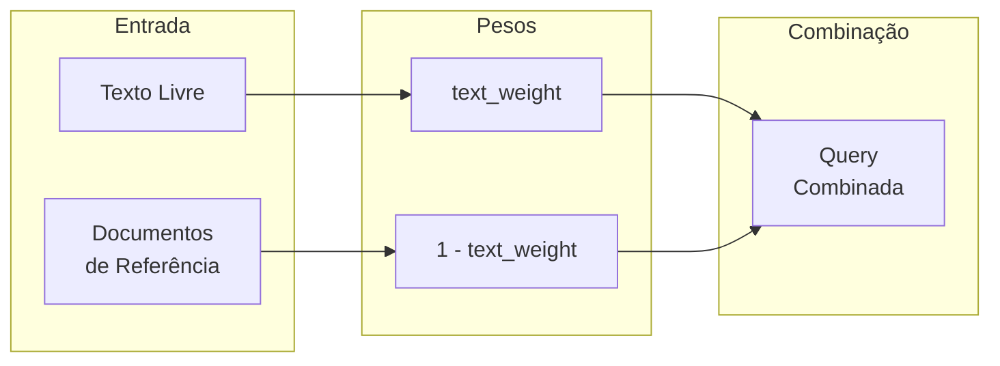
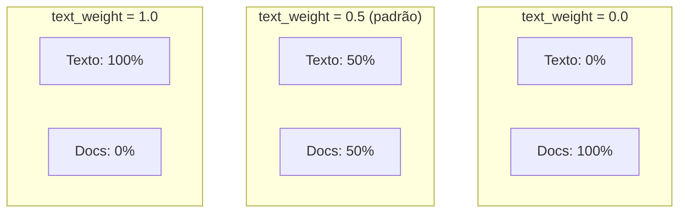

# Parâmetro text_weight

O parâmetro `text_weight` controla como combinar as queries de texto livre e documentos de referência no Doc2Doc.

---

## O que é text_weight?

O `text_weight` é um valor entre **0.0** e **1.0** que define o **peso relativo** do texto versus os documentos de referência na busca combinada.



---

## Tabela de Valores

| text_weight | Peso Texto | Peso Docs | Comportamento |
|-------------|------------|-----------|---------------|
| **0.0** | 0% | 100% | Ignora texto, usa apenas documentos |
| **0.3** | 30% | 70% | Mais relevância para documentos |
| **0.5** | 50% | 50% | Peso igual (padrão) |
| **0.7** | 70% | 30% | Mais relevância para texto |
| **1.0** | 100% | 0% | Ignora documentos, usa apenas texto |

---

## Visualização



---

## Exemplo Prático

**Cenário:**
- Texto: "recurso administrativo"
- Documento de referência: ID 135629

### Extração das Queries

**Query do Texto:**
```
content:recurso^1.0 content:administrativo^1.0
```

**Query do Documento 135629:**
```
content:multa^0.8 content:transito^0.6 content:infracao^0.4
```

### Aplicação de text_weight = 0.7

**Cálculo:**

| Fonte | Termo | Score Original | Peso | Score Final |
|-------|-------|----------------|------|-------------|
| Texto | recurso | 1.0 | × 0.7 | **0.70** |
| Texto | administrativo | 1.0 | × 0.7 | **0.70** |
| Docs | multa | 0.8 | × 0.3 | **0.24** |
| Docs | transito | 0.6 | × 0.3 | **0.18** |
| Docs | infracao | 0.4 | × 0.3 | **0.12** |

**Query Final:**
```
content:recurso^0.70 content:administrativo^0.70 content:multa^0.24 content:transito^0.18 content:infracao^0.12
```

### Resultado

Os termos do texto (`recurso`, `administrativo`) têm quase **3x mais peso** que os termos dos documentos.

---

## Casos de Uso

### 1. Busca Guiada por Texto (text_weight = 0.8)

Quando o usuário sabe exatamente o que procura:

```bash
curl "...?text=multa de trânsito&list_id_doc=135629&text_weight=0.8"
```

O texto tem prioridade, documentos servem apenas para refinar.

### 2. Busca Guiada por Documentos (text_weight = 0.2)

Quando os documentos de referência são mais importantes:

```bash
curl "...?text=recurso&list_id_doc=135629&list_id_doc=135630&text_weight=0.2"
```

Os documentos de referência definem o contexto.

### 3. Busca Equilibrada (text_weight = 0.5)

Quando texto e documentos são igualmente relevantes:

```bash
curl "...?text=acordo&list_id_doc=135629&text_weight=0.5"
```

---

## Fórmula de Combinação

Para cada termo, o peso final é calculado:

```python
def merge_queries(query_texto, query_docs, text_weight):
    peso_texto = text_weight
    peso_docs = 1 - text_weight

    query_final = {}

    # Termos do texto
    for termo, score in query_texto.items():
        query_final[termo] = score * peso_texto

    # Termos dos documentos
    for termo, score in query_docs.items():
        if termo in query_final:
            query_final[termo] += score * peso_docs
        else:
            query_final[termo] = score * peso_docs

    return query_final
```

### Termos em Comum

Se um termo aparece tanto no texto quanto nos documentos, os pesos são **somados**:

```
Texto: content:recurso^1.0 (peso final: 0.7)
Docs:  content:recurso^0.5 (peso final: 0.15)

Combinado: content:recurso^0.85
```

---

## Comportamento nos Extremos

### text_weight = 0.0

```bash
curl "...?text=recurso&list_id_doc=135629&text_weight=0.0"
```

- O texto é **completamente ignorado**
- Equivalente a buscar apenas por documentos de referência

### text_weight = 1.0

```bash
curl "...?text=recurso&list_id_doc=135629&text_weight=1.0"
```

- Os documentos são **completamente ignorados**
- Equivalente a buscar apenas por texto

---

## Recomendações

| Cenário | text_weight Sugerido |
|---------|----------------------|
| Busca exploratória | 0.5 |
| Usuário sabe o que quer | 0.7 - 0.8 |
| Documentos são autoridade | 0.2 - 0.3 |
| Refinamento de busca | 0.3 - 0.5 |

---

## Exemplo de Requisição Completa

```bash
curl -X GET "http://localhost:8000/document-recommenders/mlt-recommender/recommendations" \
  -G \
  --data-urlencode "text=recurso administrativo sobre multa" \
  --data-urlencode "list_id_doc=135629" \
  --data-urlencode "list_id_doc=135630" \
  --data-urlencode "list_type_id_doc=4" \
  --data-urlencode "list_type_id_doc=7" \
  --data-urlencode "list_type_id_doc=8" \
  --data-urlencode "text_weight=0.7" \
  --data-urlencode "rows=10" \
  --data-urlencode "normalized=true"
```

---

## Próximos Passos

- [Fluxo Passo a Passo](fluxo-passo-a-passo.md) - Ver text_weight no contexto do fluxo
- [Visão Geral](index.md) - Voltar à visão geral do Doc2Doc
- [API Reference](../api-reference/index.md) - Todos os endpoints
