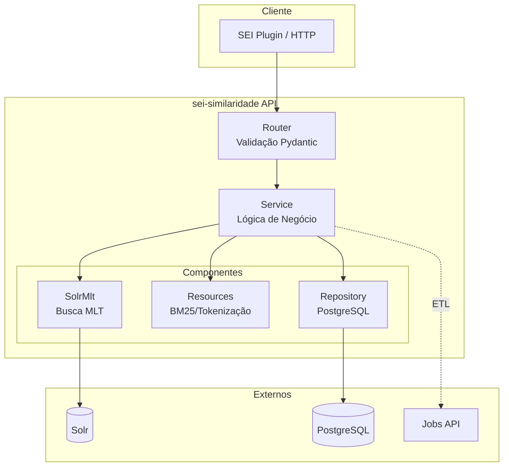
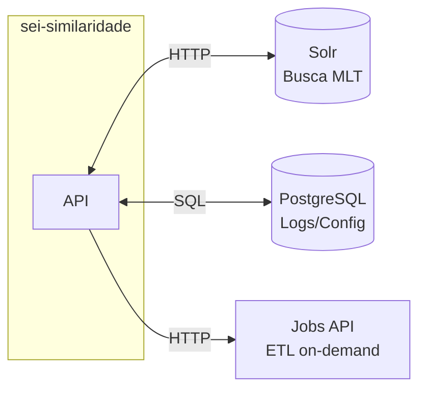

# sei-similaridade

[](https://img.shields.io/github/v/release/Anatel/sei-similaridade)
[](https://github.com/Anatel/sei-similaridade/actions/workflows/main.yml?query=branch%3Amain)
[](https://www.python.org/downloads/)

API de Recomendação de Processos e Documentos do Sistema Eletrônico de Informações (SEI).

---

## O que é o sei-similaridade?

O **sei-similaridade** é uma API RESTful que encontra **processos e documentos similares** usando técnicas de Information Retrieval (Recuperação de Informação). O sistema analisa o conteúdo textual e encontra itens que tratam de assuntos semelhantes.

### O que a API faz?

1. **Recomendação de Processos (WMLT)**: Dado um processo, encontra outros processos similares
2. **Busca de Jurisprudência (Doc2Doc)**: Dado texto ou documentos, encontra jurisprudências relacionadas
3. **Persistência**: Armazena recomendações para auditoria e histórico

---

## Arquitetura



---

## Integrações Externas



---

## Funcionalidades Principais

| Funcionalidade | Endpoint | Descrição |
|----------------|----------|-----------|
| **WMLT** | `/process-recommenders/weighted-mlt-recommender/recommendations/{id}` | Processos similares com pesos |
| **Doc2Doc** | `/document-recommenders/mlt-recommender/recommendations` | Jurisprudências similares |
| **Verificação** | `/process-recommenders/.../indexed-ids/{id}` | Verifica indexação |

---

## Stack Tecnológico

| Componente | Tecnologia |
|------------|------------|
| **Framework Web** | FastAPI + Uvicorn + Gunicorn |
| **Linguagem** | Python 3.10+ |
| **Busca Textual** | Apache Solr 9.0+ |
| **Banco de Dados** | PostgreSQL 15+ |
| **ORM** | SQLAlchemy 2.0+ |
| **Validação** | Pydantic |
| **Observabilidade** | OpenTelemetry (opcional) |
| **Containerização** | Docker |

---

## Quick Start

```bash
# Clonar repositório
git clone https://git.anatel.gov.br/processo_eletronico/sei-ia/sei-similaridade.git
cd sei-similaridade/api

# Configurar variáveis
cp .env.example .env
nano .env

# Executar
docker-compose up -d

# Testar
curl http://localhost:8000/health
```

---

## Navegação

### [Getting Started](getting-started/index.md)

Instalação e configuração inicial da API.

- [Instalação](getting-started/index.md)
- [Variáveis de Ambiente](getting-started/environment-variables.md)

### [WMLT - Recomendação de Processos](wmlt/index.md)

Algoritmo de recomendação de processos com pesos customizados.

- [Visão Geral](wmlt/index.md)
- [Fluxo Passo a Passo](wmlt/fluxo-passo-a-passo.md)
- [Sistema de Pesos](wmlt/pesos-e-configuracao.md)
- [Métodos de Extração](wmlt/metodos-extracao.md)

### [Doc2Doc - Busca de Jurisprudência](doc2doc/index.md)

Sistema de busca de documentos de jurisprudência similares.

- [Visão Geral](doc2doc/index.md)
- [Fluxo Passo a Passo](doc2doc/fluxo-passo-a-passo.md)
- [Parâmetro text_weight](doc2doc/text-weight.md)

### [Camada de Dados](dados/index.md)

Configuração e uso dos bancos de dados.

- [Visão Geral](dados/index.md)
- [Apache Solr](dados/solr.md)
- [PostgreSQL](dados/postgresql.md)
- [Jobs API](dados/jobs-api.md)

### [API Reference](api-reference/index.md)

Documentação completa dos endpoints.

---

## Links Externos

- [Repositório GitLab](https://git.anatel.gov.br/processo_eletronico/sei-ia/sei-similaridade)
- [Jobs API (ETL)](https://git.anatel.gov.br/processo_eletronico/sei-ia/sei-similaridade/-/tree/master/jobs)
- [SEI - Sistema Eletrônico de Informações](https://pt.wikipedia.org/wiki/Sistema_Eletr%C3%B4nico_de_Informa%C3%A7%C3%B5es_(SEI))
