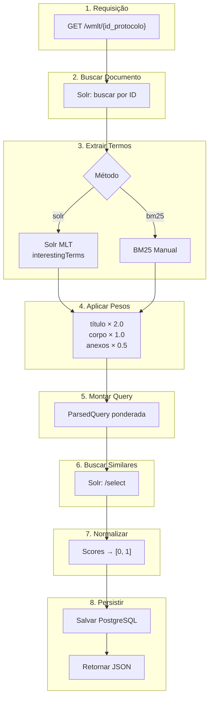
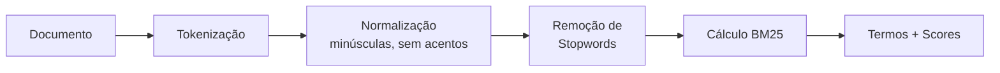
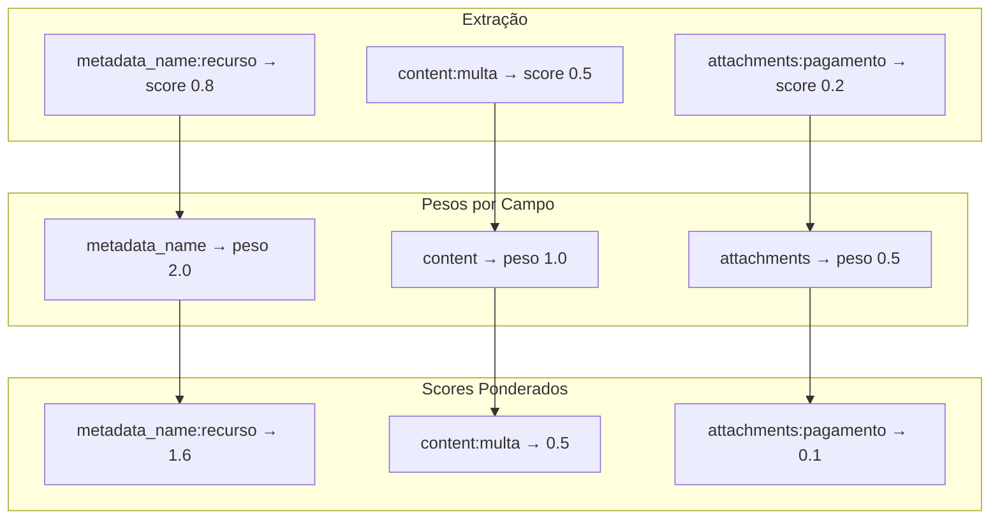
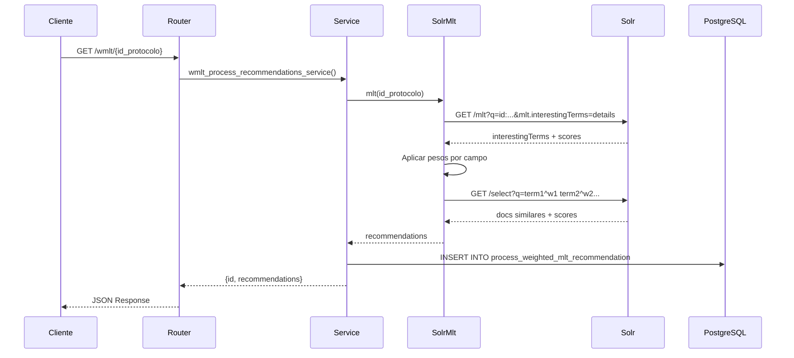

# Fluxo WMLT Passo a Passo

Este documento detalha as 8 etapas do processamento WMLT, desde a requisição até a resposta.

---

## Visão Geral do Fluxo



---

## Etapa 1: Recepção da Requisição

O cliente envia uma requisição HTTP com o ID do processo:

```
GET /process-recommenders/weighted-mlt-recommender/recommendations/53500123456202400?rows=10
```

O **Router** valida os parâmetros usando Pydantic:

| Parâmetro | Validação |
|-----------|-----------|
| `id_protocolo` | String de 17-20 dígitos |
| `rows` | Inteiro positivo (default: 10) |
| `extraction_method` | Enum: `solr` ou `bm25` |

---

## Etapa 2: Busca do Documento no Solr

O sistema busca o documento original no Solr para extrair seu conteúdo:

```
GET /solr/processos_mlt/select?q=id_protocolo:53500123456202400
```

O Solr retorna o documento com seus campos indexados:

| Campo | Conteúdo | Exemplo |
|-------|----------|---------|
| `metadata_name` | Título do processo | "Recurso Administrativo - Multa de Trânsito" |
| `content` | Corpo do documento | "O recorrente alega que a multa aplicada..." |
| `attachments` | Texto dos anexos | "Comprovante de pagamento..." |

---

## Etapa 3: Extração de Termos Relevantes

O sistema identifica os **termos mais importantes** do documento. Existem dois métodos disponíveis:

### Método Solr (Padrão)

Usa o handler MLT nativo do Solr:

```
GET /solr/processos_mlt/mlt?q=id_protocolo:123...&mlt.fl=content&mlt.interestingTerms=details
```

O Solr analisa o documento e retorna os "termos interessantes":

```json
{
  "interestingTerms": [
    ["recurso", 15.2],
    ["multa", 12.8],
    ["administrativo", 10.5],
    ["pagamento", 8.3]
  ]
}
```

### Método BM25

Tokeniza o documento localmente e calcula scores BM25:



Veja mais detalhes em [Métodos de Extração](metodos-extracao.md).

---

## Etapa 4: Aplicação de Pesos por Campo

Esta é a parte **"Weighted"** do WMLT. Cada campo do documento tem um peso diferente:



**Exemplo Prático:**

| Campo | Termo | Score Original | Peso do Campo | Score Final |
|-------|-------|----------------|---------------|-------------|
| `metadata_name` | recurso | 0.8 | × 2.0 | = **1.6** |
| `content` | multa | 0.5 | × 1.0 | = **0.5** |
| `attachments` | pagamento | 0.2 | × 0.5 | = **0.1** |

Veja mais detalhes em [Sistema de Pesos](pesos-e-configuracao.md).

---

## Etapa 5: Montagem da ParsedQuery

Os termos ponderados são combinados em uma **ParsedQuery**:

```
metadata_name:recurso^1.6 content:multa^0.5 content:administrativo^0.4 attachments:pagamento^0.1
```

Esta query é enviada ao Solr no formato:

```json
{
  "query": "metadata_name:recurso^1.6 content:multa^0.5 ...",
  "params": {
    "q.op": "OR",
    "fl": "id_protocolo,score",
    "rows": 10
  }
}
```

---

## Etapa 6: Busca de Documentos Similares

O Solr executa a query e retorna documentos ordenados por **score de similaridade**:

```json
{
  "response": {
    "numFound": 150,
    "docs": [
      {"id_protocolo": "53500987654202400", "score": 25.8},
      {"id_protocolo": "53500111222202300", "score": 22.3},
      {"id_protocolo": "53500333444202300", "score": 18.7}
    ]
  }
}
```

O score é calculado pelo Solr somando a contribuição de cada termo:

```
score_doc = Σ (peso_termo × relevância_no_doc)
```

!!! info "Documento de Entrada"
    O documento de entrada é automaticamente removido dos resultados.

---

## Etapa 7: Normalização de Scores

Se `normalized=true`, os scores são normalizados para o intervalo [0, 1]:

```
score_normalizado = score / score_maximo
```

| Documento | Score Original | Score Normalizado |
|-----------|----------------|-------------------|
| Doc 1 | 25.8 | 1.00 |
| Doc 2 | 22.3 | 0.86 |
| Doc 3 | 18.7 | 0.72 |

---

## Etapa 8: Persistência e Resposta

### Persistência no PostgreSQL

A recomendação é salva para auditoria:

```sql
INSERT INTO process_weighted_mlt_recommendation
(id_protocolo, extraction_method, rows, recommendation, requested_at)
VALUES ('53500123456202400', 'solr', 10, '[{"id": "987...", "score": 25.8}, ...]', NOW())
```

### Resposta ao Cliente

```json
{
  "id": 42,
  "recommendations": [
    {"id_protocolo": "53500987654202400", "score": 1.00},
    {"id_protocolo": "53500111222202300", "score": 0.86},
    {"id_protocolo": "53500333444202300", "score": 0.72}
  ]
}
```

---

## Diagrama de Sequência Completo



---

## Próximos Passos

- [Sistema de Pesos](pesos-e-configuracao.md) - Entenda como configurar pesos
- [Métodos de Extração](metodos-extracao.md) - Solr MLT vs BM25
- [Visão Geral](index.md) - Voltar à visão geral do WMLT
