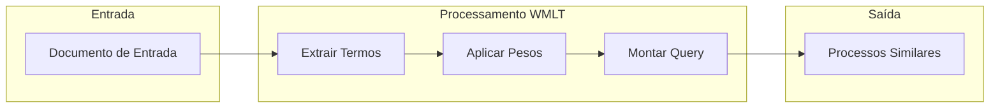
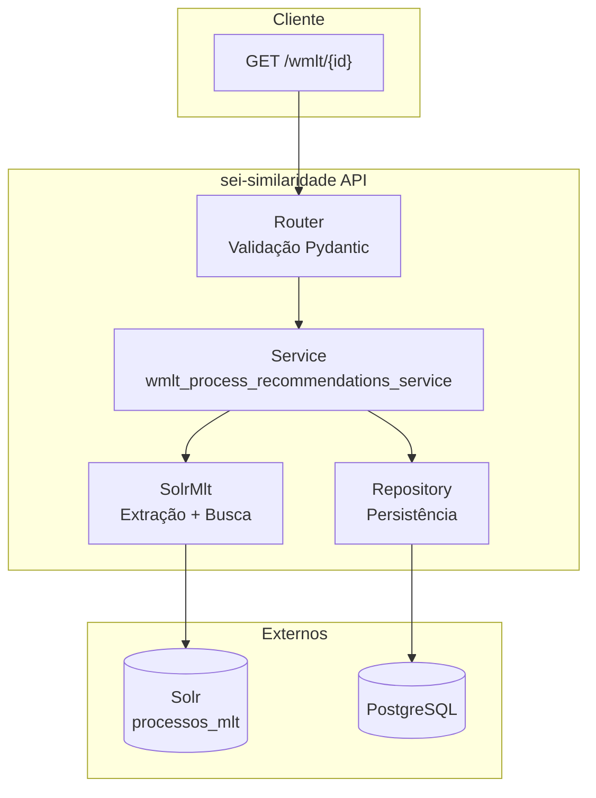

# WMLT - Recomendação de Processos

O **WMLT** (Weighted More Like This) é o algoritmo principal de recomendação de processos do sei-similaridade.

---

## O que é WMLT?

O WMLT é uma implementação customizada do [More Like This](https://solr.apache.org/guide/solr/latest/query-guide/morelikethis.html) do Apache Solr que aplica **pesos diferenciados** aos termos conforme sua origem no documento.



---

## Diferencial

A ideia central do WMLT é que **nem todos os campos têm a mesma importância**:

| Campo | Relevância | Exemplo |
|-------|------------|---------|
| **Título** | Alta | "Recurso Administrativo" no título é muito relevante |
| **Corpo** | Média | Conteúdo geral do documento |
| **Anexos** | Baixa | Comprovantes e documentos auxiliares |

Um termo que aparece no **título** é mais significativo que o mesmo termo em um **anexo**.

---

## Endpoint

```
GET /process-recommenders/weighted-mlt-recommender/recommendations/{id_protocolo}
```

### Parâmetros

| Parâmetro | Tipo | Default | Obrigatório | Descrição |
|-----------|------|---------|-------------|-----------|
| `id_protocolo` | string | - | Sim | ID do processo (17-20 dígitos) |
| `rows` | int | 10 | Não | Quantidade de resultados |
| `debug` | bool | false | Não | Retorna informações de debug |
| `extraction_method` | string | `solr` | Não | Método: `solr` ou `bm25` |
| `id_user` | int | null | Não | ID do usuário (auditoria) |

### Exemplo de Requisição

```bash
curl "http://localhost:8000/process-recommenders/weighted-mlt-recommender/recommendations/53500123456202400?rows=5"
```

### Exemplo de Resposta

```json
{
  "id": 42,
  "recommendations": [
    {"id_protocolo": "53500987654202400", "score": 1.00},
    {"id_protocolo": "53500111222202300", "score": 0.87},
    {"id_protocolo": "53500333444202300", "score": 0.72}
  ]
}
```

---

## Arquitetura



---

## Próximos Passos

- [Fluxo Passo a Passo](fluxo-passo-a-passo.md) - Entenda cada etapa do processo
- [Sistema de Pesos](pesos-e-configuracao.md) - Como os pesos são configurados
- [Métodos de Extração](metodos-extracao.md) - Solr MLT vs BM25
