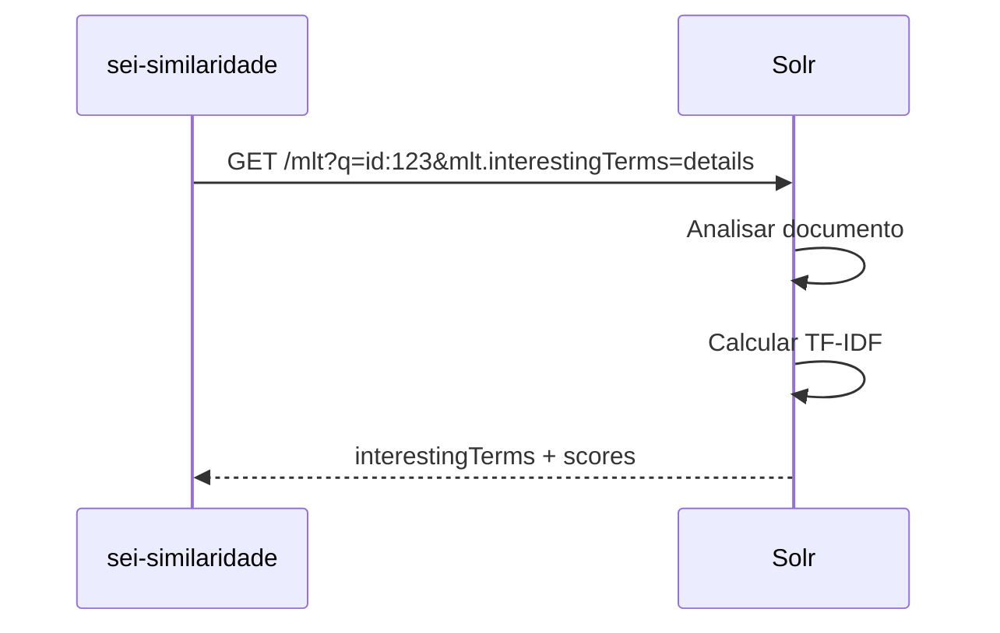
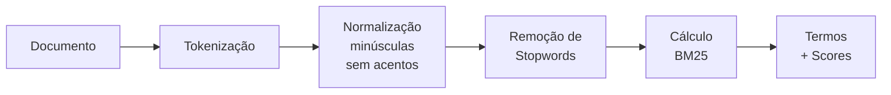

# Métodos de Extração de Termos

O WMLT suporta dois métodos para extrair termos relevantes de um documento: **Solr MLT** (padrão) e **BM25**.

---

## Visão Geral

| Aspecto | Solr MLT | BM25 |
|---------|----------|------|
| Processamento | Servidor Solr | Local (Python) |
| Velocidade | Mais rápido | Mais lento |
| Algoritmo | TF-IDF | BM25 |
| Configuração | `mlt.mindf`, `mlt.mintf` | `k1`, `b` |
| Uso | Padrão | Alternativo |

---

## Método Solr MLT (Padrão)

O método Solr usa o handler **More Like This** nativo do Apache Solr.

### Como Funciona



### Requisição ao Solr

```
GET /solr/processos_mlt/mlt?
    q=id_protocolo:53500123456202400&
    mlt.fl=content,metadata_name&
    mlt.interestingTerms=details&
    mlt.mintf=2&
    mlt.mindf=5&
    mlt.maxqt=25
```

### Parâmetros MLT

| Parâmetro | Valor | Descrição |
|-----------|-------|-----------|
| `mlt.fl` | `content,metadata_name` | Campos a analisar |
| `mlt.interestingTerms` | `details` | Retorna termos + scores |
| `mlt.mintf` | `2` | Min Term Frequency |
| `mlt.mindf` | `5` | Min Document Frequency |
| `mlt.maxqt` | `25` | Max Query Terms |

### Resposta do Solr

```json
{
  "interestingTerms": [
    ["recurso", 15.2],
    ["multa", 12.8],
    ["administrativo", 10.5],
    ["transito", 8.3],
    ["infracao", 7.1]
  ]
}
```

### Algoritmo TF-IDF

O score de cada termo é calculado usando **TF-IDF**:

```
TF-IDF = TF × IDF
```

Onde:

- **TF (Term Frequency)**: Quantas vezes o termo aparece no documento
- **IDF (Inverse Document Frequency)**: Quão raro o termo é no corpus

```
IDF = log(N / df)
```

- `N` = total de documentos no índice
- `df` = quantos documentos contêm o termo

!!! info "Intuição"
    Termos que aparecem **muito no documento** mas são **raros no corpus** recebem scores maiores.

---

## Método BM25

O método BM25 é uma implementação local que tokeniza o documento e calcula scores usando o algoritmo BM25.

### Como Funciona



### Algoritmo BM25

O BM25 (Best Matching 25) é uma evolução do TF-IDF que considera:

1. **Saturação de frequência**: Termos muito frequentes não crescem indefinidamente
2. **Normalização de tamanho**: Documentos longos são penalizados

#### Fórmula Completa

```
score = IDF × TF_normalizado
```

**IDF (Inverse Document Frequency):**

```
IDF = log((N - df + 0.5) / (df + 0.5))
```

**TF Normalizado:**

```
TF_norm = (freq × (k1 + 1)) / (freq + k1 × (1 - b + b × dl/avgdl))
```

#### Parâmetros

| Parâmetro | Valor Padrão | Descrição |
|-----------|--------------|-----------|
| `k1` | 1.2 | Controla saturação da frequência |
| `b` | 0.75 | Controla normalização por tamanho |

#### Variáveis

| Variável | Descrição |
|----------|-----------|
| `N` | Total de documentos no índice |
| `df` | Document Frequency (docs com o termo) |
| `freq` | Frequência do termo no documento |
| `dl` | Document Length (tamanho do documento) |
| `avgdl` | Average Document Length |

### Exemplo Numérico

**Cenário:**
- Termo: "multa"
- Frequência no documento (`freq`): 5
- Tamanho do documento (`dl`): 1000 palavras
- Tamanho médio (`avgdl`): 800 palavras
- Documentos com o termo (`df`): 100
- Total de documentos (`N`): 10.000

**Cálculo IDF:**

```
IDF = log((10000 - 100 + 0.5) / (100 + 0.5))
    = log(9900.5 / 100.5)
    = log(98.51)
    = 1.99
```

**Cálculo TF Normalizado:**

```
TF_norm = (5 × (1.2 + 1)) / (5 + 1.2 × (1 - 0.75 + 0.75 × 1000/800))
        = (5 × 2.2) / (5 + 1.2 × (0.25 + 0.9375))
        = 11 / (5 + 1.2 × 1.1875)
        = 11 / (5 + 1.425)
        = 11 / 6.425
        = 1.71
```

**Score Final:**

```
score = IDF × TF_norm
      = 1.99 × 1.71
      = 3.40
```

---

## Quando Usar Cada Método

### Use Solr MLT quando:

- Velocidade é importante
- Índice Solr está bem configurado
- Casos de uso padrão

### Use BM25 quando:

- Precisa de mais controle sobre tokenização
- Quer ajustar parâmetros `k1` e `b`
- Debugging e análise detalhada

---

## Configuração no Código

### Via API

```bash
# Usando Solr MLT (padrão)
curl ".../recommendations/123?extraction_method=solr"

# Usando BM25
curl ".../recommendations/123?extraction_method=bm25"
```

### Via Pydantic Model

```python
from api_sei.pydantic_models.solr_mlt import ExtractionMethodEnum

# Solr MLT
config = SolrMltConfigModel(
    extraction_method=ExtractionMethodEnum.solr
)

# BM25
config = SolrMltConfigModel(
    extraction_method=ExtractionMethodEnum.bm25
)
```

---

## Comparação de Resultados

Para o mesmo documento, os métodos podem retornar termos diferentes:

| Termo | Score Solr MLT | Score BM25 |
|-------|----------------|------------|
| recurso | 15.2 | 12.8 |
| multa | 12.8 | 14.1 |
| administrativo | 10.5 | 9.8 |

!!! note "Diferenças"
    As diferenças ocorrem porque:

    - Solr MLT usa TF-IDF puro
    - BM25 considera saturação e normalização
    - Tokenização pode ser diferente

---

## Próximos Passos

- [Sistema de Pesos](pesos-e-configuracao.md) - Como pesos são aplicados aos termos
- [Fluxo Passo a Passo](fluxo-passo-a-passo.md) - Ver métodos no contexto do fluxo
- [Visão Geral](index.md) - Voltar à visão geral do WMLT
