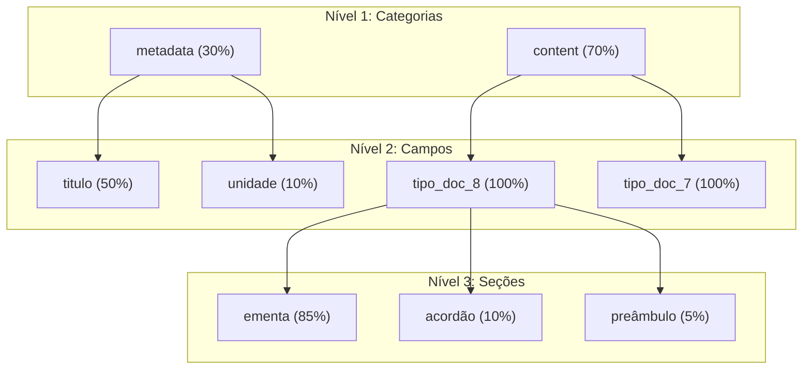

# Sistema de Pesos WMLT

O sistema de pesos é o diferencial do WMLT. Ele permite atribuir importâncias diferentes aos termos conforme sua origem no documento.

---

## Conceito

### Por que pesos são importantes?

Um termo que aparece no **título** é mais relevante que o mesmo termo no **corpo**. Por exemplo:

- Se o título é "Recurso Administrativo", a palavra "recurso" é **muito importante**
- Se "recurso" aparece apenas no meio de um anexo, ela é **menos relevante**

### Estrutura Hierárquica

Os pesos são organizados em uma estrutura hierárquica de 3 níveis:



---

## Nível 1: Categorias Principais

| Categoria | Peso | Descrição |
|-----------|------|-----------|
| `metadata` | **0.30** (30%) | Informações estruturadas do processo |
| `content` | **0.70** (70%) | Conteúdo textual dos documentos |

---

## Nível 2: Campos de Metadata

| Campo | Peso | Descrição |
|-------|------|-----------|
| `metadata_name_id_type_process` | 0.50 | Tipo do processo |
| `metadata_info_related_processes` | 0.15 | Processos relacionados |
| `metadata_name_id_type_doc_*` | 0.15 | Tipos de documento no processo |
| `metadata_id_unit_process_generator` | 0.10 | Unidade geradora |
| `metadata_process_specification` | 0.05 | Especificação |
| `metadata_id_contact_interested` | 0.03 | Interessados |

---

## Nível 3: Conteúdo por Tipo de Documento

### Acórdão (tipo 8)

| Seção | Peso | Justificativa |
|-------|------|---------------|
| `ementa` | **0.85** | Resumo do acórdão - mais importante |
| `acordao` | 0.10 | Texto do acórdão |
| `preambulo` | 0.05 | Introdução formal |

### Análise (tipo 7)

| Seção | Peso | Justificativa |
|-------|------|---------------|
| `relatorio` | **0.55** | Análise detalhada |
| `ementa` | 0.15 | Resumo |
| `assunto` | 0.10 | Tema principal |
| `conclusao` | 0.10 | Conclusão |
| `conselheiro` | 0.05 | Responsável |
| `referencias` | 0.05 | Referências legais |

#### Subseções do Relatório (tipo 7)

| Subseção | Peso |
|----------|------|
| `relatorio_da_analise` | **0.5454** |
| `relatorio_do_direito` | 0.2727 |
| `relatorio_dos_fatos` | 0.1818 |

### Despacho (tipo 4)

| Seção | Peso | Justificativa |
|-------|------|---------------|
| `decide` | **0.90** | Decisão - mais importante |
| `preambulo` | 0.10 | Introdução |

### Informe (tipo 16)

| Seção | Peso | Justificativa |
|-------|------|---------------|
| `analise` | **0.65** | Análise técnica |
| `assunto` | 0.10 | Tema |
| `referencias` | 0.10 | Referências |
| `conclusao` | 0.10 | Conclusão |
| `anexos` | 0.05 | Documentos anexos |

### Voto (tipo 94)

| Seção | Peso | Justificativa |
|-------|------|---------------|
| `relatorio` | **0.55** | Análise detalhada |
| `ementa` | 0.15 | Resumo |
| `assunto` | 0.10 | Tema |
| `conclusao` | 0.10 | Conclusão |
| `conselheiro` | 0.05 | Responsável |
| `referencias` | 0.05 | Referências |

---

## Exemplo Numérico Completo

**Documento de entrada:** Processo sobre "Recurso Administrativo de Multa de Trânsito"

### Passo 1: Extração de Termos

O Solr extrai os termos interessantes:

| Campo | Termo | Score Original |
|-------|-------|----------------|
| `metadata_name_id_type_process` | recurso | 0.8 |
| `content_id_type_doc_8_ementa` | multa | 0.6 |
| `content_id_type_doc_8_acordao` | transito | 0.4 |

### Passo 2: Cálculo dos Pesos Hierárquicos

Para `metadata_name_id_type_process`:
```
peso_final = peso_metadata × peso_campo
           = 0.30 × 0.50
           = 0.15
```

Para `content_id_type_doc_8_ementa`:
```
peso_final = peso_content × peso_tipo_doc × peso_ementa
           = 0.70 × 0.98 × 1.0 × 0.85
           = 0.583
```

Para `content_id_type_doc_8_acordao`:
```
peso_final = peso_content × peso_tipo_doc × peso_acordao
           = 0.70 × 0.98 × 1.0 × 0.10
           = 0.069
```

### Passo 3: Aplicação dos Pesos

| Campo | Termo | Score × Peso | Score Final |
|-------|-------|--------------|-------------|
| `metadata_name...` | recurso | 0.8 × 0.15 | **0.12** |
| `content_..._ementa` | multa | 0.6 × 0.583 | **0.35** |
| `content_..._acordao` | transito | 0.4 × 0.069 | **0.03** |

### Passo 4: Query Final

```
metadata_name_id_type_process:recurso^0.12
content_id_type_doc_8_ementa:multa^0.35
content_id_type_doc_8_acordao:transito^0.03
```

O termo "multa" na ementa tem **peso 3x maior** que "recurso" nos metadados!

---

## Configuração dos Pesos

### Arquivo de Configuração

Os pesos são definidos em `api_sei/configs/conf_mlt_fields_weights.json`:

```json
{
  "metadata": {
    "weight": 0.3,
    "fields": {
      "metadata_name_id_type_process": {"weight": 0.5},
      "metadata_id_unit_process_generator": {"weight": 0.1}
    }
  },
  "content": {
    "weight": 0.7,
    "fields": {
      "content_id_type_doc_": {
        "weight": 0.98,
        "fields": {
          "content_id_type_doc_8": {
            "weight": 1.0,
            "fields": {
              "content_id_type_doc_8_ementa": {"weight": 0.85},
              "content_id_type_doc_8_acordao": {"weight": 0.10}
            }
          }
        }
      }
    }
  }
}
```

### Tabela no PostgreSQL

Os pesos também são armazenados no PostgreSQL para permitir customização dinâmica:

```sql
SELECT * FROM config_mlt_fields_weights ORDER BY created_on DESC LIMIT 1;
```

| id | weights | created_on |
|----|---------|------------|
| 1 | `{"metadata": {"weight": 0.3, ...}}` | 2024-01-15 10:30:00 |

!!! info "Atualização Dinâmica"
    Pesos podem ser atualizados no banco de dados sem necessidade de reimplantar a aplicação.

---

## Próximos Passos

- [Fluxo Passo a Passo](fluxo-passo-a-passo.md) - Ver como os pesos são aplicados no fluxo
- [Métodos de Extração](metodos-extracao.md) - Entender TF-IDF e BM25
- [Visão Geral](index.md) - Voltar à visão geral do WMLT
