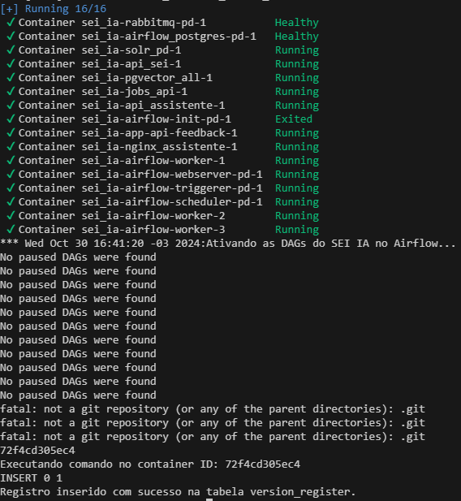

# Instalação do Servidor de Soluções de IA do módulo SEI IA

- Este guia descreve os procedimentos para instalação do *Servidor de Soluções de IA* do módulo SEI IA, em um ambiente Linux.
- É importante observar que este manual não tem como objetivo fornecer conhecimento sobre as tecnologias adotadas. Para isto recomendamos buscar fontes mais apropriadas.
- Para instalar o *Servidor de Soluções de IA do Módulo SEI IA* é mandatório ter o [Módulo SEI IA](https://github.com/anatelgovbr/mod-sei-ia) previamente instalado e configurado no SEI do ambiente correspondente. **Ou seja, antes, instale o módulo no SEI!**
- **ATENÇÃO:** O Servidor a ser instalado NÃO DEVE ser compartilhado com outras soluções.
- **ATENÇÃO:** Na seção [Health Checker Geral do Ambiente](docs/HEALTH_CHECKER.md) temos um detalhamento de como usar os testes automatizados para validar a conformidade da instalação e configuração, nesta seção também orientamos como deve ser feita a leitura dos logs que indicarão eventuais erros e necessidades de ajustes para a total conformidade da instalação e configuração.

---
## Sumário

- [Instalação do Servidor de Soluções de IA do módulo SEI IA](#instalação-do-servidor-de-soluções-de-ia-do-módulo-sei-ia)
  - [Sumário](#sumário)
  - [Pré-requisitos](#pré-requisitos)
  - [Passos para Instalação](#passos-para-instalação)
  - [Health Checker Geral do Ambiente](docs/HEALTH_CHECKER.md)
  - [Testes de Acessos](docs/TESTES.md)
  - [Mapeamento da Integração no SEI](docs/INTEGRACAO.md)
  - [Resolução de Problemas Conhecidos](docs/PROBLEMAS.md)
  - [Pontos de Atenção para Escalabilidade](docs/ESCALABILIDADE.md)
  - [Backup periódico dos dados do Servidor de Soluções de IA](docs/BACKUP.md)
  - [Anexos](docs/ANEXOS.md)
- [Guia de utilização de certificado SSL proprietário](docs/SSL.md)
- [Guia de atualizações SEI IA](docs/ATUALIZACOES.md)


## Pré-requisitos

Os pré-requisitos aqui apresentados foram testados no ambiente da Anatel, considerando os dados e a carga de trabalho da Anatel. Outras configurações de alocação de recursos podem ser avalidas por pessoas devidamente capacitadas.

- **CPU**:
  - Provisionado: 16 Cores com 2.10GHz
  - Consumo na ANATEL (Produção):
    - médio: 60%
    - máximo: 100%

- **Memória**:
  - Provisionado: 128GB
  - Consumo na ANATEL (Produção):
    - mínimo: 64GB
    - máximo: 115GB

- **Espaço em Disco**:
  - Provisionado: 450GB.
  - Consumo na ANATEL (Produção):
      | Aplicação  | Caminho                                          | Tamanho em disco |
      |------------|--------------------------------------------------|------------------|
      | Solr       | /var/lib/docker/volumes/sei_ia_solr-db-volume    | 100 GB           |
      | PostgreSQL | /var/lib/docker/volumes/sei_ia_pgvector-db-volume-all | 300 GB      |
      | Docker     | /var/lib/docker/                                 | 50 GB            |

- **ATENÇÃO**: As informações acima sobre **"Consumo na ANATEL (Produção)"**, em 04/11/2024, possuem como contexto os números abaixo do SEI de Produção na Agência:
  - **Quantidade de Processos**: 1.5 milhão
  - **Quantidade de Documentos Gerados** (Editor do SEI - salvos no banco): 4.2 milhões
  - **Quantidade de Documentos Externos** (Filesystem do SEI): 8 milhões
  - **Usuários Internos**: cerca de 1.800, dentre servidores públicos e colaboradores em geral
> **Realidade de Cada Órgão**:
>  - A partir dos dados acima, cada órgão deve avaliar o ambiente do SEI e prever recursos proporcionais, especialmente sobre o Solr e o PostgreSQL, pois essas duas aplicações na arquitetura apresentam crescimento diretamente proporcional ao volume de documentos existentes no ambiente do SEI.
> - Ao final deste Manual são fornecidas algumas dicas de escalabilidade para ajustar o sistema conforme a demanda.

### Configurações na Rede Local do Órgão

Para garantir a comunicação entre os serviços do *Servidor de Soluções de IA* e o SEI, são necessárias as seguintes permissões de conexões de rede:

1. **Do Servidor de Soluções de IA para o SEI**:
   - **HTTP do SEI**: Permissão de acesso ao host e porta do SEI, para permitir acesso ao Webservice do Módulo SEI IA (p. ex., 192.168.2.17:8000).

2. **Do servidor do SEI para o Servidor de Soluções de IA**:
   - **Portas Necessárias**:
      - **Airflow**: Porta 8081
        - Também pode ser liberada a conexão para o Administrador do ambiente computacional do SEI, para ter acesso às DAGS das tasks de toda a arquitetura de Soluções de IA.
      - **API SEI IA**: Porta 8082
      - **API SEI IA Feedback**: Porta 8086
      - **API SEI IA Assistente**: Porta 8088

As configurações de rede acima são mandatórias para o funcionamento correto dos sub-módulos de recomendação de processos/documentos e do Assistente.

**ATENÇÃO**: Se as configurações de conexões na rede local do órgão não forem efetivadas, conforme acima, antes dos "Passos para Instalação", abaixo, e não for garantido que estão funcionando adequadamente, poderá ter problemas no meio do deploy do servidor ou durante o funcionamento de algumas das aplicações. Assim que criadas as conexões indicadas, é importante testá-las a partir do servidor correspondente, antes de seguir para os "Passos para Instalação". Seguir para a instalação somente depois que confirmar que as conexões em ambos os sentidos estiverem efetivamente funcionando.

## Passos para Instalação

Antes de começar a instalação, certifique-se de que os seguintes pacotes estejam instalados no Linux do servidor:
- Docker Engine (versão >= 27.1.1).
- Docker Compose (versão >= 2.29).

Caso não estejam instalados, consulte o pequeno tutorial de instalação do Docker na seção de [Anexos](docs/ANEXOS.md) deste Manual.
- Também é possível seguir a documentação oficial do Docker para a instalação do [Docker Engine](https://docs.docker.com/engine/install/) e do [Docker Compose](https://docs.docker.com/compose/install/), desde que observados os requisitos de compatibilidade com as versões docker e docker compose homologadas para o SEI IA.

> **Observação**:
> - Todos os comandos ilustrados neste Manual são exemplos de comandos executados via terminal/console/CLI.

1. **Criar o usuário:**

```bash
sudo useradd -m -s /bin/bash -u 4000 seiia
```

Atualize a senha do usuario com o comando

```bash
sudo passwd seiia
```

2. **Adicionar o usuário ao grupo docker:**

```bash
sudo usermod -aG docker seiia
```

3. **Adicionar o usuário ao grupo root:**

Nesse caso deve-se atentar ao sistema operacional usado.

**Debian/Ubuntu**

```bash
sudo usermod -aG sudo seiia
```

**RHEL/CentOS/Fedora**

```bash
sudo usermod -aG wheel seiia
```

4. **Criar as pastas necessárias:**

```bash
sudo mkdir -p /opt/seiia/volumes
```

5. **Corrigir as permissoes de pastas:**

```bash
sudo chown -R seiia:docker /opt/seiia/volumes
```

6. **Acessar o usuario:**

Antes de iniciar a instalação tenha certeza de que está no usuário correto.

```bash
su seiia
```

7. **Iniciar o Docker:**

   Inicie o serviço do Docker.

   ```bash
   sudo systemctl start docker
   docker --version # deve aparecer algo como Docker version 27.2.0, build 3ab4256
   ```

8. **Criar a rede Docker**

   O Docker utiliza como default a faixa de IP `172.17.*.*`, que pode ser utilizada internamente por uma organização e causar conflitos. Desta forma, se faz necessária a utilização de uma faixa de IPs dedicadas para os containers Docker rodando no Servidor, com objetivo de evitar erros de roteamento causados pela sobreposição de endereços IP.

   A restrição da subnet deve ser feita através da criação de *user defined bridge network*. Também deve remover a default bridge, como forma de evitar o uso de uma bridge fora da subnet, dado que novos containers adotam a default bridge por padrão se uma rede não for especificada e se a default bridge estiver disponível.

   Para os seguintes procedimentos, é necessário assegurar que o Docker está instalado e parado.

   ```bash
   sudo systemctl stop docker
   ```

   A remoção da default bridge é feita através de uma configuração do daemon.json, através de:

   ```bash
   sudo vim /etc/docker/daemon.json
   ```

   Deve ser configurado o daemon.json com o seguinte conteúdo:

   ```bash
   {
        "bridge": "none"
   }
   ```

   Após a configuração é necessário inicializar o Docker e verificar o resultado obtido:

   ```bash
   sudo systemctl start docker
   docker network ls
   ```

   O resultado deve exibir uma lista de docker networks, sem a presença da bridge, conforme abaixo:

   ```bash
   NETWORK ID     NAME                 DRIVER    SCOPE
   7cee8287f256   host                 host      local
   0355f600e1d7   none                 null      local
   ```

   O próximo passo é a criação da *user defined bridge network* com a definição da subnet e gateway em conformidade com a política de endereçamento do órgão, semelhante ao comando:

   ```bash
   docker network create --driver=bridge --subnet=192.168.144.0/24 --ip-range=192.168.144.0/24 --gateway=192.168.144.1 docker-host-bridge
   ```

   É mandatório que os valores de *--subnet*, *--iprange* e *--gateway* sejam adequadamente definidos pelo órgão, podendo adotar os valores do exemplo acima apenas se houver certeza de inexistência de conflito de endereços.

9. **Clonar o repositório dos códigos-fonte do *Servidor de Soluções de IA***

  > **Observação**:
  > - Aqui consta apenas um exemplo, fazendo o clone direto de Tag de Release estável do projeto no GitHub para o Servidor. Trocar no comando de exemplo abaixo do `git clone` o trecho `[identificacao_release_estavel]` pela identificação correta da Release estável de interesse, constante na [página de Releases do projeto](https://github.com/anatelgovbr/sei-ia/releases), por exemplo, `v1.0.0`, `v1.0.1`, `v1.2.0` etc.
> - Contudo, caso o órgão possua procedimentos e ferramentas de deploy próprias para seu ambiente computacional, como GitLab e Jenkins, deve adaptar esse passo aos seus próprios procedimentos.
> - Alternativamente, é possível fazer o download direto da release e utilizar os seguintes comandos para configuração:
> ```bash
> # Coloque o arquivo da release no diretório /opt/sei-ia
> cd /opt/sei-ia
> unzip sei-ia-v.1.0.0.zip . # O nome do arquivo pode mudar. ATENÇÃO: para subir o arquivo zip antes no servidor.
> ```
>   - **Atenção:** mantenha a estrutura de código deste projeto no GitHub dentro da pasta **/opt/seiia/sei-ia**.
>   - Enquanto o projeto estiver privado no github, para realizar o clone é necessário utilizar as credenciais do usuário do GitHub que possua acesso autorizado no repositório.

   Instale o Git, seguindo os passos da [documentação oficial](https://git-scm.com/downloads/linux) ou da seção de [Anexos deste Manual](docs/ANEXOS.md) que orienta a instalar o Git no Servidor.

   ```bash
   git clone --branch [identificacao_release_estavel] --single-branch git@github.com:anatelgovbr/sei-ia.git
   cd sei-ia
   ```

> **Observação**
> Para clonar o repositório com um usuário específico, enquanto o repositório está privado no GitHub, substitua `USERNAME` pelo usuário autorizado:
> ```bash
> git clone --branch [identificacao_release_estavel] --single-branch git@USERNAME@github.com:anatelgovbr/sei-ia.git
> cd sei-ia
> ```
> - Assim que for dado o comando acima, será apresentada linhas de comando solicitando as credenciais de acesso no GitHub do usuário informado, conforme suas configurações pessoais no cadastro dele no GitHub.


10. **Configuração do Arquivo env_files/security.env**

O arquivo `env_files/security.env` contém as variáveis de configuração necessárias para o ambiente do Servidor de Soluções de IA do módulo SEI IA.

O repositório disponibiliza um arquivo de exemplo em `env_files/security_example.env`. Para realizar a configuração, crie uma cópia desse arquivo e utilize-a como base para o arquivo final de configuração:

```bash
cp env_files/security_example.env env_files/security.env
````

> ⚠️ Atenção: o arquivo `security.env` contém informações sensíveis.
> Não versionar este arquivo em repositórios públicos e restrinja as permissões de acesso no servidor.

As tabelas abaixo foram organizadas com base no novo arquivo `security.env`.


### Ambiente

| Variável              | Descrição | Exemplo |
|-----------------------|-----------|---------|
| `GID_DOCKER`         | O GID (Group ID) do grupo Docker no host do ambiente de instalação. Deve ser obtido executando o comando: <code>cat /etc/group &#124; grep ^docker: &#124; cut -d: -f3</code> | 983 |
| `ENVIRONMENT`        | Indicativo do tipo de ambiente de instalação. Para usuários externos, manter sempre como "prod". Opções disponíveis: dev, homol, prod. | `prod` |

### Banco de Dados da Aplicação SEI IA

| Variável        | Descrição | Exemplo |
|----------------|-----------|---------|
| `DB_SEIIA_USER` | Usuário de acesso ao banco de dados PostgreSQL interno do Servidor de IA. | `seiia_user` |
| `DB_SEIIA_PWD`  | Senha do usuário de banco a ser criado. **Não deve conter**: "`'`" (aspas simples), "`"`" (aspas duplas), "`\`", "` `" (espaço), "`$`", "`(`", "`)`", "`:`", "`@`", "`;`", "`` ` ``" (crase), "`&`", "`*`", "`+`" (mais), "`-`" (menos), "`=`", "`/`", "`?`", "`!`", "`[`", "`]`", "`{`", "`}`", "`<`", "`>`", "`\|`", "`%`", "`^`", "`~`".                   | `iJI_YTuygb`                 |

### Solr da Aplicação SEI IA

| Variável       | Descrição | Exemplo |
|---------------|-----------|---------|
| `SOLR_USER`   | Usuário de acesso ao Solr SEI IA. | `seiia` |
| `SOLR_PASSWORD` | Senha do usuário de acesso ao Solr SEI IA. | `solr_password` |

### Airflow

| Variável                     | Descrição | Exemplo |
|------------------------------|-----------|---------|
| `_AIRFLOW_WWW_USER_USERNAME` | Usuário para acesso à UI do Airflow. Não alterar. | `seiia` |
| `_AIRFLOW_WWW_USER_PASSWORD` | Senha para acesso à UI do Airflow. Não alterar. | `seiia` |
| `AIRFLOW_POSTGRES_USER` | Usuário de acesso ao PostgreSQL do Airflow. Não alterar. | `seiia` |
| `AIRFLOW_POSTGRES_PASSWORD` | Senha para acesso ao PostgreSQL do Airflow. Não alterar. | `seiia` |
| `AIRFLOW_AMQP_USER` | Usuário para acesso ao RabbitMQ do Airflow. Não alterar. | `seiia` |
| `AIRFLOW_AMQP_PASSWORD` | Senha para acesso ao RabbitMQ do Airflow. Não alterar. | `seiia` |

#### Configuração de Modelos LLM - LiteLLM Proxy

**A partir da versão 1.2, o SEI IA usa o LiteLLM Proxy para gerenciar conexões com Azure OpenAI.**

O LiteLLM Proxy centraliza a configuração de todos os modelos de IA em um único arquivo YAML. As chaves de API e endpoints do Azure OpenAI são configurados diretamente neste arquivo.

##### Obter informações do Azure OpenAI

Antes de configurar, obtenha as seguintes informações do Azure Portal para cada modelo:

1. **Acesse o Azure Portal**: https://portal.azure.com
2. **Navegue até Azure OpenAI**: Busque por "Azure OpenAI" nos recursos
3. **Selecione seu recurso**: Clique no recurso Azure OpenAI
4. **Obtenha o Endpoint e API Key**:
   - Vá em "Keys and Endpoint"
   - Copie o **Endpoint** (ex: https://meurecurso.openai.azure.com)
   - Copie a **API Key** (KEY 1 ou KEY 2)
5. **Obtenha o nome do Deployment**:
   - Vá em "Model deployments" > "Manage Deployments"
   - No Azure OpenAI Studio, vá em "Deployments"
   - Anote o **nome exato** de cada deployment

Você precisará destas informações para **cada modelo** que for usar (standard, mini, think, embedding).

##### Configurar o arquivo `litellm_config.yaml`

O repositório disponibiliza um arquivo de exemplo em `llm_config/litellm_config_example.yaml`. Para realizar a configuração, crie uma cópia desse arquivo e utilize-a como base para o arquivo final de configuração:

```bash
cp llm_config/litellm_config_example.yaml llm_config/litellm_config.yaml
````

> ⚠️ Atenção: o arquivo `litellm_config.yaml` contém informações sensíveis.
> Não versionar este arquivo em repositórios públicos e restrinja as permissões de acesso no servidor.

Em seguida, edite o arquivo `llm_config/litellm_config.yaml` e preencha as informações necessárias para integração com o Azure OpenAI, como:

```yaml
model_list:
  # Modelo Standard - Modelo principal para respostas do assistente
  - model_name: standard
    litellm_params:
      model: azure/gpt-4.1                              # Nome do deployment no Azure
      api_base: https://seu-endpoint.openai.azure.com   # Endpoint do Azure
      api_key: sua-api-key-standard                     # API Key do Azure
      api_version: "2025-03-01-preview"
      max_completion_tokens: 32768

  # Modelo Mini - Modelo econômico para tarefas mais simples
  - model_name: mini
    litellm_params:
      model: azure/gpt-4.1-mini
      api_base: https://seu-endpoint.openai.azure.com
      api_key: sua-api-key-mini
      api_version: "2025-03-01-preview"
      max_completion_tokens: 32768

  # Modelo Think - Modelo com raciocínio avançado (GPT-5)
  - model_name: think
    litellm_params:
      model: azure/gpt-5.2
      api_base: https://seu-endpoint-think.openai.azure.com
      api_key: sua-api-key-think
      api_version: "2025-03-01-preview"
      max_completion_tokens: 102400
      reasoning_effort: "medium"                        # Apenas para GPT-5

  # Modelo Embedding - Para geração de embeddings (RAG)
  - model_name: embedding
    litellm_params:
      model: azure/text-embedding-3-small
      api_base: https://seu-endpoint-embedding.openai.azure.com
      api_key: sua-api-key-embedding
      api_version: "2025-03-01-preview"
```

**Observações importantes:**
- O valor em `model:` deve ser `azure/` seguido do **nome do deployment** configurado no Azure OpenAI Studio
- O parâmetro `reasoning_effort` é **exclusivo para modelos GPT-5** (think). Não adicione este parâmetro aos modelos gpt-4.1
- Cada modelo pode estar em endpoints diferentes (recursos Azure distintos)
- Use a versão de API `2025-03-01-preview` para todos os modelos (GPT-4.1, GPT-5 e embeddings)

**Exemplo prático:**

Se no Azure você configurou:
- Recurso: "minha-org-openai"
- Endpoint: `https://minha-org-openai.openai.azure.com`
- Deployment do modelo gpt-4.1 com nome: `gpt-4-deployment`
- API Key: `abc123xyz456`

Configure assim:
```yaml
- model_name: standard
  litellm_params:
    model: azure/gpt-4-deployment                          # Nome do deployment
    api_base: https://minha-org-openai.openai.azure.com    # Endpoint
    api_key: abc123xyz456                                   # API Key
    api_version: "2025-03-01-preview"
    max_completion_tokens: 32768
```

##### Variáveis do security.env


O arquivo `env_files/security.env` já possui valores padrão configurados. As principais variáveis relacionadas ao LiteLLM Proxy são:

| Variável | Descrição | Valor Padrão |
|----------|-----------|--------------|
| `ASSISTENTE_LITELLM_PROXY_URL` | URL do proxy no Docker | `http://litellm:4000` |
| `ASSISTENTE_LITELLM_PROXY_API_KEY` | API Key do proxy (vazio se sem auth) | *(vazio)* |
| `ASSISTENTE_EMBEDDING_MODEL` | Modelo de embeddings | `text-embedding-3-small` |
| `ASSISTENTE_EMBEDDING_ENCODING_NAME` | Encoding tiktoken para tokenização (**não alterar se já possui base de dados**) | `o200k_base` |
| `ASSISTENTE_DEFAULT_RESPONSE_MODEL` | Modelo padrão | `standard` |

**Importante sobre `EMBEDDING_ENCODING_NAME`:**
- Este parâmetro define qual encoding (tokenizador) será usado para dividir os documentos em chunks antes de gerar embeddings
- **Se você já possui uma base de dados de embeddings criada**, NÃO altere este valor, pois mudá-lo tornará os novos embeddings incompatíveis com os existentes
- Para instalações novas, pode usar `o200k_base` (padrão) ou `cl100k_base`

##### Verificar a configuração

Após editar o `litellm_config.yaml`, reinicie o container e verifique a saúde dos modelos:

```bash
# Verificar saúde dos modelos (requer jq instalado)
curl -s http://localhost:4000/health | jq '{
  status: (if .unhealthy_count == 0 then "healthy" else "unhealthy" end),
  healthy_count: .healthy_count,
  unhealthy_count: .unhealthy_count,
  models: [.healthy_endpoints[].model] | unique
}'
```

**Saída esperada:**
```json
{
  "status": "healthy",
  "healthy_count": 5,
  "unhealthy_count": 0,
  "models": [
    "azure/gpt-4.1",
    "azure/gpt-4.1-mini",
    "azure/gpt-5.2",
    "azure/text-embedding-3-small"
  ]
}
```

> **Nota:** Se não tiver o `jq` instalado, pode usar `curl http://localhost:4000/health` diretamente. A saída será mais verbosa mas conterá as mesmas informações em `healthy_endpoints` e `unhealthy_endpoints`.

**Se algum modelo aparecer como "unhealthy" ou em `unhealthy_endpoints`, verifique:**
- API Key está correta
- Endpoint está acessível e corresponde ao recurso Azure
- Nome do deployment corresponde ao configurado em `model:` (ex: `azure/gpt-4.1`)
- Parâmetros específicos do modelo (ex: `reasoning_effort` só é válido para GPT-5)

#### WsIa (API REST CENTRAL DE INTEGRAÇÃO COM OS DADOS DO SEI)

| Variável             | Descrição                                                                              | Exemplo |
|----------------------|----------------------------------------------------------------------------------------|---------|
| `SEI_ADDRESS`        | Endereço raiz do SEI.                                                                   | http://www.sei.gov.br |
| `SEI_API_DB_IDENTIFIER_SERVICE`   | Chave de Acesso que deve ser gerada na Administração do SEI, pelo menu Administração > Sistemas > "Usuario_IA" > Serviços > "consultarDocumentoExternoIA".                |         |
| `SEI_API_DB_TIMEOUT` | Timeout padrão da conexão da aplicação SEI IA junto à API do SEI de integração dos dados do SEI.  | 120     |
| `SEI_API_DB_USER` | SiglaSistema criado automaticamente pelo script de instalação do Módulo SEI IA. Não alterar.  | `Usuario_IA` |


11. **Executar o deploy**
 > **ATENÇÃO**:
 > - Para instalar o *Servidor de Soluções de IA do Módulo SEI IA* é mandatório ter o [Módulo SEI IA](https://github.com/anatelgovbr/mod-sei-ia) previamente instalado e configurado no SEI do ambiente correspondente. **Ou seja, antes, instale o módulo no SEI!**
 > - A funcionalidade de "Pesquisa de Documentos" (recomendação de documentos similares) somente funcionará depois que configurar pelo menos um Tipo de Documento como Alvo da Pesquisa no menu Administração > Inteligência Artificial > Pesquisa de Documentos (na seção "Tipos de Documentos Alvo da Pesquisa").

  Vamos criar os diretório que serão utilizados como `volume bind`
  ***IMPORTANTE*** : o usuário deve ter permissão sudo para criar os volumer no /var
  ```
  source env_files/default.env
  sudo mkdir --parents --mode=750 $VOL_SEIIA_DIR && sudo chown seiia:docker $VOL_SEIIA_DIR
  ```

  Executar o script de deploy com o usuário seiia.
  ```
  su seiia
  bash deploy-externo.sh
  ```

   Este passo pode levar bastante tempo, pois é realizado o download de todas as imagens do [repositório da Anatel no dockerhub](https://hub.docker.com/u/anatelgovbr). Logo, se faz necessária a devida **autorização que o servidor possa acessar a dockerhub**.

   Resultado da finalização do deploy:

   

Nas seções a seguir são apresentados os procedimentos para **validar a instalação e a configuração do Servidor de IA**, bem como para **interpretar o estado de saúde dos serviços executados**.

A validação deve ser realizada por meio do mecanismo de *Health Checker*. Para instruções detalhadas sobre os testes disponíveis, interpretação dos resultados e localização dos logs gerados, consulte o documento [Health Checker Geral do Ambiente](docs/HEALTH_CHECKER.md).
