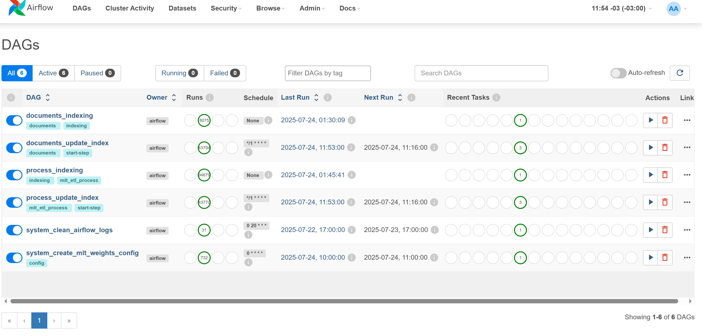

# Manual de Instalação do Servidor de Soluções de IA do módulo do SEI IA

Este guia descreve os procedimentos para instalação do *Servidor de Soluções de IA* do módulo SEI IA, em um ambiente Linux.

## Pré-requisitos

Os pré-requisitos aqui apresentados foram testados no ambiente da Anatel, considerando os dados e a carga de trabalho da Anatel. Outras configurações de alocação de recursos podem ser avalidas por pessoas devidamente capacitadas.

- **CPU**:
  - Provisionado: 16 Cores com 2.10GHz
  - Consumo na ANATEL (Produção):
    - médio: 60%
    - máximo: 100%

- **Memória**:
  - Provisionado: 128GB
  - Consumo na ANATEL (Produção):
    - mínimo: 64GB
    - máximo: 115GB
  
- **Espaço em Disco**:
  - Provisionado: 600GB.
  - Consumo na ANATEL (Produção):
      | Aplicação  | Caminho                                          | Tamanho em disco |
      |------------|--------------------------------------------------|------------------|
      | Solr       | /var/lib/docker/volumes/sei_ia_solr-db-volume    | 100 GB           |
      | PostgreSQL | /var/lib/docker/volumes/sei_ia_pgvector-db-volume-all | 300 GB      |
      | Filesystem | /opt/sei-ia-storage/                             | 40 GB            |
      | Docker     | /var/lib/docker/                                 | 50 GB            |

- **ATENÇÃO**: As informações acima sobre **"Consumo na ANATEL (Produção)"**, em 04/11/2024, possuem como contexto os números abaixo do SEI de Produção na Agência:
  - **Quantidade de Processos**: 1.5 milhão
  - **Quantidade de Documentos Gerados** (Editor do SEI - salvos no banco): 4.2 milhões
  - **Quantidade de Documentos Externos** (Filesystem do SEI): 8 milhões
  - **Usuários Internos**: cerca de 1.800, dentre servidores públicos e colaboradores em geral
> **Realidade de Cada Órgão**:
>  - A partir dos dados acima, cada órgão deve avaliar o ambiente do SEI e prever recursos proporcionais, especialmente sobre o Solr e o PostgreSQL, pois essas duas aplicações na arquitetura apresentam crescimento diretamente proporcional ao volume de documentos existentes no ambiente do SEI.
> - Ao final deste Manual são fornecidas algumas dicas de escalabilidade para ajustar o sistema conforme a demanda.
> - Caso necessário, consulte o pequeno tutorial de instalação do Docker na seção de anexos deste Manual.

### Configurações de Rede

Para garantir a comunicação entre os serviços do *Servidor de Soluções de IA* e o SEI, são necessárias as seguintes permissões de conexões de rede:

1. **Do Servidor de Soluções de IA para o SEI**:
   - **Banco de Dados do SEI**: Permissão de acesso ao host e porta configurada do banco de dados do SEI (p. ex. 192.168.2.17:3306 para MySQL, sendo 192.168.2.17: um exemplo fictício).
   - **Solr do SEI**: Permissão de acesso ao host e porta do Solr do SEI (p. ex., 192.168.2.17:8983).
   - **HTTP do SEI**: Permissão de acesso ao host e porta do SEI, para permitir acesso ao Webservice do Módulo SEI IA (p. ex., 192.168.2.17:8000).

2. **Do servidor do SEI para o Servidor de Soluções de IA**:
   - **Portas Necessárias**:
      - **Airflow**: Porta 8081 - pode ser liberado para o Administrador do ambiente computacional do SEI, para ter acesso às DAGS de toda a arquitetura de Soluções de IA rodando no servidor.
      - **API SEI IA**: Porta 8082
      - **API SEI IA Feedback**: Porta 8086
      - **API SEI IA Assistente**: Porta 8088

As configurações de rede acima são essenciais para o funcionamento correto dos sub-módulos de recomendação e de processamento de documentos do SEI IA, além do Assistente.

## Passos para Instalação

Antes de começar a instalação, certifique-se de que os seguintes pacotes estejam instalados no Linux do servidor:
- Docker >= 27.1.1
- Docker Compose >= 2.29

Caso não estejam instalados, recomendamos que sejam seguidos os procedimentos do tutorial de instalação do Docker, na seção Anexos. Também é possível seguir a documentação oficial do Docker para a instalação do [Docker Engine](https://docs.docker.com/engine/install/) e do [Docker Compose](https://docs.docker.com/compose/install/), desde que observados os requisitos de compatibilidade com as versões homologadas.

> **Observação**:
> - Todos os comandos ilustrados neste Manual são exemplos de comandos executados via terminal/console/CLI.

1. **Criar a pasta para armazenar os códigos-fonte do *Servidor de Soluções de IA***

   ```bash
   sudo mkdir /opt/seiia
   sudo chmod 777 /opt/seiia
   cd /opt/seiia
   ```

2. **Iniciar o Docker**

   Inicie o serviço do Docker.

   ```bash
   sudo service docker start
   docker --version # deve aparecer algo como Docker version 27.2.0, build 3ab4256
   ```

3. **Preparar o ambiente**

   Crie um usuário específico: - Nei Jobson: não entendi esse passo, pois não está criando um Usuário com o comando.

   ```bash
   sudo mkdir /opt/sei-ia-storage
   sudo chmod 777 /opt/sei-ia-storage
   ```

5. **Clonar o repositório dos códigos-fonte do *Servidor de Soluções de IA***

   Instale o Git, seguindo os passos da [documentação oficial](https://git-scm.com/downloads/linux).
   
   Troque para o usuário expecífico criado e clone o repositório via SSH: - Nei Jobson: Não seria melhor orientar o clone pela Tag de versão?

   ```bash
   git clone git@github.com:anatelgovbr/sei-ia.git
   cd sei-ia
   ```
> **Observação**:
> - Aqui consta apenas um exemplo, fazendo o clone direto do projeto no GitHub.
> - Contudo, caso o órgão possua procedimentos e ferramentas de Deploy próprios de seu ambiente computacional, como um GitLab e Jenkins, deve adequar este passo aos seus próprios procedimentos.

7. **Criar a rede Docker**

   Crie uma rede Docker customizada para a instalação:

   ```bash
   docker network create --driver=bridge docker-host-bridge 
   ```

   Em muitos casos, é importante definir o range de distribuição dos IPs da rede Docker, para evitar conflitos com outros computadores ou serviços do ambiente onde está sendo feita a instalação.

   Exemplo:

   ```bash
   docker network create --driver=bridge --subnet=192.168.144.0/24 --ip-range=192.168.144.0/24 --gateway=192.168.144.1 docker-host-bridge # TROCAR OS IPs DE ACORDO COM A SUA NECESSIDADE
   ```

8. **Configurar o arquivo `env_files/security.env` do ambiente**

   Certifique-se de conhecer o tipo de banco de dados utilizado pelo SEI do órgão.

   Preencha os campos no arquivo `env_files/security.env` conforme comentário sobre cada variável.

   **Importante:** As variáveis da seção `# ESSENCIAIS NO MOMENTO DA INSTALACAO:` no arquivo `env_files/security.env` são obrigatórias durante a instalação inicial .

| Variável                   | Descrição                                                                                   | Exemplo                             |
|----------------------------|---------------------------------------------------------------------------------------------|-------------------------------------|
| ENVIRONMENT                | Define o tipo do ambiente                                                    | `prod`                              |
| LOG_LEVEL                  | Define o nível de log do SEI IA; opções disponíveis: INFO, DEBUG, WARNING, ERROR.           | `INFO`                              |
| GID_DOCKER                 | O GID (Group ID) do grupo Docker no host; obtido com "cat /etc/group | grep ^docker: | cut -d: -f3". | `1001`                     |
| DB_SEI_USER                | Usuário de aplicação com permissão de SOMENTE LEITURA que deve ser criado no banco de dados do SEI.    | `sei_user`                          |
| DB_SEI_PWD                 | Senha do usuário de aplicação criado no banco de dados do SEI, conforme variável acima.                | `senha_sei`                         |
| DB_SEI_HOST                | Endereço do host do banco de dados do SEI.                                                     | `192.168.0.10`                      |
| DB_SEI_DATABASE            | Nome do banco de dados do SEI.                                                                 | `sei_db`                            |
| DB_SEI_PORT                | Porta de conexão do banco de dados do SEI.                                                     | `5432`                              |
| DB_SEI_SCHEMA              | Esquema do banco de dados do SEI (para MySQL, mesmo valor de database).                        | `sei_schema`                        |
| DATABASE_TYPE              | Tipo de banco de dados do SEI (ex: mssql, mysql, oracle).                                         | `mssql`                             |
| SEI_SOLR_ADDRESS           | Endereço do Solr do SEI. Deve ser no formato `http://IP_OU_HOSTNAME:8983`.                 | `http://192.168.0.10:8983`          |
| SEI_SOLR_CORE              | Nome do core de protocolos no Solr do SEI.                                                 | `sei_protocolos`                    |
| POSTGRES_USER              | Informe o nome de usuário a ser criado automaticamente no banco de dados PostgreSQL interno do Servidor de IA.  | `sei_llm`            |
| POSTGRES_PASSWORD          | Informe a senha que deseja usar para o usuário de banco a ser criado, conforma variável acima.                  | `postgres_password`  |
| ASSISTENTE_PGVECTOR_USER   | Repetir a informação da variável POSTGRES_USER, acima.                                 | `$POSTGRES_USER`                    |
| ASSISTENTE_PGVECTOR_PWD    | Senha para o banco de dados PGVector do Assistente. - Nei Jobson: Não entendi. Deve ser outra senha?  | `$POSTGRES_PASSWORD`                |

7. **Configurações adicionais**

   No arquivo `env_files/security.env`, preencha as variáveis da seção `# NAO ESSENCIAIS NO MOMENTO DA INSTALACAO:`. Essas variáveis não são essenciais durante a instalação inicial do Servidor de Soluções de IA do módulo SEI IA, mas serão necessárias para o uso do **ASSISTENTE**.

| Variável                          | Descrição                                                                                                      | Exemplo                                  |
|-----------------------------------|----------------------------------------------------------------------------------------------------------------|------------------------------------------|
| SEI_IAWS_URL                      | URL do serviço web do SEI IAWS. Deve ser no formato `http://[dominio_servidor]/sei/controlador_ws.php?servico=wsia`.  | `http://[dominio_servidor]/sei/controlador_ws.php?servico=wsia`  |
| SEI_IAWS_SIGLA_SISTEMA            | SiglaSistema criado automaticamente pelo script de instalação do Módulo SEI IA.                                       | `Usuario_IA` |
| SEI_IAWS_KEY                      | Chave de Acesso que deve ser gerada na Administração do SEI, pelo menu Administração > Sistemas > "Usuario_IA" > Serviços > "consultarDocumentoExternoIA".   | `minha_chave_de_acesso`  |
| AZURE_OPENAI_ENDPOINT            | Endpoint do Azure OpenAI Service.                                                                       | `https://meuendpoint.openai.azure.com`  |
| AZURE_OPENAI_ENDPOINT_GPT4o      | Endpoint específico para GPT-4o no Azure OpenAI Service.                                                | `https://meuendpointgpt4.openai.azure.com`  |
| AZURE_OPENAI_KEY_GPT4o           | Chave de acesso para GPT-4o no Azure OpenAI Service.                                                    | `minha_chave_gpt4`                      |
| GPT_MODEL_4o_128k                | Nome do modelo GPT-4o com 128k tokens.                                                                  | `gpt-4-128k`                            |
| AZURE_OPENAI_ENDPOINT_GPT4o_mini | Endpoint específico para GPT-4o-mini no Azure OpenAI Service.                                           | `https://meuendpointgpt4mini.openai.azure.com`  |
| AZURE_OPENAI_KEY_GPT4o_mini      | Chave de acesso para GPT-4o-mini no Azure OpenAI Service.                                               | `minha_chave_gpt4_mini`                 |
| GPT_MODEL_4o_mini_128k           | Nome do modelo GPT-4o-mini com 128k tokens.                                                             | `gpt-4-mini-128k`                       |
| OPENAI_API_VERSION               | Versão da API da OpenAI no Azure OpenAI Service.                                                        | `2024-02-01`                            |

8. **Executar o deploy**

    Execute o script de deploy:

   ```bash
   sudo bash deploy-externo-imgs.sh 
   ```

   Este passo pode levar bastante tempo, pois é realizado o download de todas as imagens do [repositório da Anatel no dockerhub](https://hub.docker.com/u/anatelgovbr). Logo, se faz necessária a devida **autorização que o servidor possa acessar a dockerhub**.

   Resultado da finalização do deploy:

   

Você ainda pode verificar o status das aplicações rodando o comando abaixo:

```bash
docker ps --format "table {{.Names}}	{{.Status}}"
```

O comando acima deverá retornar algo semelhante à imagem abaixo:


* **Vale ressaltar que algumas aplicações podem levar até 5 minutos para atingir o status de "healthy".** Então, espere esse tempo e confira novamente.

Caso um longo tempo tenha se passado e ainda não tenha obtido o status **healthy**, favor rever os passos anteriores e reportar eventuais problemas que permaneçam.

Após a finalização do deploy, o Airflow iniciará a indexação dos documentos já existentes no SEI do ambinete correspondente. Esse processo pode levar dias para ser concluído, dependendo do volume de documentos a serem indexados e da capacidade do servidor.

Nas seções a seguir apresentamos como testar e validar os resultados da instalação e configuração. 

## Testes de Acessos

Após finalizar o deploy, você poderá realizar testes acessando cada solução da arquitetura:

| Solução                                     | URL de Acesso                          | Descrição                                                                                   | Recomendações                                                                       |
|---------------------------------------------|----------------------------------------|---------------------------------------------------------------------------------------------|-------------------------------------------------------------------------------------|
| Airflow                                     | http://[Servidor_Solucoes_IA]:8081    | Orquestrador de tarefas para gerar insumos necessários à recomendação de documentos e embeddings. | - Alterar a senha do Airflow                                                   |
|                                             |                                        |                                                                                               | - Preferencialmente, bloquear o acesso de rede, exceto para o administrador do SEI. |
|                                             |                                        |                                                                                                | - Necessita comunicação com banco de dados e Solr do SEI.                          |
| API SEI IA                                  | http://[Servidor_Solucoes_IA]:8082    | API que utiliza Solr para encontrar processos e documentos semelhantes no banco de dados do SEI. | - Bloquear em nível de rede o acesso a todos, exceto aos servidores do SEI do ambiente correspondente. |
| API SEI IA Feedback                         | http://[Servidor_Solucoes_IA]:8086/docs | API para registrar feedbacks dos usuários sobre as recomendações feitas pela API SEI.           | - Bloquear em nível de rede o acesso a todos, exceto aos servidores do SEI do ambiente correspondente. |
| API SEI IA Assistente                       | http://[Servidor_Solucoes_IA]:8088    | API que fornece funcionalidades do Assistente de IA do SEI.                                     | - Necessita comunicação com banco de dados e Solr do SEI.                              |
|                                             |                                        |                                                                                                | - Bloquear em nível de rede o acesso a todos, exceto aos servidores do SEI do ambiente correspondente. |
| Solr do Servidor de Soluções de IA  | http://[Servidor_Solucoes_IA]:8084    | Interface do Solr, usada para indexar e pesquisar documentos no SEI.                                    | - Por padrão, já vem bloqueado.                                                 |
| Banco de Dados do Servidor de Soluções de IA (PostgreSQL)  | [Servidor_Solucoes_IA]:5432  | Acesso ao banco de dados PostgreSQL que armazena as informações do SEI.                   | - Por padrão, já vem bloqueado.                                                 |

> **Observação:**
> Nei Jobson: qual é a necessidade dessa observação?
> * Por padrão, as portas de acesso externo ao Solr e PostgreSQL não possuem direcionamento para o ambiente externo. Para permitir o acesso, deve-se alterar o script de deploy (localizado no arquivo: `deploy-externo-imgs.sh`) de:

```bash
[...]
docker compose --profile externo \
  -f docker-compose-prod.yaml \
  -p $PROJECT_NAME \
  up \
  --no-build -d
[...]
```
para:
```bash
[...]
docker compose --profile externo \
  -f docker-compose-prod.yaml \
  -f docker-compose-dev.yaml \
  -p $PROJECT_NAME \
  up \
  --no-build -d
[...]
```

### Airflow

O Airflow é um orquestrador de tarefas que gera os insumos necessários para o funcionamento da recomendação de documentos e para a criação de embeddings para RAG.

**Recomendamos bloquear o acesso de rede, exceto para o administrador do ambiente computacional. O Airflow necessita de acessos ao banco de dados do SEI e ao Solr do SEI.**

#### Principais DAGs
- **dag_embeddings_start**: Cria a fila para gerar os embeddings para RAG.
- **document_create_index_v1**: Processa os documentos para serem indexados no Solr para recomendação.
- **indexing_embedding_document**: Processa a fila de embeddings, gerando os embeddings para RAG.
- **process_count_tokens_v1**: Gera a contagem de tokens para os documentos internos do SEI.
- **process_create_index_v1**: Processa os processos para serem indexados no Solr para recomendação.
- **process_external_docs_count_token_v1**: Gera a contagem de tokens para os documentos externos do SEI.
- **process_update_index_v1**: Cria a fila para indexar os processos e documentos no Solr.
- **system_clean_airflow_logs_v1**: Realiza a limpeza de logs do Airflow.
- **system_create_mlt_weights_config_v1**: Gera o arquivo de pesos para a pesquisa de documentos relevantes da API SEI IA.

Ao acessar o Airflow, será apresentada a tela:


No primeiro acesso, o usuário é: `airflow` e a senha é: `airflow`.

  - **ESSA SENHA DEVE SER ALTERADA!** Nei Jobson: vai orientar alterar mesmo? Se sim, a aplicação usa esse usuário em algum canto mais? Não precisa alterar em algum arquivo .ENV não?

#### Monitoramento e Significado das Cores das DAGs

Para garantir o funcionamento correto do sistema, acompanhe o status das DAGs, que usam um esquema de cores para indicar o estado atual de cada uma:

- **Verde escuro**: Execução bem-sucedida, indicando que a DAG foi concluída sem erros.
- **Verde claro**: DAG em execução. Caso esteja em execução por um longo período, pode indicar um possível atraso ou alta carga de processamento.
- **Vermelho**: Falha na execução. Verifique e corrija o erro para evitar impacto nas recomendações e na criação de embeddings para o RAG.
- **Cinza**: DAG sem execução agendada ou manual. Pode ser normal em processos que são executados apenas em intervalos específicos.
- **Amarelo**: Indica que a execução foi interrompida antes de sua conclusão. Necessita ser retomada ou reiniciada conforme necessário.

#### Como Obter o Log de Execução em Caso de Falha (DAG Vermelha)

Se uma DAG estiver marcada em vermelho, isso indica que houve uma falha durante a execução. Para investigar o problema:

1. **Clique no nome da DAG** para abrir uma visão detalhada.
2. Navegue até a execução com falha (marcada em vermelho no diagrama).
3. **Clique na tarefa específica que falhou** para acessar as opções de log.
4. Selecione a aba **Log** para ver o histórico detalhado de execução e identificar o erro.

Essa análise dos logs ajudará a entender a causa da falha e facilitará a correção do problema antes de reiniciar a DAG.

**ESSA SENHA DEVE SER ALTERADA!**

#### Alterando a senha do Airflow
- Inicialmente, você deve acessar `Your Profile`
   
- Em seguida, clique em `Reset my password`

- Por fim, insira sua nova senha (`password`), confirme-a (`confirm password`) e clique em `save`

- Sua senha foi alterada com sucesso.

### API de Recomendação de Processos e Documentos do SEI IA

- **URL**: http://[Servidor_Solucoes_IA]:8082
- **Descrição**: API do SEI que utiliza o Solr para encontrar processos semelhantes.
- **Health Check**:
  - API
      ```bash
      curl -X 'GET' 'http://[Servidor_Solucoes_IA]:8082/health' -H 'accept: application/json'
      ```

      deve retornar:

      ```bash
      {
         "status":"OK",
         "response_time": null
      }
      ```
  - Banco de dados
      ```bash
      curl -X 'GET' 'http://[Servidor_Solucoes_IA]:8082/health/database' -H 'accept: application/json'
      ```
      deve retornar:
      ```bash
      {
         "status":"OK",
         "response_time": null
      }
      ```
  - Recomendação de processos
      ```bash
      curl -X 'GET' 'http://[Servidor_Solucoes_IA]:8082/health/process-recommendation' -H 'accept: application/json'
      ```
      deve retornar:
      ```bash
      {
         "status":"OK",
         "response_time": tempo de resposta
      }
      ```
  - Recomendação de documentos
      ```bash
      curl -X 'GET' 'http://[Servidor_Solucoes_IA]:8082/health/document-recommendation' -H 'accept: application/json'
      ```
      deve retornar:
      ```bash
      {
         "status":"OK",
         "response_time": tempo de resposta
      }
      ```

### API SEI IA Feedback de Processos

- **URL**: http://[Servidor_Solucoes_IA]:8086/docs
- **Descrição**: API que grava o feedback do usuário sobre uma recomendação feita pela API SEI.
- **Health Check**:
   ```bash
   curl -X 'GET' 'http://[Servidor_Solucoes_IA]:8086/health' -H 'accept: application/json'
   ```
   deve retornar:
   ```bash
   {
      "status":"OK",
      "timestamp":"DATA"
   }
   ```

### API SEI IA Assistente

- **URL**: http://[Servidor_Solucoes_IA]:8088
- **Descrição**: API do Assistente de IA do SEI.
- **Health Check**: 
   ```bash
   curl -X 'GET' 'http://[Servidor_Solucoes_IA]:8088/health' -H 'accept: application/json'
   ```
   deve retornar:
   ```bash
   {"status":"OK"}
   ```

### Bancos de Dados

#### Solr

- **URL**: http://[Servidor_Solucoes_IA]:8084
- **Descrição**: Interface do Solr do Servidor de Soluções de IA do SEI, utilizado na recomendação de processos.

#### PostgreSQL
- **URL**: [Servidor_Solucoes_IA]:5432
- **Descrição**: Acesso ao banco de dados pgvector, utilizando a senha criada no passo 8:
  - Usuário: `sei_llm`
  - Senha:   `ASSISTENTE_PGVECTOR_PWD`

## Resolução de Problemas

- **Erro de montagem de arquivo**:

  ```bash
  Error response from daemon: failed to create task for container: failed to create shim task: OCI runtime create failed: runc create failed: unable to start container process: error during container init: error mounting "/opt/sei/sei-ia/solr_config/log4j2.xml" to rootfs at "/opt/solr/server/resources/log4j2.xml": create mount destination for /opt/solr/server/resources/log4j2.xml mount: cannot mkdir in /var/lib/docker/overlay2/...: not a directory: unknown
  ```

  Solução:

  ```bash
  rmdir /opt/sei/sei-ia/solr_config/log4j2.xml
  touch /opt/sei/sei-ia/solr_config/log4j2.xml
  ```

- **Erro de limite de CPU**:

  ```bash
  Error response from daemon: Range of CPUs is from 0.01 to 4.00, as there are only 4 CPUs available
  ```

  Solução: Alterar o arquivo `prod.env` (caso o `ENVIRONMENT` seja diferente, alterar o `.env` específico) e modificar todas as chaves que possuem `CPU_LIMIT`.

- **Erro de nome de container duplicado**:

  ```bash
  Error response from daemon: Conflict. The container name "/3bd4ff6aae26_sei_ia-jobs_api-1" is already in use by container "64856a9070ccf94bbc1803a98749bee282813cd6d65dab51ecab827449ee0423".
  ```

  Solução: Identificar qual o processo que ainda está rodando:

  ```bash
  docker ps -a
  ```

  Buscar o ID do container e parar:

  ```bash
  docker stop [NUMERO_do_container] # no exemplo seria 3bd4ff6aae26
  ```

- **Dependência falhando ao iniciar**:

  ```bash
  dependency failed to start: container sei_ia-rabbitmq-pd-1 is unhealthy
  ```

  Solução: Por padrão, ao rodar novamente o comando de inicialização, volta a funcionar. Se persistir, deve-se verificar a quantidade de memória disponível no sistema.

  ```bash
  sudo bash deploy-externo-imgs.sh 
  ```

## Pontos de Atenção para Escalabilidade

* Caso necessário, podem ser alteradas as variáveis de `..._MEM_LIMIT` no `env_files/prod.env` – não devem ser alteradas para valores menores, pois isso afetará o funcionamento do sistema.

### Pontos de Montagem de Volumes

Os pontos de montagem dos volumes Docker estão localizados em `/var/lib/docker/volumes/`. * Esses volumes tendem a crescer de acordo com a quantidade de documentos e processos armazenados, conforme descrito nos requisitos de sistema.

É possível também alterar os pontos de montagem dos volumes Docker modificando o arquivo `daemon.json`. Mais informações podem ser encontradas na [documentação do Docker](https://docs.docker.com/reference/cli/dockerd/#configure-runtimes-using-daemonjson). Como alternativa, pode-se criar links simbólicos para cada um dos volumes, ou para todos.

- Exemplo de criação de um link simbólico para `/var/lib/docker/volumes/sei_ia_pgvector-db-volume-all`:
  - Pare o Docker para evitar problemas durante a movimentação dos dados:

   ```bash
   sudo systemctl stop docker
   ```

  - Mova a pasta de volumes para o novo caminho:

  ```bash

  sudo mv /var/lib/docker/volumes/sei_ia_pgvector-db-volume-all /novo/caminho/para/volumes
  ```

  - Crie o link simbólico apontando para o novo local dos volumes:

  ```bash

  sudo ln -s /novo/caminho/para/volumes /var/lib/docker/volumes/sei_ia_pgvector-db-volume-all
  ```

  - Reinicie o Docker:

  ```bash
  sudo systemctl start docker
  ```

### Ajustes Necessários

Ao escalar a solução, considere os seguintes pontos:

- **Solr**:
  - Aumente a alocação de memória se houver necessidade de lidar com uma maior quantidade de documentos ou consultas simultâneas. Uma boa prática é aumentar a memória em incrementos de 2 GB.
  - Para isso, altere no arquivo `env_files/prod.env`:

   | Variável                   | Descrição                                                                                      |
   |----------------------------|------------------------------------------------------------------------------------------------|
   | `SOLR_JAVA_MEM="-Xms2g -Xmx8g"` | Define as opções de memória Java para Solr, com um mínimo de 2 GB e um máximo de 8 GB.     |
   | `SOLR_MEM_LIMIT=10g`            | Define o limite de memória para Solr como 10 GB.                                           |
   | `SOLR_CPU_LIMIT='2'`            | Define o limite de CPU para Solr como 2 unidades de CPU.                                   |

- **Airflow**:
  - O Airflow pode ser escalado horizontalmente adicionando mais workers. Para mais informações, consulte a [documentação do Airflow](https://airflow.apache.org/docs/apache-airflow/stable/core-concepts/overview.html).
  - Em nossa solução, é possível configurar mais workers na variável `AIRFLOW_WORKERS_REPLICAS` no `env_files/prod.env`, lembrando que cada réplica usa em média 6 GB.

- **Postgres**:
  - Para aumentar o desempenho, considere aumentar a memória disponível. Monitore o uso de disco e ajuste conforme necessário.

   | Variável                    | Descrição                                                    |
   |-----------------------------|----------------------------------------------------------------|
   | `PGVECTOR_MEM_LIMIT=8g`     | Define o limite de memória para Pgvector como 8 GB.           |
   | `PGVECTOR_CPU_LIMIT='2'`    | Define o limite de CPU para Pgvector como 2 unidades de CPU.  |


## Backup periódico dos dados do Servidor de Soluções do SEI IA

Um ponto importante em relação ao uso do módulo SEI IA e consequentemente do  Servidor de Soluções do SEI IA, é a realização de backup periódico, principalmente dos bancos de dados utilizados pelas aplicações. Todos os dados do servidor de soluções do SEI IA são armazenados em volumes Docker e, via de regra, estão localizados na pasta `/var/lib/docker/volume`. O comando abaixo lista os volumes relacionados ao Servidor de Soluções do SEI IA:

```bash
docker volume ls | grep "^sei_ia-"
```

## ANEXOS:
### **Instalar Git - OPCIONAL**
   
>   **OBSERVAÇÃO**: 
> * É possível instalar sem o Git, apenas tenha certeza de manter a estrutura do GitHub dentro da pasta /opt/seiia/sei-ia.
   
   Siga a documentação oficial para instalar o Git: [Documentação Git](https://git-scm.com/book/pt-br/v2/Come%C3%A7ando-Instalando-o-Git)

   Aqui está o resumo dos comandos necessários para Ubuntu/Debian:

   ```bash
   sudo apt-get update
   sudo apt-get install git
   ```

   Aqui está o resumo dos comandos necessários para o CentOS/RHEL:

   ```bash
   sudo yum install git-all
   ```

### **Instalar Docker - CASO AINDA NÃO ESTEJA INSTALADO**

   Siga a documentação oficial para instalar o Docker: [Documentação Docker](https://docs.docker.com/engine/install/)

   Aqui está o resumo dos comandos necessários para Ubuntu/Debian:

   ```bash
   for pkg in docker.io docker-doc docker-compose docker-compose-v2 podman-docker containerd runc; do sudo apt-get remove $pkg; done

   # Adicionar a chave GPG oficial do Docker:
   sudo apt-get update
   sudo apt-get install ca-certificates curl
   sudo install -m 0755 -d /etc/apt/keyrings
   sudo curl -fsSL https://download.docker.com/linux/ubuntu/gpg -o /etc/apt/keyrings/docker.asc
   sudo chmod a+r /etc/apt/keyrings/docker.asc

   # Adicionar o repositório do Docker:
   echo "deb [arch=$(dpkg --print-architecture) signed-by=/etc/apt/keyrings/docker.asc] https://download.docker.com/linux/ubuntu $(. /etc/os-release && echo "$VERSION_CODENAME") stable" | sudo tee /etc/apt/sources.list.d/docker.list > /dev/null

   # Instalar o Docker
   sudo apt-get update
   sudo apt-get install docker-ce docker-ce-cli containerd.io docker-buildx-plugin docker-compose-plugin
   ```

   Aqui está o resumo dos comandos necessários para o CentOS/RHEL:

   ```bash
   # Remover pacotes antigos do Docker, caso existam
   for pkg in docker docker-client docker-client-latest docker-common docker-latest docker-latest-logrotate docker-logrotate docker-engine podman containerd runc; do sudo yum remove $pkg; done

   # Instalar o Docker
   sudo yum install -y yum-utils
   sudo yum-config-manager --add-repo https://download.docker.com/linux/centos/docker-ce.repo
   sudo yum install docker-ce docker-ce-cli containerd.io docker-buildx-plugin docker-compose-plugin
   ```
