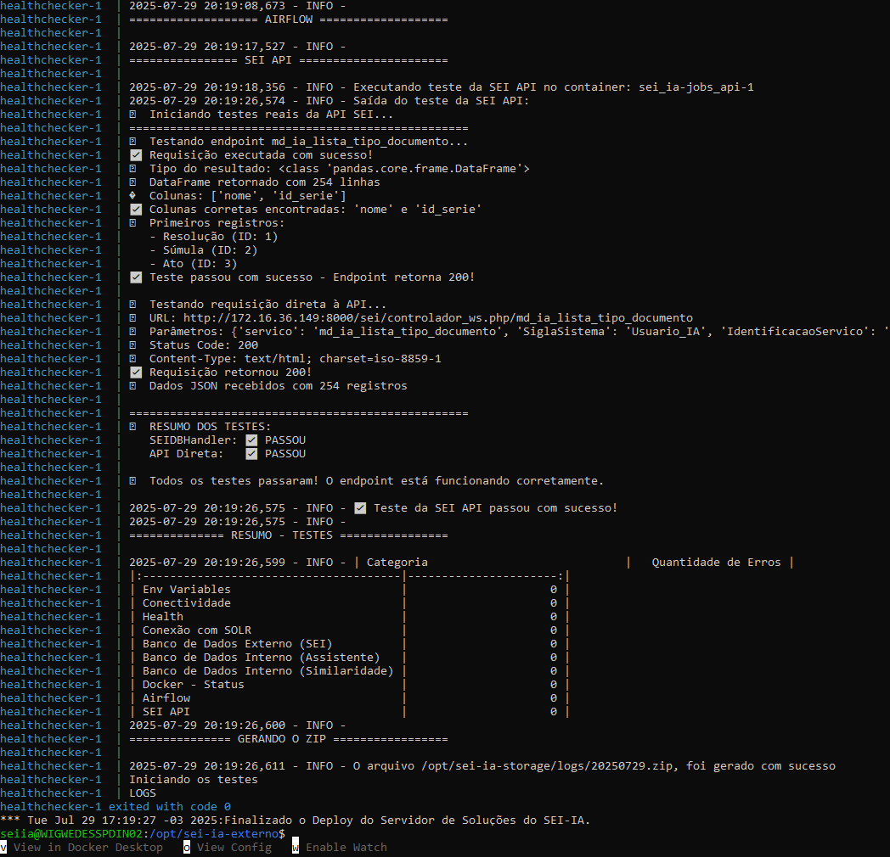
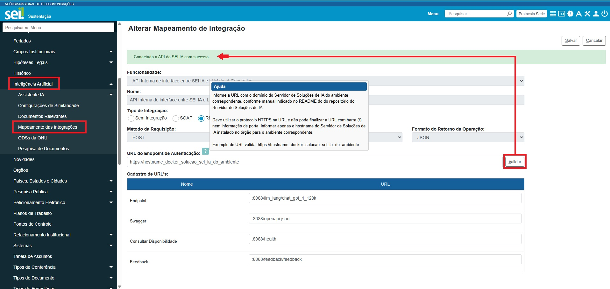

# Instalação do Servidor de Soluções de IA do módulo SEI IA

- Este guia descreve os procedimentos para instalação do *Servidor de Soluções de IA* do módulo SEI IA, em um ambiente Linux.
- É importante observar que este manual não tem como objetivo fornecer conhecimento sobre as tecnologias adotadas. Para isto recomendamos buscar fontes mais apropriadas.
- **ATENÇÃO:** O Servidor a ser instalado NÃO DEVE ser compartilhado com outras soluções.

## Pré-requisitos

Os pré-requisitos aqui apresentados foram testados no ambiente da Anatel, considerando os dados e a carga de trabalho da Anatel. Outras configurações de alocação de recursos podem ser avalidas por pessoas devidamente capacitadas.

- **CPU**:
  - Provisionado: 16 Cores com 2.10GHz
  - Consumo na ANATEL (Produção):
    - médio: 60%
    - máximo: 100%

- **Memória**:
  - Provisionado: 128GB
  - Consumo na ANATEL (Produção):
    - mínimo: 64GB
    - máximo: 115GB
  
- **Espaço em Disco**:
  - Provisionado: 600GB.
  - Consumo na ANATEL (Produção):
      | Aplicação  | Caminho                                          | Tamanho em disco |
      |------------|--------------------------------------------------|------------------|
      | Solr       | /var/lib/docker/volumes/sei_ia_solr-db-volume    | 100 GB           |
      | PostgreSQL | /var/lib/docker/volumes/sei_ia_pgvector-db-volume-all | 300 GB      |
      | Filesystem | /opt/sei-ia-storage/                             | 40 GB            |
      | Docker     | /var/lib/docker/                                 | 50 GB            |

- **ATENÇÃO**: As informações acima sobre **"Consumo na ANATEL (Produção)"**, em 04/11/2024, possuem como contexto os números abaixo do SEI de Produção na Agência:
  - **Quantidade de Processos**: 1.5 milhão
  - **Quantidade de Documentos Gerados** (Editor do SEI - salvos no banco): 4.2 milhões
  - **Quantidade de Documentos Externos** (Filesystem do SEI): 8 milhões
  - **Usuários Internos**: cerca de 1.800, dentre servidores públicos e colaboradores em geral
> **Realidade de Cada Órgão**:
>  - A partir dos dados acima, cada órgão deve avaliar o ambiente do SEI e prever recursos proporcionais, especialmente sobre o Solr e o PostgreSQL, pois essas duas aplicações na arquitetura apresentam crescimento diretamente proporcional ao volume de documentos existentes no ambiente do SEI.
> - Ao final deste Manual são fornecidas algumas dicas de escalabilidade para ajustar o sistema conforme a demanda.

### Configurações na Rede Local do Órgão

Para garantir a comunicação entre os serviços do *Servidor de Soluções de IA* e o SEI, são necessárias as seguintes permissões de conexões de rede:

1. **Do Servidor de Soluções de IA para o SEI**:
   - **Banco de Dados do SEI**: Permissão de acesso ao host e porta configurada do banco de dados do SEI (p. ex. 192.168.2.17:3306 para MySQL, sendo 192.168.2.17: um exemplo fictício).
   - **Solr do SEI**: Permissão de acesso ao host e porta do Solr do SEI (p. ex., 192.168.2.17:8983).
   - **HTTP do SEI**: Permissão de acesso ao host e porta do SEI, para permitir acesso ao Webservice do Módulo SEI IA (p. ex., 192.168.2.17:8000).

2. **Do servidor do SEI para o Servidor de Soluções de IA**:
   - **Portas Necessárias**:
      - **Airflow**: Porta 8081
        - Também pode ser liberada a conexão para o Administrador do ambiente computacional do SEI, para ter acesso às DAGS das tasks de toda a arquitetura de Soluções de IA.
      - **API SEI IA**: Porta 8082
      - **API SEI IA Feedback**: Porta 8086
      - **API SEI IA Assistente**: Porta 8088

As configurações de rede acima são essenciais para o funcionamento correto dos sub-módulos de recomendação e de processamento de documentos do SEI IA, além do Assistente.

**ATENÇÃO**: Se as configurações de conexões na rede local do órgão não forem efetivadas, conforme acima, antes dos "Passos para Instalação", abaixo, e não for garantido que estão funcionando adequadamente, poderá ter problemas no meio do deploy do servidor ou durante o funcionamento de algumas das aplicações. Assim, criadas as conexões indicadas, é importante testá-las a partir do servidor correspondente, antes de seguir para os "Passos para Instalação". Seguir para a instalação somente depois que confirmar que as conexões nos sentidos corretos estão efetivamente funcionando.

### Ajustar Permissão por IP no Solr do SEI

Conforme orientado no Manual de Instalação do SEI até sua versão 4.1.0, o Solr do SEI é configurado com limitação de acesso por IPs. Assim, além de rota de rede adequada do Servidor de Soluções de IA até o Solr do SEI, conforme tópico anterior, é necessário editar o arquivo `/opt/solr/server/etc/jetty.xml` no Solr do SEI **para adicionar o IP do Servidor de Soluções de IA**, tão quanto já deve constar no mencionado arquivo os IPs dos nós de aplicação do SEI do correspondente ambiente.

Por mais que exista rota na rede local do órgão configurada, depois do deploy do Servidor de Soluções de IA, caso não tenha a permissão por IP liberada no Solr do SEI, algumas DAGs no AirFlow ficarão com erro por falta de permissão de acesso à aplicação em si do Solr do SEI.

## Passos para Instalação

Antes de começar a instalação, certifique-se de que os seguintes pacotes estejam instalados no Linux do servidor:
- Docker Engine (versão >= 27.1.1).
- Docker Compose (versão >= 2.29).

Caso não estejam instalados, consulte o pequeno tutorial de instalação do Docker na seção de Anexos deste Manual.
- Também é possível seguir a documentação oficial do Docker para a instalação do [Docker Engine](https://docs.docker.com/engine/install/) e do [Docker Compose](https://docs.docker.com/compose/install/), desde que observados os requisitos de compatibilidade com as versões homologadas.

> **Observação**:
> - Todos os comandos ilustrados neste Manual são exemplos de comandos executados via terminal/console/CLI.

1. **Criar a pasta para armazenar os códigos-fonte do *Servidor de Soluções de IA***

   ```bash
   sudo mkdir /opt/seiia
   sudo chmod 777 /opt/seiia
   cd /opt/seiia
   ```

2. **Iniciar o Docker**

   Inicie o serviço do Docker.

   ```bash
   sudo service docker start
   docker --version # deve aparecer algo como Docker version 27.2.0, build 3ab4256
   ```

3. **Preparar o ambiente**

   Crie a pasta necessária para cache do Servidor de Soluções de IA.

   ```bash
   sudo mkdir /opt/sei-ia-storage
   sudo chmod 777 /opt/sei-ia-storage
   ```

4. **Clonar o repositório dos códigos-fonte do *Servidor de Soluções de IA***

  > **Observação**:
  > - Aqui consta apenas um exemplo, fazendo o clone direto de Tag de Release estável do projeto no GitHub para o Servidor. No exemplo abaixo, a Tag de Release estável é indicada como `v1.0.0`.
> - Contudo, caso o órgão possua procedimentos e ferramentas de deploy próprias para seu ambiente computacional, como GitLab e Jenkins, deve adaptar esse passo aos seus próprios procedimentos.
> - Alternativamente, é possível fazer o download direto da release e utilizar os seguintes comandos para configuração:
> ```bash
> sudo mkdir /opt/sei-ia
> sudo chmod 777 /opt/sei-ia
> # Coloque o arquivo da release neste diretório
> cd /opt/sei-ia
> unzip sei-ia-v.1.0.0.zip . # O nome do arquivo pode mudar. ATENÇÃO: para subir o arquivo zip antes no servidor.
> ```
>   - Apenas tenha certeza de manter a estrutura de código deste projeto no GitHub dentro da pasta **/opt/seiia/sei-ia**.
>   - Enquanto o projeto estiver privado, para realizar o clone é necessário utilizar as credenciais do usuário do GitHub que possua acesso autorizado no repositório.

   Instale o Git, seguindo os passos da [documentação oficial](https://git-scm.com/downloads/linux) ou da seção de [Anexos deste Manual](https://github.com/anatelgovbr/sei-ia/blob/main/docs/INSTALL.md#anexos) que orienta a instalar o Git no Servidor.
   
   ```bash
   git clone --branch v1.0.0 --single-branch git@github.com:anatelgovbr/sei-ia.git
   cd sei-ia
   ```

> **Observação**
> Para clonar o repositório com um usuário específico, enquanto o repositório está privado no GitHub, substitua `USERNAME` pelo usuário autorizado:
> ```bash
> git clone --branch v1.0.0 --single-branch git@USERNAME@github.com:anatelgovbr/sei-ia.git
> cd sei-ia
> ```
> - Assim que for dado o comando acima, será apresentada linhas de comando solicitando as credenciais de acesso no GitHub do usuário informado, conforme suas configurações pessoais no cadastro dele no GitHub.

5. **Criar a rede Docker**

   O Docker utiliza como default a faixa de IP `172.17.*.*`, que pode ser utilizada internamente por uma organização e causar conflitos. Desta forma, se faz necessária a utilização de uma faixa de IPs dedicadas para os containers Docker rodando no Servidor, com objetivo de evitar erros de roteamento causados pela sobreposição de endereços IP.

   A restrição da subnet deve ser feita através da criação de *user defined bridge network*. Também deve remover a default bridge, como forma de evitar o uso de uma bridge fora da subnet, dado que novos containers adotam a default bridge por padrão se uma rede não for especificada e se a default bridge estiver disponível.

   Para os seguintes procedimentos, é necessário assegurar que o Docker está instalado e parado.

   ```bash
   systemctl stop docker
   ```

   A remoção da default bridge é feita através de uma configuração do daemon.json, através de:

   ```bash
   vim /etc/docker/daemon.json
   ```

   Deve ser configurado o daemon.json com o seguinte conteúdo:

   ```bash
   {
        "bridge": "none"
   }
   ``` 

   Após a configuração é necessário Inicializar o Docker e verificar o resultado obtido:

   ```bash
   sudo systemctl start docker
   docker network ls
   ```

   O resultado deve exibir uma lista de docker networks, sem a presença da bridge, conforme abaixo:

   ```bash
   NETWORK ID     NAME                 DRIVER    SCOPE
   7cee8287f256   host                 host      local
   0355f600e1d7   none                 null      local
   ```

   O próximo passo é a criação da *user defined bridge network* com a definição da subnet e gateway em conformidade com a política de endereçamento do órgão, semelhante ao comando:
   
   ```bash
   docker network create --driver=bridge --subnet=192.168.144.0/24 --ip-range=192.168.144.0/24 --gateway=192.168.144.1 docker-host-bridge
   ```

   É mandatório que os valores de *--subnet*, *--iprange* e *--gateway* sejam adequadamente definidos pelo órgão, podendo adotar os valores do exemplo acima apenas se houver certeza de inexistência de conflito de endereços.

6. **Configurar o arquivo `env_files/security.env` do ambiente**
   
   Certifique-se de conhecer o tipo de banco de dados utilizado pelo SEI do órgão.

   Preencha os campos no arquivo `env_files/security.env` conforme descrito nos comentários sobre cada variável.

   **Importante**: As variáveis da seção `# ESSENCIAIS NO MOMENTO DA INSTALACAO:` no arquivo `env_files/security.env` são obrigatórias durante a instalação inicial.

   **Recomendação**: Os arquivos `env_files/*.env` são de configurações de ambiente. Deve adicionar `env_files/*.env` ao `.gitignore` local para não serem substituídos acidentalmente no ambiente correspondente nos próximos deploys de código.

| Variável                   | Descrição                                                                                                        | Exemplo                             |
|----------------------------|------------------------------------------------------------------------------------------------------------------|-------------------------------------|
| ENVIRONMENT                | Define o tipo do ambiente da instalação. Opções disponíveis: `dev`, `homol`, `prod`.                             | `prod`                              |
| LOG_LEVEL                  | Define o nível do ambiente da instalação. Opções disponíveis: `INFO`, `DEBUG`, `WARNING`, `ERROR`.               | `INFO`                              |
| GID_DOCKER                 | O GID (Group ID) do grupo Docker no host do ambiente de instalação.                                              | `1001`                              |
| DB_SEI_USER                | Usuário de aplicação com permissão de SOMENTE LEITURA que deve ser criado no banco de dados do SEI.              | `sei_user`                          |
| DB_SEI_PWD                 | Senha do usuário de aplicação criado no banco de dados do SEI, conforme variável acima.                          | `senha_sei`                         |
| DB_SEI_HOST                | Endereço do host do banco de dados do SEI.                                                                       | `192.168.0.10`                      |
| DB_SEI_DATABASE            | Nome do banco de dados do SEI, conforme consta no ConfiguracaoSEI.php do ambiente do SEI.                        | `sei_db`                            |
| DB_SEI_PORT                | Porta de conexão do banco de dados do SEI , conforme consta no ConfiguracaoSEI.php do ambiente do SEI.           | `3306`                              |
| DB_SEI_SCHEMA              | Esquema do banco de dados do SEI, conforme consta no ConfiguracaoSEI.php do ambiente do SEI.                     | `sei_schema`                        |
| DATABASE_TYPE              | Tipo de banco de dados do SEI. Opções disponíveis: `mysql`, `mssql` e `oracle`.                                  | `mysql`                             |
| SEI_SOLR_ADDRESS           | Endereço do Solr do SEI. Deve ser no formato `https://IP_OU_HOSTNAME:8983`.                                      | `https://192.168.0.10:8983`         |
| POSTGRES_USER              | Nome de usuário já existente de acesso ao banco de dados PostgreSQL interno do Servidor de IA. Não alterar.   | `sei_llm`                           |
| POSTGRES_PASSWORD          | Informe a senha que deseja usar para o usuário de banco a ser criado, conforme a variável acima. **Não deve conter**: "`'`" (aspas simples), "`"`" (aspas duplas), "`\`", "` `" (espaço), "`$`", "`(`", "`)`", "`:`", "`@`", "`;`", "`` ` ``" (crase), "`&`", "`*`", "`+`" (mais), "`-`" (menos), "`=`", "`/`", "`?`", "`!`", "`[`", "`]`", "`{`", "`}`", "`<`", "`>`", "`\|`", "`%`", "`^`", "`~`".                   | `iJI_YTuygb`                 |

> **Observação**:
> - Sobre a variável `GID_DOCKER`, Group ID do ambiente de instalação correspondente deve ser obtido executando o comando: `cat /etc/group | grep ^docker: | cut -d: -f3`.

7. **Configurações adicionais**

   No arquivo `env_files/security.env`, preencha as variáveis da seção `# NAO ESSENCIAIS NO MOMENTO DA INSTALACAO:`. Essas variáveis não são essenciais durante a instalação inicial do Servidor de Soluções de IA do módulo SEI IA, mas serão necessárias para o uso do **ASSISTENTE**.

| Variável                          | Descrição                                                                                                        | Exemplo                                  |
|-----------------------------------|------------------------------------------------------------------------------------------------------------------|------------------------------------------|
| SEI_IAWS_URL                      | URL do Webservice do Módulo SEI IA. Deve ser no formato `https://[dominio_servidor]/sei/modulos/ia/ws/IaWS.php`  | `https://[dominio_servidor]/sei/modulos/ia/ws/IaWS.php`  |
| SEI_IAWS_SISTEMA                  | SiglaSistema criado automaticamente pelo script de instalação do Módulo SEI IA. Não alterar.                     | `Usuario_IA` |
| SEI_IAWS_KEY                      | Chave de Acesso que deve ser gerada na Administração do SEI, pelo menu Administração > Sistemas > "Usuario_IA" > Serviços > "consultarDocumentoExternoIA".   | `minha_chave_de_acesso`  |
| AZURE_OPENAI_ENDPOINT             | Endpoint do Azure OpenAI Service. Note que não deve ser posta `/` ao final do endpoint.                             | `https://meuendpoint.openai.azure.com`  |
| AZURE_OPENAI_ENDPOINT_GPT4o       | Endpoint específico para GPT-4o no Azure OpenAI Service. Note que não deve ser posta `/` ao final do endpoint.      | `https://meuendpointgpt4.openai.azure.com`  |
| AZURE_OPENAI_KEY_GPT4o            | Chave de acesso para GPT-4o no Azure OpenAI Service.                                                    | `minha_chave_gpt4o`                      |
| GPT_MODEL_4o_128k                 | Nome do modelo GPT-4o com 128k tokens.                                                                  | `gpt-4o-128k`                            |
| AZURE_OPENAI_ENDPOINT_GPT4o_mini  | Endpoint específico para GPT-4o-mini no Azure OpenAI Service. Note que não deve ser posta `/` ao final do endpoint. | `https://meuendpointgpt4mini.openai.azure.com`  |
| AZURE_OPENAI_KEY_GPT4o_mini       | Chave de acesso para GPT-4o-mini no Azure OpenAI Service.                                               | `minha_chave_gpt4o_mini`                 |
| GPT_MODEL_4o_mini_128k            | Nome do modelo GPT-4o-mini com 128k tokens.                                                             | `gpt-4o-mini-128k`                       |
| OPENAI_API_VERSION                | Versão da API da OpenAI no Azure OpenAI Service. Não alterar                                            | `2024-10-21`                            |

Note que existem algumas variáveis que estão abaixo de `# NÃO ALTERAR AS VARIAVEIS ABAIXO` que não podem ser alteradas.

8. **Executar o deploy**
 > **ATENÇÃO**:
 > - **Para instalar o *Servidor de Soluções de IA do Módulo SEI IA* é necessário ter o [Módulo SEI IA](https://github.com/anatelgovbr/mod-sei-ia) previamente instalado e configurado no SEI do ambiente correspondente.**
 > - A funcionalidade de "Pesquisa de Documentos" (recomendação de documentos similares) somente funcionará depois que configurar pelo menos um Tipo de Documento como Alvo da Pesquisa no menu Administração > Inteligência Artificial > Pesquisa de Documentos (na seção "Tipos de Documentos Alvo da Pesquisa").

   Execute o script de deploy:
   ```bash
   sudo bash deploy-externo-imgs.sh 
   ```

   Este passo pode levar bastante tempo, pois é realizado o download de todas as imagens do [repositório da Anatel no dockerhub](https://hub.docker.com/u/anatelgovbr). Logo, se faz necessária a devida **autorização que o servidor possa acessar a dockerhub**.

   Resultado da finalização do deploy:

   

Você ainda pode verificar o status das aplicações rodando o comando abaixo:

```bash
docker ps --format "table {{.Names}}	{{.Status}}"
```

O comando acima deverá retornar algo semelhante à imagem abaixo:


* **Vale ressaltar que algumas aplicações podem levar até 5 minutos para atingir o status de "healthy".** Então, espere esse tempo e confira novamente.

Caso um longo tempo tenha se passado e ainda não tenha obtido o status **healthy**, favor rever os passos anteriores e reportar eventuais problemas que permaneçam.

Após a finalização do deploy, o Airflow iniciará a indexação dos documentos já existentes no SEI do ambinete correspondente. Esse processo pode levar dias para ser concluído, dependendo do volume de documentos a serem indexados e da capacidade do servidor.

Se a instalação não for concluída com sucesso, conforme acima, **e for exclusivamente a primeira instalação**, é importante levantar informações sobre qualquer erro apresentado durante o deploy e realizar a limpeza completa do ambiente para eliminar qualquer lixo que a instalação com erro possa deixar no ambiente. Utilize o comando abaixo para a limpeza total do ambiente:

```bash
docker ps -q --filter "name=sei_ia" | xargs -r docker stop
docker ps -a -q --filter "name=sei_ia" | xargs -r docker rm -v
```

9. **Ampliar permissão dentro da pasta `sei-ia-storage` depois do deploy do servidor**

Depois que o deploy do Servidor de Soluções de IA é concluído com sucesso, é necessário ampliar as permissões dentro da pasta `sei-ia-storage` criada no passo 3 da Instalação, mais acima. Execute o comando abaixo:

```bash
sudo chmod 777 -R /opt/sei-ia-storage/*
```

10. **SEI > Administração > Inteligência Artificial > Mapeamento das Integrações**

Conforme consta orientado no [README do Módulo SEI IA](https://github.com/anatelgovbr/mod-sei-ia?tab=readme-ov-file#orienta%C3%A7%C3%B5es-negociais), somente com tudo configurado na Administração do módulo no SEI do ambiente correspondente será possível o uso adequado de toda a solução.
 
Assim, com todas as soluções do servidor em status "Up", conforme verificado acima, a primeira verificação no SEI para confirmar que a comunicação entre SEI <> Servidor de Soluções de IA está funcionando com sucesso é configurar os dois registros existentes no menu do SEI de Administração > Inteligência Artificial > Mapeamento das Integrações.
- Nos dois registros existentes no menu acima, é necessário entrar na tela "Alterar Integração" para cadastrar o host do Servidor de Soluções de IA instalado e "Validar" a integração, conforme print abaixo.



Se o SEI não se conectar com sucesso ao Servidor de Soluções de IA que acabou de instalar, conforme acima, vai dar uma mensagem de crítica abaixo e, com isso, é necessário ajustar configurações de rede para que a comunicação funcione.


Nas seções a seguir apresentamos como testar e validar os resultados da instalação e configuração. 

## Testes de Acessos

Após finalizar o deploy, você poderá realizar testes acessando cada solução da arquitetura:

| Solução                                     | URL de Acesso                          | Descrição                                                                                   | Recomendações                                                                       |
|---------------------------------------------|----------------------------------------|---------------------------------------------------------------------------------------------|-------------------------------------------------------------------------------------|
| Airflow                                     | http://[Servidor_Solucoes_IA]:8081    | Orquestrador de tarefas para gerar insumos necessários à recomendação de documentos e embeddings. | - Alterar a senha do Airflow                                                   |
|                                             |                                        |                                                                                               | - Preferencialmente, bloquear o acesso de rede, exceto para o administrador do SEI. |
|                                             |                                        |                                                                                                | - Necessita comunicação com banco de dados e Solr do SEI.                          |
| API SEI IA                                  | http://[Servidor_Solucoes_IA]:8082    | API que utiliza Solr para encontrar processos e documentos semelhantes no banco de dados do SEI. | - Bloquear em nível de rede o acesso a todos, exceto aos servidores do SEI do ambiente correspondente. |
| API SEI IA Feedback                         | http://[Servidor_Solucoes_IA]:8086/docs | API para registrar feedbacks dos usuários sobre as recomendações feitas pela API SEI.           | - Bloquear em nível de rede o acesso a todos, exceto aos servidores do SEI do ambiente correspondente. |
| API SEI IA Assistente                       | http://[Servidor_Solucoes_IA]:8088    | API que fornece funcionalidades do Assistente de IA do SEI.                                     | - Necessita comunicação com banco de dados e Solr do SEI.                              |
|                                             |                                        |                                                                                                | - Bloquear em nível de rede o acesso a todos, exceto aos servidores do SEI do ambiente correspondente. |
| Solr do Servidor de Soluções de IA  | http://[Servidor_Solucoes_IA]:8084    | Interface do Solr do Servidor de Soluções de IA, utilizado na recomendação de processos e de documentos similares.                                    | - Por padrão, já vem bloqueado.                                                 |
| Banco de Dados do Servidor de Soluções de IA (PostgreSQL)  | [Servidor_Solucoes_IA]:5432  | Banco de dados PostgreSQL interno, que armazena informações do SEI e os embeddings no seu módulo pgvector.                   | - Por padrão, já vem bloqueado.                                                 |

> **Observações:**
> * Por padrão, as portas de acesso externo à rede Docker criada no passo 5 de Instalação **às aplicações Solr e PostgreSQL** não possuem direcionamento para ambiente externo. E não deve ter esse redirecionamento! Essas duas aplicações **são totalmente internas** e armazenam dados indexados dos documentos do SEI. Ou seja, são os bancos de dados das soluções de IA rodando no servidor e o acesso a eles deve ter alta restrição, sendo recomendável manter acessível apenas internamente no servidor.
> * Seria uma falha de segurança abrir um acesso externo a essas duas aplicações sem controle, sem restringir o acesso em nível de rede local do órgão para apenas quem pode acessar.
> * Consideramos que o Administrador do ambiente computacional do SEI, caso precise conferir algo no Solr e PostgreSQL interno do Servidor de Soluções de IA, pode acessar diretamente a partir do acesso dele ao próprio servidor.
> * Exepcionalmente, em ambiente que não seja de Produção e devendo restringir acesso em nível de rede local do órgão, é possível permitir o acesso externo à rede Docker. Para isso é necessário adicionar a linha afeta ao `docker-compose-dev.yaml` no script de deploy, localizado no arquivo: `deploy-externo-imgs.sh`:
>
> DE:
> ```bash
> [...]
> docker compose --profile externo \
>   -f docker-compose-prod.yaml \
>   -p $PROJECT_NAME \
>   up \
>   --no-build -d
> [...]
> ```
> PARA:
> ```bash
> [...]
> docker compose --profile externo \
>   -f docker-compose-prod.yaml \
>   -f docker-compose-dev.yaml \ # Linha adicional que permite a abertura do acesso externo à rede Docker.
>   -p $PROJECT_NAME \
>   up \
>   --no-build -d
> [...]
> ```
> 
> Em seguida faça o redeploy do servidor de solução de IA, conforme abaixo:
> 
> ```bash
> sudo bash deploy-externo-imgs.sh 
> ```
> 
> Aguarde o `FIM` do deploy e em seguida prossiga com os testes.

### Airflow
- **URL**: http://[Servidor_Solucoes_IA]:8081
- **Descrição**: Orquestrador de tarefas para gerar insumos necessários à recomendação de documentos e embeddings.

**Recomendamos bloquear o acesso de rede, exceto para o administrador do ambiente computacional. O Airflow necessita de acessos ao banco de dados do SEI e ao Solr do SEI.**

#### Principais DAGs
- **dag_embeddings_start**: Cria a fila para gerar os embeddings para RAG.
- **document_create_index_v1**: Processa os documentos para serem indexados no Solr para recomendação.
- **indexing_embedding_document**: Processa a fila de embeddings, gerando os embeddings para RAG.
- **process_count_tokens_v1**: Gera a contagem de tokens para os documentos internos do SEI.
- **process_create_index_v1**: Processa os processos para serem indexados no Solr para recomendação.
- **process_external_docs_count_token_v1**: Gera a contagem de tokens para os documentos externos do SEI.
- **process_update_index_v1**: Cria a fila para indexar os processos e documentos no Solr.
- **system_clean_airflow_logs_v1**: Realiza a limpeza de logs do Airflow.
- **system_create_mlt_weights_config_v1**: Gera o arquivo de pesos para a pesquisa de documentos relevantes da API SEI IA.

Ao acessar o Airflow, será apresentada a tela:


No primeiro acesso, o usuário é `airflow` e a senha é `airflow`.

A senha padrão acima **deve ser alterada**! Seguir os passos abaixo para alterar a senha padrão do Airflow.
  - Inicialmente, você deve acessar `Your Profile`
     
  - Em seguida, clique em `Reset my password`
  
  - Por fim, insira sua nova senha (`password`), confirme-a (`confirm password`) e clique em `save`
  
  - Sua senha foi alterada com sucesso.

#### Monitoramento e Significado das Cores das DAGs

Para garantir o funcionamento correto do sistema, acompanhe o status das DAGs, que usam um esquema de cores para indicar o estado atual de cada uma:
- **Verde escuro**: Execução bem-sucedida, indicando que a DAG foi concluída sem erros.
- **Verde claro**: DAG em execução. Caso esteja em execução por um longo período, pode indicar um possível atraso ou alta carga de processamento.
- **Vermelho**: Falha na execução. Verifique e corrija o erro para evitar impacto nas recomendações e na criação de embeddings para o RAG.
- **Cinza**: DAG sem execução agendada ou manual. Pode ser normal em processos que são executados apenas em intervalos específicos.
- **Amarelo**: Indica que a execução foi interrompida antes de sua conclusão. Necessita ser retomada ou reiniciada conforme necessário.

#### Como Obter o Log de Execução em Caso de Falha (DAG Vermelha)

Se uma DAG estiver marcada em vermelho, isso indica que houve uma falha durante a execução. Para investigar o problema:
1. **Clique no nome da DAG** para abrir uma visão detalhada.
2. Navegue até a execução com falha (marcada em vermelho no diagrama).
3. **Clique na tarefa específica que falhou** para acessar as opções de log.
4. Selecione a aba **Log** para ver o histórico detalhado de execução e identificar o erro.

Essa análise dos logs ajudará a entender a causa da falha e facilitará a correção do problema antes de reiniciar a DAG.

### API de Recomendação de Processos e Documentos do SEI IA
- **URL**: http://[Servidor_Solucoes_IA]:8082
- **Descrição**: API que utiliza Solr para encontrar processos e documentos semelhantes no banco de dados do SEI.

- **Health Check**:
  - API
      ```bash
      curl -X 'GET' 'http://[Servidor_Solucoes_IA]:8082/health' -H 'accept: application/json'
      ```

      deve retornar:

      ```bash
      {
         "status":"OK",
         "response_time": null
      }
      ```
  - Banco de dados
      ```bash
      curl -X 'GET' 'http://[Servidor_Solucoes_IA]:8082/health/database' -H 'accept: application/json'
      ```
      deve retornar:
      ```bash
      {
         "status":"OK",
         "response_time": null
      }
      ```
  - Recomendação de processos
      ```bash
      curl -X 'GET' 'http://[Servidor_Solucoes_IA]:8082/health/process-recommendation' -H 'accept: application/json'
      ```
      deve retornar:
      ```bash
      {
         "status":"OK",
         "response_time": tempo de resposta
      }
      ```
  - Recomendação de documentos
      ```bash
      curl -X 'GET' 'http://[Servidor_Solucoes_IA]:8082/health/document-recommendation' -H 'accept: application/json'
      ```
      deve retornar:
      ```bash
      {
         "status":"OK",
         "response_time": tempo de resposta
      }
      ```

### API SEI IA Feedback de Processos
- **URL**: http://[Servidor_Solucoes_IA]:8086/docs
- **Descrição**: API para registrar feedbacks dos usuários sobre as recomendações feitas pela API SEI.

- **Health Check**:
   ```bash
   curl -X 'GET' 'http://[Servidor_Solucoes_IA]:8086/health' -H 'accept: application/json'
   ```
   deve retornar:
   ```bash
   {
      "status":"OK",
      "timestamp":"DATA"
   }
   ```

### API SEI IA Assistente
- **URL**: http://[Servidor_Solucoes_IA]:8088
- **Descrição**: API que fornece funcionalidades do Assistente de IA do SEI.

- **Health Check**: 
   ```bash
   curl -X 'GET' 'http://[Servidor_Solucoes_IA]:8088/health' -H 'accept: application/json'
   ```
   deve retornar:
   ```bash
   {"status":"OK"}
   ```

### Bancos de Dados

#### Solr do Servidor de Soluções de IA
- **URL**: http://[Servidor_Solucoes_IA]:8084
- **Descrição**: Interface do Solr do Servidor de Soluções de IA, utilizado na recomendação de processos e de documentos similares.


#### PostgreSQL
- **URL**: [Servidor_Solucoes_IA]:5432
- **Descrição**: Banco de dados PostgreSQL interno, que armazena informações do SEI e os embeddings no seu módulo pgvector.


## Resolução de Problemas Conhecidos

- **Erro de montagem de arquivo**:

  ```bash
  Error response from daemon: failed to create task for container: failed to create shim task: OCI runtime create failed: runc create failed: unable to start container process: error during container init: error mounting "/opt/sei/sei-ia/solr_config/log4j2.xml" to rootfs at "/opt/solr/server/resources/log4j2.xml": create mount destination for /opt/solr/server/resources/log4j2.xml mount: cannot mkdir in /var/lib/docker/overlay2/...: not a directory: unknown
  ```

  Solução:

  ```bash
  rmdir /opt/sei/sei-ia/solr_config/log4j2.xml
  touch /opt/sei/sei-ia/solr_config/log4j2.xml
  ```

- **Erro de limite de CPU**:

  ```bash
  Error response from daemon: Range of CPUs is from 0.01 to 4.00, as there are only 4 CPUs available
  ```

  Solução: Alterar o arquivo `prod.env` (caso o `ENVIRONMENT` seja diferente, alterar o `.env` específico) e modificar todas as chaves que possuem `CPU_LIMIT`.

- **Erro de nome de container duplicado**:

  ```bash
  Error response from daemon: Conflict. The container name "/3bd4ff6aae26_sei_ia-jobs_api-1" is already in use by container "64856a9070ccf94bbc1803a98749bee282813cd6d65dab51ecab827449ee0423".
  ```

  Solução: Identificar qual o processo que ainda está rodando:

  ```bash
  docker ps -a
  ```

  Buscar o ID do container e parar:

  ```bash
  docker stop [NUMERO_do_container] # no exemplo seria 3bd4ff6aae26
  ```

- **Dependência falhando ao iniciar**:

  ```bash
  dependency failed to start: container sei_ia-rabbitmq-pd-1 is unhealthy
  ```

  Solução: Por padrão, ao rodar novamente o comando de inicialização, volta a funcionar. Se persistir, deve-se verificar a quantidade de memória disponível no sistema.

  ```bash
  sudo bash deploy-externo-imgs.sh 
  ```

## Pontos de Atenção para Escalabilidade

* Caso necessário, podem ser alteradas as variáveis de `..._MEM_LIMIT` no `env_files/prod.env`.
* Não devem ser alteradas para valores menores, pois isso afetará o funcionamento do sistema.

### Pontos de Montagem de Volumes

Os pontos de montagem dos volumes Docker estão localizados em `/var/lib/docker/volumes/`.
* Esses volumes tendem a crescer de acordo com a quantidade de documentos e processos armazenados, conforme descrito nos requisitos de sistema.

É possível também alterar os pontos de montagem dos volumes Docker modificando o arquivo `daemon.json`. Mais informações podem ser encontradas na [documentação do Docker](https://docs.docker.com/reference/cli/dockerd/#configure-runtimes-using-daemonjson).
  - Como alternativa, pode-se criar links simbólicos para cada um dos volumes.

- Exemplo de criação de um link simbólico para `/var/lib/docker/volumes/sei_ia_pgvector-db-volume-all`:
  - Deve parar o Docker para evitar problemas durante a movimentação dos dados:

   ```bash
   sudo systemctl stop docker
   ```

  - Mova a pasta de volumes para o novo caminho:

  ```bash

  sudo mv /var/lib/docker/volumes/sei_ia_pgvector-db-volume-all /novo/caminho/para/volumes
  ```

  - Crie o link simbólico apontando para o novo local dos volumes:

  ```bash

  sudo ln -s /novo/caminho/para/volumes /var/lib/docker/volumes/sei_ia_pgvector-db-volume-all
  ```

  - Reinicie o Docker:

  ```bash
  sudo systemctl start docker
  ```

### Ajustes Necessários

Ao escalar a solução, considere os seguintes pontos:

- **Solr**:
  - Aumente a alocação de memória se houver necessidade de lidar com uma maior quantidade de documentos ou consultas simultâneas. Uma boa prática é aumentar a memória em incrementos de 2 GB.
  - Para isso, altere no arquivo `env_files/prod.env`:

   | Variável                        | Descrição                                                                                  |
   |---------------------------------|--------------------------------------------------------------------------------------------|
   | `SOLR_JAVA_MEM="-Xms2g -Xmx8g"` | Define as opções de memória Java para Solr, com um mínimo de 2 GB e um máximo de 8 GB.     |
   | `SOLR_MEM_LIMIT=10g`            | Define o limite de memória para Solr como 10 GB.                                           |
   | `SOLR_CPU_LIMIT='2'`            | Define o limite de CPU para Solr como 2 unidades de CPU.                                   |

- **Airflow**:
  - O Airflow pode ser escalado horizontalmente adicionando mais workers. Para mais informações, consulte a [documentação do Airflow](https://airflow.apache.org/docs/apache-airflow/stable/core-concepts/overview.html).
  - Em nossa solução, é possível configurar mais workers na variável `AIRFLOW_WORKERS_REPLICAS` no `env_files/prod.env`, lembrando que cada réplica usa em média 6 GB.

- **Postgres**:
  - Para aumentar o desempenho, considere aumentar a memória disponível. Monitore o uso de disco e ajuste conforme necessário.

   | Variável                    | Descrição                                                     |
   |-----------------------------|---------------------------------------------------------------|
   | `PGVECTOR_MEM_LIMIT=8g`     | Define o limite de memória para Pgvector como 8 GB.           |
   | `PGVECTOR_CPU_LIMIT='2'`    | Define o limite de CPU para Pgvector como 2 unidades de CPU.  |


## Backup periódico dos dados do Servidor de Soluções de IA

Um ponto importante em relação ao Servidor de Soluções de IA é a realização de backup periódico, principalmente dos bancos de dados utilizados pelas aplicações. Todos os dados do servidor são armazenados em volumes Docker e, via de regra, estão localizados na pasta `/var/lib/docker/volume`. O comando abaixo lista os volumes relacionados ao servidor:

```bash
docker volume ls | grep "^sei_ia-"
```

## ANEXOS:

### **Instalar Git - OPCIONAL**
   
> **Observação**:
> - É possível instalar sem o Git, sobretudo caso o órgão possua procedimentos e ferramentas de Deploy próprios de seu ambiente computacional, como um GitLab e Jenkins, deve adequar este passo aos seus próprios procedimentos.
> - Apenas tenha certeza de manter a estrutura de código deste projeto no GitHub dentro da pasta **/opt/seiia/sei-ia**.
   
   Siga a documentação oficial para instalar o Git: [Documentação Git](https://git-scm.com/book/pt-br/v2/Come%C3%A7ando-Instalando-o-Git)

   Aqui está o resumo dos comandos necessários para Ubuntu/Debian:
   ```bash
   sudo apt-get update
   sudo apt-get install git
   ```

   Aqui está o resumo dos comandos necessários para o CentOS/RHEL:
   ```bash
   sudo yum install git-all
   ```

### **Instalar Docker - CASO AINDA NÃO ESTEJA INSTALADO**

   Siga a documentação oficial para instalar o Docker: [Documentação Docker](https://docs.docker.com/engine/install/)

   Aqui está o resumo dos comandos necessários para Ubuntu/Debian:
   ```bash
   for pkg in docker.io docker-doc docker-compose docker-compose-v2 podman-docker containerd runc; do sudo apt-get remove $pkg; done

   # Adicionar a chave GPG oficial do Docker:
   sudo apt-get update
   sudo apt-get install ca-certificates curl
   sudo install -m 0755 -d /etc/apt/keyrings
   sudo curl -fsSL https://download.docker.com/linux/ubuntu/gpg -o /etc/apt/keyrings/docker.asc
   sudo chmod a+r /etc/apt/keyrings/docker.asc

   # Adicionar o repositório do Docker:
   echo "deb [arch=$(dpkg --print-architecture) signed-by=/etc/apt/keyrings/docker.asc] https://download.docker.com/linux/ubuntu $(. /etc/os-release && echo "$VERSION_CODENAME") stable" | sudo tee /etc/apt/sources.list.d/docker.list > /dev/null

   # Instalar o Docker
   sudo apt-get update
   sudo apt-get install docker-ce docker-ce-cli containerd.io docker-buildx-plugin docker-compose-plugin
   ```

   Aqui está o resumo dos comandos necessários para o CentOS/RHEL:
   ```bash
   # Remover pacotes antigos do Docker, caso existam
   for pkg in docker docker-client docker-client-latest docker-common docker-latest docker-latest-logrotate docker-logrotate docker-engine podman containerd runc; do sudo yum remove $pkg; done

   # Instalar o Docker
   sudo yum install -y yum-utils
   sudo yum-config-manager --add-repo https://download.docker.com/linux/centos/docker-ce.repo
   sudo yum install docker-ce docker-ce-cli containerd.io docker-buildx-plugin docker-compose-plugin
   ```
