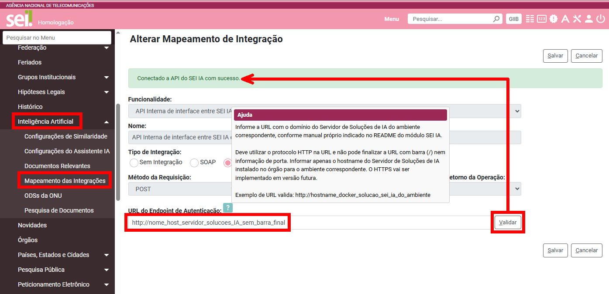
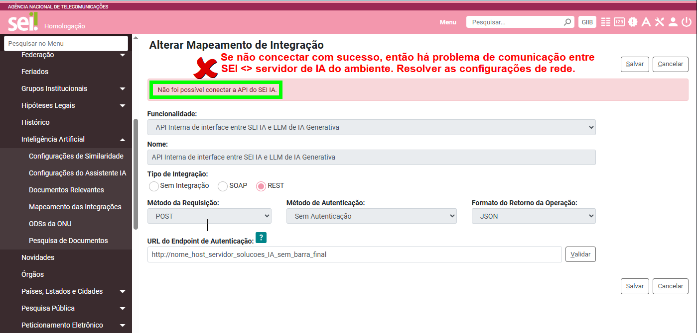

## Mapeamento da Integração no SEI

**SEI > Administração > Inteligência Artificial > Mapeamento das Integrações**

Conforme consta orientado no [README do Módulo SEI IA](https://github.com/anatelgovbr/mod-sei-ia?tab=readme-ov-file#orienta%C3%A7%C3%B5es-negociais), somente com tudo configurado na Administração do módulo no SEI do ambiente correspondente será possível o uso adequado de toda a solução.

Assim, com todas as soluções do servidor em status "Up", conforme verificado acima, a primeira verificação no SEI para confirmar que a comunicação entre SEI <> Servidor de Soluções de IA está funcionando com sucesso é configurar os dois registros existentes no menu do SEI de Administração > Inteligência Artificial > Mapeamento das Integrações.
- Nos dois registros existentes no menu acima, é necessário entrar na tela "Alterar Integração" para cadastrar o host do Servidor de Soluções de IA instalado e "Validar" a integração, conforme print abaixo.

Se o SEI não se conectar com sucesso ao Servidor de Soluções de IA que acabou de instalar, conforme acima, vai dar uma mensagem de crítica abaixo e, com isso, é necessário ajustar configurações de rede para que a comunicação funcione.

## Resolução de Problemas Conhecidos

Caso o **Mapeamento das Integrações no SEI** apresente falha ou comportamento inesperado, consulte a seção de **Resolução de Problemas Conhecidos** antes de realizar qualquer ajuste manual no ambiente.

Esse documento reúne os cenários mais comuns identificados durante a instalação e operação do Servidor de IA, incluindo:
- Sintomas observados durante os testes técnicos e de integração
- Possíveis causas relacionadas à configuração, rede ou ambiente
- Ações recomendadas para correção

Acesse a documentação completa em [Resolução de Problemas Conhecidos](docs/PROBLEMAS.md)

## Pontos de Atenção para Escalabilidade

É recomendada a leitura da seção de **Pontos de Atenção para Escalabilidade**.

Este documento apresenta orientações relacionadas a:
- Consumo de CPU e memória
- Ajustes de parâmetros de serviços
- Crescimento da demanda e impacto na infraestrutura
- Boas práticas para ambientes de produção

Acesse a documentação completa em [Pontos de Atenção para Escalabilidade](docs/ESCALABILIDADE.md)
