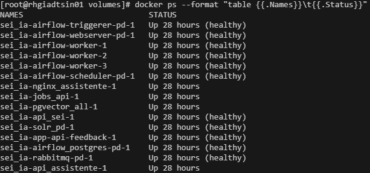
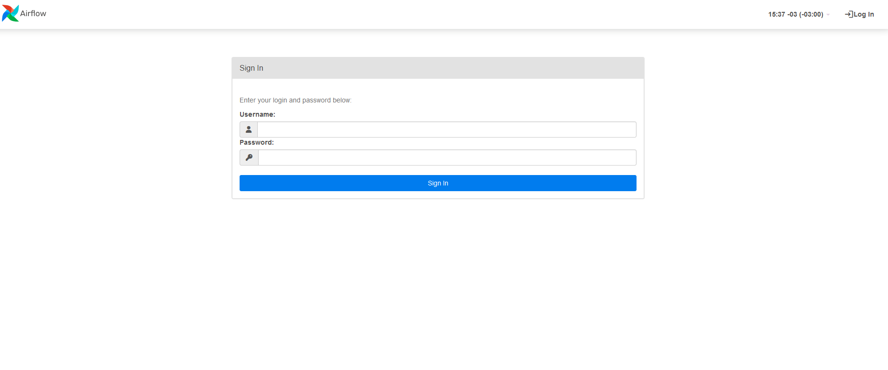
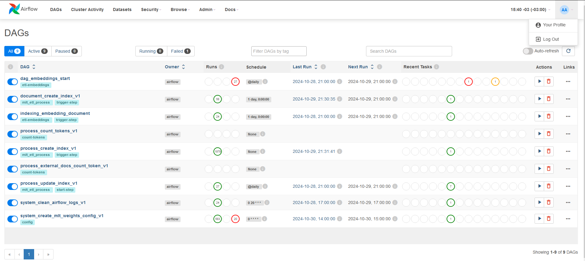
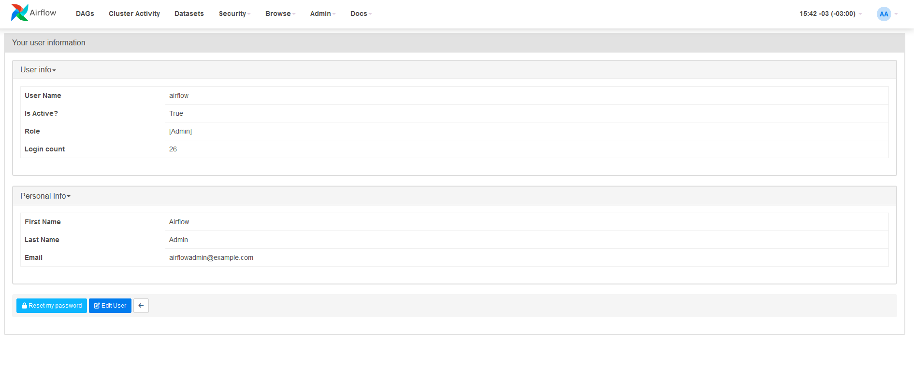
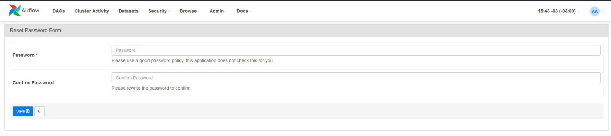
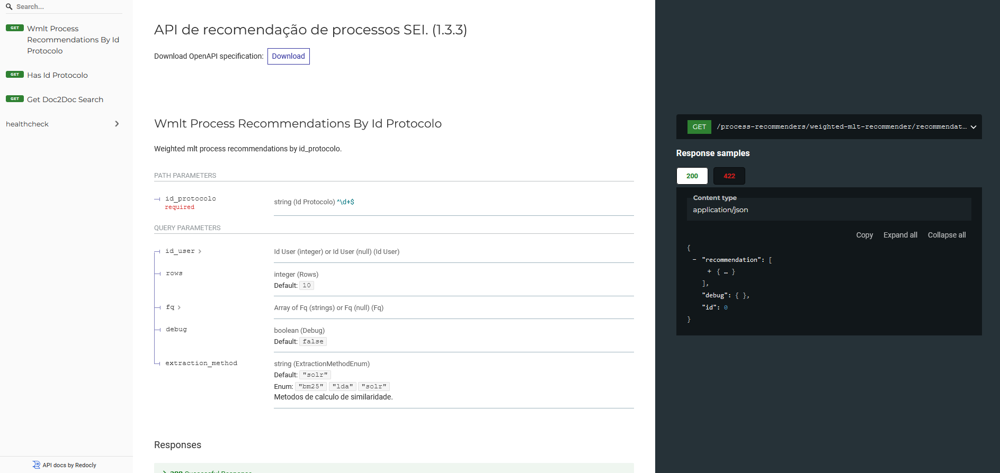
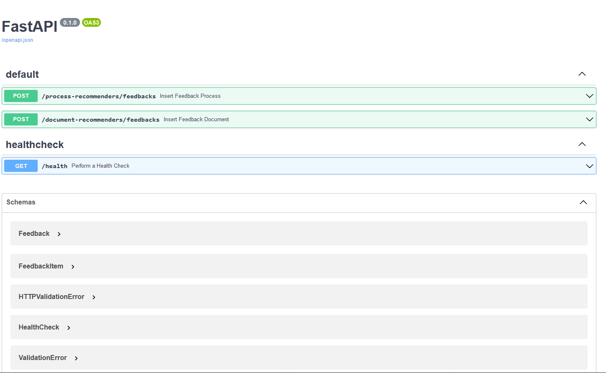
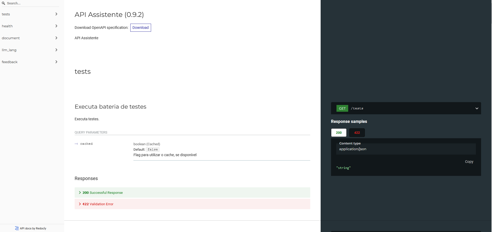
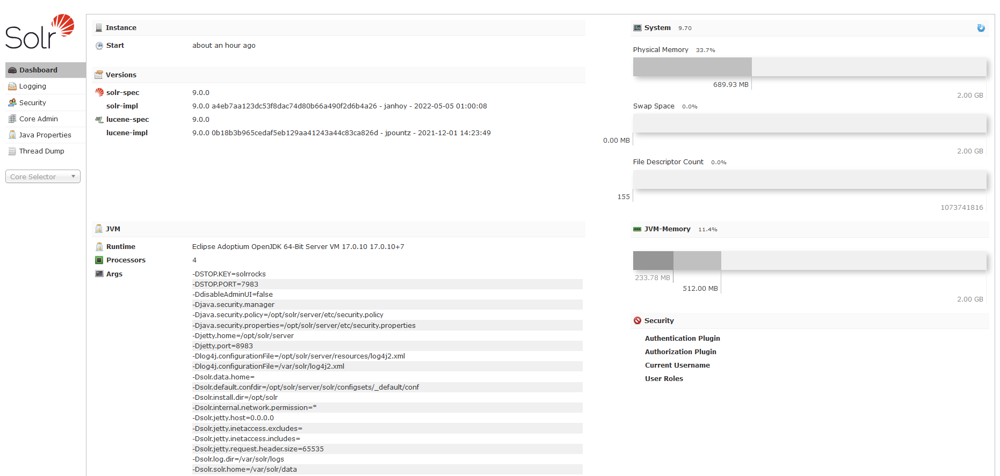

## Testes de Acessos

Você pode verificar o status das aplicações rodando o comando abaixo:

```bash
docker ps --format "table {{.Names}}	{{.Status}}"
```

O comando acima deverá retornar algo semelhante à imagem abaixo:



* **Vale ressaltar que algumas aplicações podem levar até 5 minutos para atingir o status de "healthy".** Então, espere esse tempo e confira novamente.

Caso um longo tempo tenha se passado e ainda não tenha obtido o status **healthy**, favor seguir as orientações do [Health Checker](docs/HEALTH_CHECKER.md) e rever os passos anteriores deste manual, até que não haja mais ERROR no log do Health Checker. Caso os erros persistam, deve ser repostado o problema para a Anatel, juntamente com o arquivo gerado pelo Health Checker.

Após a finalização do deploy, o Airflow iniciará a indexação dos documentos já existentes no SEI do ambinete correspondente. Esse processo pode levar dias para ser concluído, dependendo do volume de documentos a serem indexados e da capacidade computacional alocada para o servidor.

Se a instalação não for concluída com sucesso **e for exclusivamente a primeira instalação**, antes de realizar uma nova instalação é necessário realizar a limpeza completa do ambiente, para eliminar qualquer lixo que a instalação com erro possa deixar no ambiente.

Utilize os comando abaixo para a limpeza total do ambiente:

```bash
docker stop $(docker ps -a -q)
docker rm $(docker ps -a -q)
docker system prune -a --volumes
# Verifique se os volumes foram deletados:
docker volumes ls
# caso nao tenham sido deverá ser removido com o comando docker volume rm [nome-do-volume]
```

Após finalizar o deploy, você poderá realizar testes acessando cada solução da arquitetura:

| Solução                                     | URL de Acesso                          | Descrição                                                                                   | Recomendações                                                                       |
|---------------------------------------------|----------------------------------------|---------------------------------------------------------------------------------------------|-------------------------------------------------------------------------------------|
| Airflow                                     | http://[Servidor_Solucoes_IA]:8081    | Orquestrador de tarefas para gerar insumos necessários à recomendação de documentos e embeddings. | - Alterar a senha do Airflow                                                   |
| API SEI IA                                  | https://[Servidor_Solucoes_IA]:8082    | API que utiliza Solr para encontrar processos e documentos semelhantes no banco de dados do SEI. | - Bloquear em nível de rede o acesso a todos, exceto aos servidores do SEI do ambiente correspondente. |
| API SEI IA Feedback                         | https://[Servidor_Solucoes_IA]:8086/docs | API para registrar feedbacks dos usuários sobre as recomendações feitas pela API SEI.           | - Bloquear em nível de rede o acesso a todos, exceto aos servidores do SEI do ambiente correspondente. |
| API SEI IA Assistente                       | https://[Servidor_Solucoes_IA]:8088    | API que fornece funcionalidades do Assistente de IA do SEI.                                      |  - Bloquear em nível de rede o acesso a todos, exceto aos servidores do SEI do ambiente correspondente.
|                                             |                                        |                                                                                          - Bloquear em nível de rede o acesso a todos, exceto aos servidores do SEI do ambiente correspondente. |
| Solr do Servidor de Soluções de IA  | https://[Servidor_Solucoes_IA]:8084    | Interface do Solr do Servidor de Soluções de IA, utilizado na recomendação de processos e de documentos similares.                                    | - Por padrão, já vem bloqueado.                                                 |
| Banco de Dados do Servidor de Soluções de IA (PostgreSQL)  | [Servidor_Solucoes_IA]:5432  | Banco de dados PostgreSQL interno, que armazena informações do SEI e os embeddings no seu módulo pgvector.                   | - Por padrão, já vem bloqueado.                                                 |

> **Observações:**
> * Por padrão, as portas de acesso externo à rede Docker criada no passo 5 de Instalação **às aplicações Solr e PostgreSQL** não possuem direcionamento para ambiente externo. E não deve ter esse redirecionamento! Essas duas aplicações **são totalmente internas** e armazenam dados indexados dos documentos do SEI. Ou seja, são os bancos de dados das soluções de IA rodando no servidor e o acesso a eles deve ter alta restrição, sendo recomendável manter acessível apenas internamente no servidor.
> * Seria uma falha de segurança abrir um acesso externo a essas duas aplicações sem controle, sem restringir o acesso em nível de rede local do órgão para apenas quem pode acessar.
> * Consideramos que o Administrador do ambiente computacional do SEI, caso precise conferir algo no Solr e PostgreSQL interno do Servidor de Soluções de IA, pode acessar diretamente a partir do acesso dele ao próprio servidor.
> * Exepcionalmente, em ambiente que não seja de Produção e devendo restringir acesso em nível de rede local do órgão, é possível permitir o acesso externo à rede Docker. Para isso é necessário adicionar a linha afeta ao `docker-compose-dev.yaml` no script de deploy, localizado no arquivo: `deploy-externo.sh`:
>
> DE:
> ```bash
> [...]
> docker compose --profile externo \
>   -f docker-compose-ext.yaml \
>   -p $PROJECT_NAME \
>   up \
>   --no-build -d
> [...]
> ```
> PARA:
> ```bash
> [...]
> docker compose --profile externo \
>   -f docker-compose-ext.yaml \
>   -f docker-compose-dev.yaml \ # Linha adicional que permite a abertura do acesso externo à rede Docker.
>   -p $PROJECT_NAME \
>   up \
>   --no-build -d
> [...]
> ```
>
> Em seguida faça o redeploy do servidor de solução de IA, conforme abaixo:
>
> ```bash
> bash deploy-externo.sh
> ```
>
> Aguarde o `FIM` do deploy e em seguida prossiga com os testes.

### Airflow
- **URL**: http://[Servidor_Solucoes_IA]:8081
- **Descrição**: Orquestrador de tarefas para gerar insumos necessários à recomendação de documentos e embeddings.

**Recomendamos bloquear o acesso de rede, exceto para o administrador do ambiente computacional.

#### Principais DAGs
- **documents_indexing**: Processa os documentos para serem indexados no Solr do SEI IA para recomendação.
- **documents_update_index**: Atualiza o índice de documentos no Solr do SEI IA.
- **process_indexing**: Processa os processos para serem indexados no Solr do SEI IA para recomendação.
- **process_update_index**: Cria a fila para indexar os processos e documentos no Solr do SEI IA.
- **system_clean_airflow_logs**: Realiza a limpeza de logs do Airflow.
- **system_create_mlt_weights_config**: Gera o arquivo de pesos para a pesquisa de documentos relevantes da API SEI IA.

Ao acessar o Airflow, será apresentada a tela:


No primeiro acesso, o usuário padrão é `seiia` (variável _AIRFLOW_WWW_USER_USERNAME no security.env) e a senha padrão é `seiia` (variável _AIRFLOW_WWW_USER_PASSWORD no security.env).

A senha padrão acima **deve ser alterada**! Seguir os passos abaixo para alterar a senha padrão do Airflow.
  - Inicialmente, você deve acessar `Your Profile`
  
  - Em seguida, clique em `Reset my password`
  
  - Por fim, insira sua nova senha (`password`), confirme-a (`confirm password`) e clique em `save`
  
  - Sua senha foi alterada com sucesso.

#### Monitoramento e Significado das Cores das DAGs

Para garantir o funcionamento correto do sistema, acompanhe o status das DAGs, que usam um esquema de cores para indicar o estado atual de cada uma:
- **Verde escuro**: Execução bem-sucedida, indicando que a DAG foi concluída sem erros.
- **Verde claro**: DAG em execução. Caso esteja em execução por um longo período, pode indicar um possível atraso ou alta carga de processamento.
- **Vermelho**: Falha na execução. Verifique e corrija o erro para evitar impacto nas recomendações e na criação de embeddings para o RAG.
- **Cinza**: DAG sem execução agendada ou manual. Pode ser normal em processos que são executados apenas em intervalos específicos.
- **Amarelo**: Indica que a execução foi interrompida antes de sua conclusão. Necessita ser retomada ou reiniciada conforme necessário.

#### Como Obter o Log de Execução em Caso de Falha (DAG Vermelha)

Se uma DAG estiver marcada em vermelho, isso indica que houve uma falha durante a execução. Para investigar o problema:
1. **Clique no nome da DAG** para abrir uma visão detalhada.
2. Navegue até a execução com falha (marcada em vermelho no diagrama).
3. **Clique na tarefa específica que falhou** para acessar as opções de log.
4. Selecione a aba **Log** para ver o histórico detalhado de execução e identificar o erro.

Essa análise dos logs ajudará a entender a causa da falha e facilitará a correção do problema antes de reiniciar a DAG.

### API de Recomendação de Processos e Documentos do SEI IA
- **URL**: http://[Servidor_Solucoes_IA]:8082
- **Descrição**: API que utiliza Solr para encontrar processos e documentos semelhantes no banco de dados do SEI.

- **Health Check**:
  - API
      ```bash
      curl -X 'GET' 'http://[Servidor_Solucoes_IA]:8082/health' -H 'accept: application/json'
      ```

      deve retornar:

      ```bash
      {
         "status":"OK",
         "response_time": null
      }
      ```
  - Banco de dados
      ```bash
      curl -X 'GET' 'http://[Servidor_Solucoes_IA]:8082/health/database' -H 'accept: application/json'
      ```
      deve retornar:
      ```bash
      {
         "status":"OK",
         "response_time": null
      }
      ```
  - Recomendação de processos
      ```bash
      curl -X 'GET' 'http://[Servidor_Solucoes_IA]:8082/health/process-recommendation' -H 'accept: application/json'
      ```
      deve retornar:
      ```bash
      {
         "status":"OK",
         "response_time": tempo de resposta
      }
      ```
  - Recomendação de documentos
      ```bash
      curl -X 'GET' 'http://[Servidor_Solucoes_IA]:8082/health/document-recommendation' -H 'accept: application/json'
      ```
      deve retornar:
      ```bash
      {
         "status":"OK",
         "response_time": tempo de resposta
      }
      ```

### API SEI IA Feedback de Processos
- **URL**: http://[Servidor_Solucoes_IA]:8086/docs
- **Descrição**: API para registrar feedbacks dos usuários sobre as recomendações feitas pela API SEI.

- **Health Check**:
   ```bash
   curl -X 'GET' 'http://[Servidor_Solucoes_IA]:8086/health' -H 'accept: application/json'
   ```
   deve retornar:
   ```bash
   {
      "status":"OK",
      "timestamp":"DATA"
   }
   ```

### API SEI IA Assistente
- **URL**: http://[Servidor_Solucoes_IA]:8088
- **Descrição**: API que fornece funcionalidades do Assistente de IA do SEI.

- **Health Check**:
   ```bash
   curl -X 'GET' 'http://[Servidor_Solucoes_IA]:8088/health' -H 'accept: application/json'
   ```
   deve retornar:
   ```bash
   {"status":"OK"}
   ```

### Bancos de Dados

#### Solr do Servidor de Soluções de IA
- **URL**: http://[Servidor_Solucoes_IA]:8084
- **Descrição**: Interface do Solr do Servidor de Soluções de IA, utilizado na recomendação de processos e de documentos similares.


#### PostgreSQL
- **URL**: [Servidor_Solucoes_IA]:5432
- **Descrição**: Banco de dados PostgreSQL interno, que armazena informações do SEI e os embeddings no seu módulo pgvector.

## Resolução de Problemas Conhecidos

Caso algum dos **Testes de Acesso** apresente falha ou comportamento inesperado, consulte a seção de **Resolução de Problemas Conhecidos** antes de realizar qualquer ajuste manual no ambiente.

Esse documento reúne os cenários mais comuns identificados durante a instalação e operação do Servidor de IA, incluindo:
- Sintomas observados durante os testes
- Possíveis causas
- Ações recomendadas para correção

Acesse a documentação completa em [Resolução de Problemas Conhecidos](docs/PROBLEMAS.md)

## Mapeamento da Integração no SEI

Após a conclusão dos **Testes de Acesso** e a confirmação de que todas as soluções do Servidor de IA estão em status **“Up”**, é necessário realizar a verificação da integração no SEI. Os procedimentos detalhados para essa configuração estão descritos no documento [Mapeamento da Integração no SEI](docs/INTEGRACAO.md)
