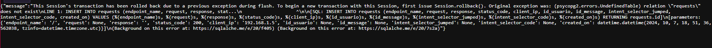
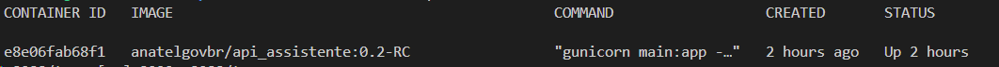

# Instalação SEI-IA em ambiente Linux

Este guia descreve os passos para instalar o SEI-IA em um servidor Linux.

## Pré-requisitos

- **CPU**: CPU Intel(R) Xeon(R) 2.10GHz (16 threads)
- **MEMÓRIA**: Mínimo de 128GB
- **ESPAÇO EM DISCO**: Mínimo de 50 GB + Espaco usado pelo SEI para embedding de documentos.


Antes de começar a instalação, certifique-se de que os seguintes pacotes estejam instalados no sistema:
- docker >= 27.1.1
- docker compose >= 2.29

**TODOS OS COMANDOS ILUSTRADOS NESSE DOCUMENTO SÃO DADOS VIA TERMINAL**

## Passos para Instalação

1. **Criar a pasta para o SEI-IA**

   ```bash
   sudo mkdir /opt/seiia
   sudo chmod 777 /opt/seiia
   cd /opt/seiia
   ```
2. **Instalar Git - OPCIONAL**
   
   **OBSERVACAO**: é possivel instalar sem git, apenas tenha certeza de manter a estrutura do github dentro da pasta /opt/seiia/sei-ia
   
   Siga a documentação oficial para instalar o git: [Documentação Git](https://git-scm.com/book/pt-br/v2/Come%C3%A7ando-Instalando-o-Git)

   Aqui está o resumo dos comandos necessários para Ubuntu/Debian:

   ```bash
   sudo apt-get update
   sudo apt-get install git
   ```

   Aqui está o resumo dos comandos necessarios para o CentOS/RHEL

   ```bash
   sudo yum install git-all
   ```
3. **Instalar Docker - CASO AINDA NAO ESTEJA INSTALADO**
   Siga a documentação oficial para instalar o Docker: [Documentação Docker](https://docs.docker.com/engine/install/)

   Aqui está o resumo dos comandos necessários para Ubuntu/Debian:

   ```bash
   for pkg in docker.io docker-doc docker-compose docker-compose-v2 podman-docker containerd runc; do sudo apt-get remove $pkg; done

   # Adicionar a chave GPG oficial do Docker:
   sudo apt-get update
   sudo apt-get install ca-certificates curl
   sudo install -m 0755 -d /etc/apt/keyrings
   sudo curl -fsSL https://download.docker.com/linux/ubuntu/gpg -o /etc/apt/keyrings/docker.asc
   sudo chmod a+r /etc/apt/keyrings/docker.asc

   # Adicionar o repositório do Docker:
   echo "deb [arch=$(dpkg --print-architecture) signed-by=/etc/apt/keyrings/docker.asc] https://download.docker.com/linux/ubuntu $(. /etc/os-release && echo "$VERSION_CODENAME") stable" | sudo tee /etc/apt/sources.list.d/docker.list > /dev/null

   # Instalar o Docker
   sudo apt-get update
   sudo apt-get install docker-ce docker-ce-cli containerd.io docker-buildx-plugin docker-compose-plugin
   ```

   Aqui está o resumo dos comandos necessarios para o CentOS/RHEL

   ```bash
   # Remover pacotes antigos do Docker, caso existam
   for pkg in docker docker-client docker-client-latest docker-common docker-latest docker-latest-logrotate docker-logrotate docker-engine podman containerd runc; do sudo yum remove $pkg; done

   # Instalar o Docker
   sudo yum install -y yum-utils
   sudo yum-config-manager --add-repo https://download.docker.com/linux/centos/docker-ce.repo
   sudo yum install docker-ce docker-ce-cli containerd.io docker-buildx-plugin docker-compose-plugin
   ```
4. **Iniciar o Docker**

   Inicie o servico do docker.

   ```bash
   sudo service docker start
   docker --version
   ```
5. **Preparar o ambiente**
   Instale o Docker e o Git conforme descrito anteriormente. Crie um usuário específico para o SEI-IA:

   ```bash
   sudo mkdir /opt/sei-ia-storage
   sudo chmod 777 /opt/sei-ia-storage
   ```
6. **Clonar o repositório SEI-IA**
   Troque para o usuário criado e clone o repositório via SSH:

   ```bash
   git clone git@github.com:anatelgovbr/sei-ia.git
   cd sei-ia
   ```
7. **Criar a rede Docker**
   Crie uma rede Docker customizada para a instalação:

   ```bash
   docker network create --driver=bridge docker-host-bridge 
   ```

   Em alguns casos, é importante definir o range de distribuicao dos ips para evitar conflito com outros computadores e/ou servicos.

   Exemplo:

   ```bash
   docker network create --driver=bridge --subnet=192.168.144.0/24 --ip-range=192.168.144.0/24 --gateway=192.168.144.1 docker-host-bridge #TROCAR OS IPS DE ACORDO COM A SUA NECESSIDADE
   ```
8. **Configurar o arquivo `env_files/security.env`**
   Certifique-se de conhecer o tipo de banco de dados da instalação do SEI. Preencha os seguintes campos no arquivo `env_files/security.env`:

   ```bash
   #### Ambiente
   ENVIRONMENT=prod  # Define o ambiente como "prod" (produção).

   GID_DOCKER=****   # O GID (Group ID) do grupo Docker no host; deve ser obtido executando o comando no terminal: 
                     # "cat /etc/group | grep docker | cut -d: -f3".

   #### Banco Sei
   export DB_SEI_USER=****       # Usuário para acessar o banco de dados SEI.
   export DB_SEI_PWD=*****       # Senha para o banco de dados SEI.
   export DB_SEI_HOST=*****      # Endereço do host do banco de dados SEI. Caso apresente erro com o nome do host será necessario colocar o IP do servidor SEI.
   export DB_SEI_DATABASE=****   # Nome do banco de dados SEI.
   export DB_SEI_PORT=*****      # Porta de conexão do banco de dados SEI.
   export DB_SEI_SCHEMA=*****    # Esquema do banco de dados SEI (caso for mysql é o mesmo do database).
   export DATABASE_TYPE=*****    # Tipo de banco de dados (ex: mssql, mysql, oracle.).

   #### Assistente do Sei (você deve escolher a senha na primeira instalação.)
   export ASSISTENTE_PGVECTOR_PWD=*****          # Senha para o banco de dados PGVector do Assistente, será criado no momento da primeira instalação.
   ```

   Nao alterar as variaveis:

   ```bash
   export ASSISTENTE_PGVECTOR_USER=sei_llm      # Usuário para acessar o banco de dados PGVector do Assistente.
   export ASSISTENTE_PGVECTOR_HOST=pgvector_all # Host do serviço PGVector do Assistente.
   export ASSISTENTE_PGVECTOR_DB=SEI_LLM        # Nome do banco de dados PGVector do Assistente.
   export POSTGRES_DATABASE=sei_similaridade    # Nome do banco de dados do sei_similaridade
   ```
9.  **Configurações adicionais**
   Adicione os parametros no arquivo `env_files/security.env`:
   Lembrando que esses parametros nao sao essenciais para a instalacao do SEI-IA, mas serao necessarios para o uso.

```bash
    #### Banco Solr externo
    SEI_SOLR_ADDRESS=****  # Endereço do Solr externo da SEI. Deve ser apenas o ip ou host  Exemplo: http://IP_DO_SOLR_SEI_OU_HOSTNAME:8983
    SEI_SOLR_CORE=****     # Nome do core do Solr externo da SEI. Exemplo: sei-protocolos

    #### SeiWS Seguir as instrucoes em: https://github.com/anatelgovbr/mod-sei-ia/blob/master/sei/web/modulos/ia/ws/manual_ws_ia.md

    SEI_IAWS_URL=*****  # URL do serviço web da SEI IAWS. 
    SEI_IAWS_KEY=*****  # Chave de acesso para o serviço web da SEI IAWS. 

    ## securities openai
    AZURE_OPENAI_ENDPOINT=****             # Endpoint do Azure OpenAI.
    AZURE_OPENAI_ENDPOINT_GPT4o=****       # Endpoint específico para GPT-4 no Azure.
    AZURE_OPENAI_KEY_GPT4o=****            # Chave de acesso para GPT-4 no Azure.
    GPT_MODEL_4o_128k=****                 # Nome do modelo GPT-4 com 128k tokens.
    AZURE_OPENAI_ENDPOINT_GPT4o_mini=****  # Endpoint específico para GPT-4 Mini no Azure.
    AZURE_OPENAI_KEY_GPT4o_mini=****       # Chave de acesso para GPT-4 Mini no Azure.
    GPT_MODEL_4o_mini_128k=****            # Nome do modelo GPT-4 Mini com 128k tokens.
    OPENAI_API_VERSION=2024-02-01          # Versão da API da OpenAI.
    MAX_RETRIES=3                          # Número máximo de tentativas em caso de falha na chamada à API.
    TIMEOUT_API=600                        # Tempo limite (timeout) para chamadas à API, em segundos.
    TOKEN_MAX=4096                         # Número máximo de tokens permitidos para as requisições.
```

10. **Executar o deploy**
    Execute o script de deploy:

```bash
   sudo bash deploy-externo-imgs.sh 
```

   Este passo pode levar bastante tempo, pois é realizado o download de todas as imagens.
11. **Testes de acessos**

   Após finalizado o deploy, você poderá realizar os testes acessando:
   IP:8081 -> Airflow
   acesso usuario: `airflow` senha:  `airflow`

   IP:8082 -> Api do SEI  -> utiliza o solr para encontrar processos semelhantes

   IP:8084 -> Solr do SEI-IA -> Utilizado na recomendacao de processos.

   IP:8086/docs -> Api do SEI feedbacks -> grava o feedback do usuario de uma recomendacao feita pela api SEI

   IP:8088 -> api do Assistente de IA do SEI

   Acesso aos bancos de dados:

   IP:5432 -> banco de dados pgvector acesso pela senha criada no passo 8:
   usuario: `sei_llm`

```bash
   ASSISTENTE_PGVECTOR_PWD
```

## Resolução de problemas

- **Erro de montagem de arquivo**:

  ```bash
  Error response from daemon: failed to create task for container: failed to create shim task: OCI runtime create failed: runc create failed: unable to start container process: error during container init: error mounting "/opt/sei/sei-ia/solr_config/log4j2.xml" to rootfs at "/opt/solr/server/resources/log4j2.xml": create mount destination for /opt/solr/server/resources/log4j2.xml mount: cannot mkdir in /var/lib/docker/overlay2/...: not a directory: unknown
  ```

  Solução:

  ```bash
  rmdir /opt/sei/sei-ia/solr_config/log4j2.xml
  touch /opt/sei/sei-ia/solr_config/log4j2.xml
  ```
- **Erro de limite de CPU**:

  ```bash
  Error response from daemon: Range of CPUs is from 0.01 to 4.00, as there are only 4 CPUs available
  ```

  Solução: Alterar o arquivo `prod.env` (caso o `ENVIRONMENT` seja diferente, alterar o `.env` específico) e modificar todas as chaves que possuem `CPU_LIMIT`.
- **Erro de nome de container duplicado**:

  ```bash
  Error response from daemon: Conflict. The container name "/3bd4ff6aae26_sei_ia-jobs_api-1" is already in use by container "64856a9070ccf94bbc1803a98749bee282813cd6d65dab51ecab827449ee0423".
  ```

  Solução: Identificar qual o processo que ainda está rodando:

  ```bash
  docker ps -a
  ```

  Buscar o ID do container e parar:

  ```bash
  docker stop [NUMERO_do_container] # no exemplo seria 3bd4ff6aae26
  ```
- **Dependência falhando ao iniciar**:

  ```bash
  dependency failed to start: container sei_ia-rabbitmq-pd-1 is unhealthy
  ```

  Solução: Por padrão, ao rodar novamente o comando de inicialização, volta a funcionar.

  ```bash
  sudo bash deploy-externo-imgs.sh 
  ```
- **Falta tabelas no sei-assistente**:
  

  Solução: encontrar o docker referente ao anatelgovbr/api_assistente:xx

  ```bash
  docker ps
  ```

  
  apos encontrar busque o container id, nesse caso: e8e06fab68f1

  ```bash
  docker exec -it CONTAINER_ID python /app/fix-tables.py
  ```

## Conclusão

Após seguir esses passos, tanto o SEI quanto o SEI-IA devem estar instalados e configurados corretamente no seu servidor Linux.
