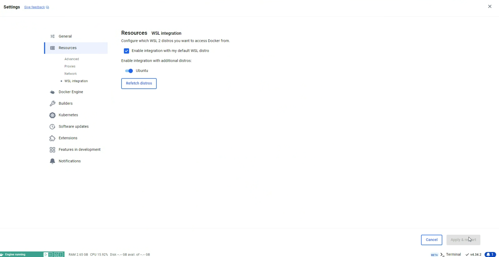

# Instalação do SEI-IA no Windows

Na instalação via Windows, recomendamos o uso do WSL (Windows Subsystem for Linux) com Ubuntu.

## Passos para Instalação do WSL

1. **Instalar o WSL**:
   - Abra o PowerShell como administrador e execute o seguinte comando:
     ```bash
     wsl --install ubuntu
     ```
   - Isso instalará o WSL e a distribuição padrão do Ubuntu. Se você já tiver o WSL instalado, pode atualizar para a versão mais recente com:
     ```bash
     wsl --update
     ```

2. **Configurar o Ubuntu**:
   - Após a instalação, inicie o Ubuntu a partir do menu Iniciar do Windows. Isso abrirá um terminal do Ubuntu, onde você poderá configurar seu usuário e senha.

## Passos para Instalação do Docker Desktop

1. **Instalar o Docker Desktop**:
   - Baixe o Docker Desktop para Windows a partir do [site oficial do Docker](https://www.docker.com/products/docker-desktop).
   - Siga as instruções de instalação.

2. **Ativar a Integração do WSL com o Docker**:
   - Após a instalação do Docker Desktop, abra o aplicativo.
   - Vá para **Configurações** (Settings).
   - Navegue até **Resources** > **WSL Integration**.
   - Habilite a integração para a distribuição Ubuntu.

   

3. **Verificar a Instalação do Docker**:
   - No terminal do Ubuntu (WSL), digite o seguinte comando para verificar se o Docker está funcionando corretamente:
     ```bash
     docker --version
     ```

## Conclusão

Após seguir esses passos, você terá o WSL e o Docker Desktop configurados no seu Windows. Agora você pode prosseguir com a instalação do SEI-IA conforme as instruções específicas para o Ubuntu.